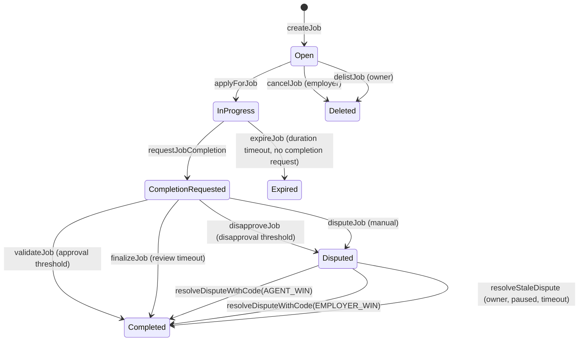

# AGIJobManager

[](LICENSE)
[](contracts/AGIJobManager.sol)
[](https://trufflesuite.com/)
[](https://github.com/MontrealAI/AGIJobManager/actions/workflows/ci.yml)

**AGIJobManager** is MONTREAL.AI’s on-chain enforcement layer for agent–employer workflows: validator-gated job escrow, payouts, dispute resolution, role gating, and reputation updates, with an ERC‑721 job NFT issuance + listing/purchase flow. It is the **enforcement** half of a “Full‑Stack Trust Layer for AI Agents.”

> **Status / Caution**: Experimental research software. Treat deployments as high-risk until you have performed independent security review, validated parameters, and ensured operational readiness. No public audit report is included in this repository.

## At a glance

**What it is**
- **Job escrow & settlement**: employer-funded jobs with agent assignment, validator approvals/disapprovals, moderator dispute resolution, and payouts/refunds.
- **Reputation mapping**: on-chain reputation updates for agents and validators based on job outcomes.
- **Job NFT issuance + marketplace**: mints an ERC‑721 “job NFT” on completion and supports listing/purchase/delist for those NFTs.
- **Trust gating**: role eligibility enforced via explicit allowlists, Merkle proofs, and ENS/NameWrapper/Resolver ownership checks.

**What it is NOT**
- **Not an on-chain ERC‑8004 implementation**: ERC‑8004 is consumed off-chain; this repo does not integrate it on-chain.
- **Not a generalized identity or reputation registry**: only contract-local reputation mappings and ENS/Merkle gating are provided.
- **Not a generalized NFT marketplace**: listings are only for job NFTs minted by this contract.
- **Not a decentralized court or DAO**: moderators and the owner have significant authority; there is no slashing or permissionless validator set.

## MONTREAL.AI × ERC‑8004: From signaling → enforcement

**ERC‑8004** standardizes *trust signals* (identity, reputation, validation outcomes) for off-chain publication and indexing. **AGIJobManager** enforces *settlement* (escrow, payouts, dispute resolution, reputation updates) on-chain.

**Recommended integration pattern (no contract changes required)**
1. **Publish trust signals** using ERC‑8004 (identity, reputation, validation outcomes).
2. **Index/rank/watch off-chain** with a trust policy specific to your domain.
3. **Translate policy into allowlists** (Merkle roots at deployment, explicit allowlists/blacklists during operation).
4. **Use AGIJobManager** as the enforcement/settlement anchor.

**Implemented here**: validator‑gated escrow, dispute resolution, reputation mapping, ENS/Merkle role gating, and job NFT issuance.
**Not implemented here**: any on-chain ERC‑8004 registry or trust‑signal processing.

## Architecture + illustrations

### Job lifecycle (state machine)

*Notes:* `validateJob`/`disapproveJob` require `completionRequested` to be true. Disputes only open after completion is requested; once disputed, validator voting no longer advances settlement.

### Full‑stack trust layer (signaling → enforcement)


## Roles & permissions

| Role | Capabilities | Trust considerations |
| --- | --- | --- |
| **Owner** | Pause/unpause, set parameters, manage allowlists/blacklists, add moderators and AGI types, withdraw surplus ERC‑20 (balance minus locked escrow). | Highly privileged. Compromise or misuse can override operational safety. |
| **Moderator** | Resolve disputes via `resolveDispute` (legacy) or `resolveDisputeWithCode` (typed). | Central dispute authority; outcomes depend on moderator integrity. |
| **Employer** | Create jobs, fund escrow, cancel pre-assignment, dispute jobs, receive job NFTs. | Funds are custodied by contract until resolution. |
| **Agent** | Apply for jobs, request completion, earn payouts and reputation. | Eligibility gated by allowlists/Merkle/ENS. |
| **Validator** | Approve/disapprove jobs, earn payout share and reputation. | Eligibility gated by allowlists/Merkle/ENS. |

## Quickstart

```bash
npm install
```

```bash
npm run build
```

```bash
npm test
```

**Local chain (Ganache)**
```bash
npx ganache -p 8545
npx truffle migrate --network development
```

**Compiler note**: `AGIJobManager.sol` declares `pragma solidity ^0.8.19`, while the Truffle compiler is pinned to `0.8.19` in `truffle-config.js` (optimizer runs `50`, `viaIR` disabled, `evmVersion` default `london`).

## Deployment & verification (Truffle)

`truffle-config.js` is the source of truth for networks and env vars. A full guide lives in [`docs/Deployment.md`](docs/Deployment.md).

**Environment setup**
- Copy `.env.example` → `.env` (keep it local):
  ```bash
  cp .env.example .env
  ```

**RPC + keys (Sepolia / Mainnet)**
- `PRIVATE_KEYS`: comma-separated private keys.
- RPC configuration, one of:
  - `SEPOLIA_RPC_URL` / `MAINNET_RPC_URL`, or
  - `ALCHEMY_KEY` / `ALCHEMY_KEY_MAIN`, or
  - `INFURA_KEY`.
- Optional provider polling: `RPC_POLLING_INTERVAL_MS`.

**Gas + confirmations (optional)**
- `SEPOLIA_GAS`, `MAINNET_GAS`
- `SEPOLIA_GAS_PRICE_GWEI`, `MAINNET_GAS_PRICE_GWEI`
- `SEPOLIA_CONFIRMATIONS`, `MAINNET_CONFIRMATIONS`
- `SEPOLIA_TIMEOUT_BLOCKS`, `MAINNET_TIMEOUT_BLOCKS`

**Deployment configuration (migrations/2_deploy_contracts.js)**
- `AGI_TOKEN_ADDRESS`, `AGI_ENS_REGISTRY`, `AGI_NAMEWRAPPER`
- `AGI_BASE_IPFS_URL`
- `AGI_CLUB_ROOT_NODE`, `AGI_ALPHA_CLUB_ROOT_NODE`, `AGI_AGENT_ROOT_NODE`, `AGI_ALPHA_AGENT_ROOT_NODE`
- `AGI_VALIDATOR_MERKLE_ROOT`, `AGI_AGENT_MERKLE_ROOT`
- `LOCK_CONFIG` (optional: set `true` to lock critical config after deploy)

**Verification**
- `ETHERSCAN_API_KEY` for `truffle-plugin-verify`.

**Deploy**
```bash
npx truffle migrate --network sepolia
npx truffle migrate --network mainnet
```

**Verify**
```bash
npx truffle run verify AGIJobManager --network sepolia
npx truffle run verify AGIJobManager --network mainnet
```

## Security considerations (summary)

- **Centralization risk**: the owner can change critical parameters and withdraw surplus ERC‑20; moderators can resolve disputes.
- **Eligibility gating**: ENS root nodes are configured at deploy-time; Merkle roots can be updated by the owner.
- **ERC‑20 compatibility**: transfers must succeed and match exact amounts; fee‑on‑transfer and rebasing tokens are not supported.
- **Dispute path**: once disputed, validator voting no longer advances settlement; moderators/owner resolve.
- **Marketplace safety**: `purchaseNFT` uses `nonReentrant` and ERC‑721 safe transfer semantics; contract buyers must implement `onERC721Received`.

See [`docs/Security.md`](docs/Security.md) for the threat model, trust assumptions, and limitations.

## Ecosystem links

- **Repository**: https://github.com/MontrealAI/AGIJobManager
- **Etherscan (deployment-specific)**: https://etherscan.io/address/<contract-address>
- **OpenSea (job NFTs, deployment-specific)**: https://opensea.io/assets/ethereum/<contract-address>
- **ERC‑8004 specification**: https://eips.ethereum.org/EIPS/eip-8004
- **ERC‑8004 deck**: https://github.com/MontrealAI/AGI-Alpha-Agent-v0/blob/main/docs/presentation/MONTREALAI_x_ERC8004_v0.pdf
- **ERC‑8004 deck (repo copy)**: [`presentations/MONTREALAI_x_ERC8004_v0.pdf`](presentations/MONTREALAI_x_ERC8004_v0.pdf)
- **AGI Jobs one‑pager (repo)**: [`docs/AGI_JOBS_ONE_PAGER.md`](docs/AGI_JOBS_ONE_PAGER.md)
- **AGI‑Alpha‑Agent reference repo**: https://github.com/MontrealAI/AGI-Alpha-Agent-v0
- **ENS docs**: https://docs.ens.domains/
- **Truffle**: https://trufflesuite.com/docs/truffle/

## Documentation

Start here:
- [`docs/README.md`](docs/README.md)
- [`docs/AGIJobManager.md`](docs/AGIJobManager.md)
- [`docs/Deployment.md`](docs/Deployment.md)
- [`docs/Security.md`](docs/Security.md)
- [`docs/ERC8004.md`](docs/ERC8004.md)
- [`docs/Interface.md`](docs/Interface.md)
