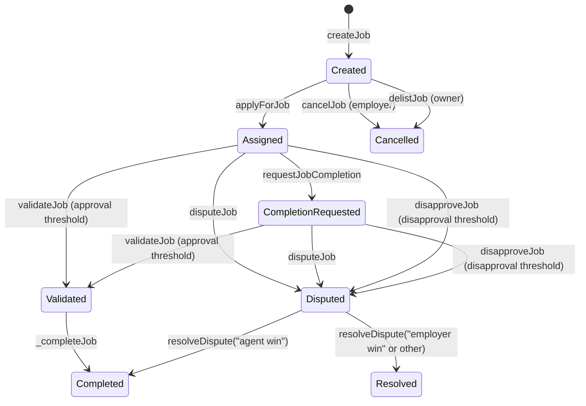
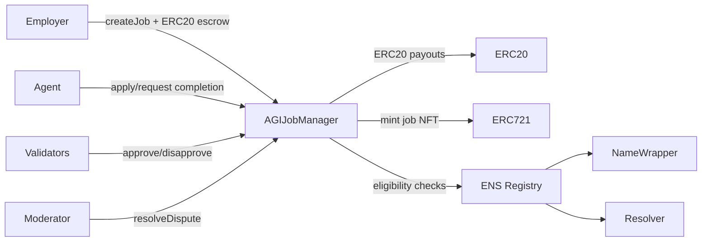

# AGIJobManager

> **Single-contract job escrow and verification** for employer/agent workflows on Ethereum-compatible networks.

> **⚠️ Experimental / research system.** Use caution in production; review code, configuration, and trust assumptions before mainnet deployment.

## Quick links
- **Contract source**: [`contracts/AGIJobManager.sol`](contracts/AGIJobManager.sol)
- **How to Deploy**: [Deployment](#deployment-truffle)
- **How to Test**: [Testing](#testing)
- **Security**: [Security considerations](#security-considerations)
- **Original deployed v0 (Etherscan)**: [0x0178b6bad606aaf908f72135b8ec32fc1d5ba477](https://etherscan.io/address/0x0178b6bad606aaf908f72135b8ec32fc1d5ba477)
- **Docs**: [`docs/`](docs/)

---

## What it is / what it isn’t

### What it is
AGIJobManager is a single-contract system that coordinates employer-funded jobs, agent assignment, validation, disputes, reputation, and ERC-721 issuance. It also includes a simple, built-in listing/purchase marketplace for job NFTs.

It provides:
- **Job escrow** using an external ERC-20 token (`agiToken`).
- **Assignment and validation** with validator approvals/disapprovals and a moderator dispute resolution path.
- **Reputation tracking** for agents and validators based on payouts and completion time.
- **ERC-721 issuance** for completed jobs, with a native listing/purchase flow.
- **Eligibility gating** for agents/validators via Merkle roots and/or ENS ownership (NameWrapper + resolver).

### What it is not
- **Not a full identity registry** (no on-chain identity profiles).
- **Not an ERC-8004 on-chain registry** (adapter is off-chain only).
- **Not a generalized marketplace** (only job NFTs minted by this contract are listed).
- **Not a permissionless validator system** (eligibility is gated by allowlists / ENS ownership).

---

## Key concepts

### Roles
- **Owner**: governance and safety controls (pause, thresholds, allowlists, token rotation, withdrawals).
- **Moderator**: resolves disputes (`resolveDispute`).
- **Employer**: creates and funds jobs; can cancel before assignment; receives job NFT on completion.
- **Agent**: applies for and completes jobs.
- **Validator**: approves/disapproves jobs and earns validation rewards.

### Assets
- **AGI ERC-20 token**: escrowed for job payouts and used for validator rewards.
- **ERC-721 job NFTs**: minted on completion to the employer.
- **AGIType NFTs**: external ERC-721s that boost agent payout percentage (highest percentage wins).
- **Listings**: a built-in, non-escrowed marketplace for job NFTs.

### Authorization sources
- **Merkle roots**: allowlists for agents and validators.
- **ENS + NameWrapper**: ownership checks for a subdomain.
- **Resolver fallback**: if NameWrapper fails, the contract attempts ENS resolver lookup.

---

## Job lifecycle (state machine)

Key state fields that change during the lifecycle:
- `assignedAgent`, `assignedAt`
- `completionRequested`
- `validatorApprovals`, `validatorDisapprovals`
- `disputed`, `completed`



---

## Architecture overview (illustrative)



---

## Contract interface summary (high level)

| Function | Who calls | Purpose | Preconditions (non-exhaustive) | Major side effects |
| --- | --- | --- | --- | --- |
| `createJob` | Employer | Create job + escrow | `payout > 0`, `duration > 0`, within limits | Transfers ERC-20 in, emits `JobCreated` |
| `applyForJob` | Agent | Assign job | Job exists, unassigned, eligible, not blacklisted | Sets `assignedAgent`, emits `JobApplied` |
| `requestJobCompletion` | Assigned agent | Submit completion | Job assigned; within duration | Updates job IPFS hash, emits `JobCompletionRequested` |
| `validateJob` | Validator | Approve job | Eligible, not blacklisted, no prior vote | Increments approvals; may complete job |
| `disapproveJob` | Validator | Disapprove job | Eligible, not blacklisted, no prior vote | Increments disapprovals; may dispute job |
| `disputeJob` | Employer/Agent | Open dispute | Not completed; not already disputed | Sets `disputed=true` |
| `resolveDispute` | Moderator | Resolve dispute | Job disputed | “agent win” completes; “employer win” refunds |
| `cancelJob` | Employer | Cancel before assignment | Unassigned, not completed | Refunds escrow, deletes job |
| `delistJob` | Owner | Emergency cancel | Unassigned, not completed | Refunds escrow, deletes job |
| `listNFT` / `purchaseNFT` / `delistNFT` | NFT owner / buyer | Marketplace | Listing active; buyer has funds | Transfers ERC-20 + NFT |
| `addAGIType` | Owner | Add payout multiplier | Valid NFT address + percentage | Updates AGI type list |

### Critical events for indexers
- **Job lifecycle**: `JobCreated`, `JobApplied`, `JobCompletionRequested`, `JobValidated`, `JobDisapproved`, `JobDisputed`, `DisputeResolved`, `JobCompleted`, `JobCancelled`.
- **Reputation**: `ReputationUpdated` (agents and validators).
- **NFT marketplace**: `NFTIssued`, `NFTListed`, `NFTPurchased`, `NFTDelisted`.
- **Allowlist/ENS checks**: `OwnershipVerified`, `RecoveryInitiated`.

---

## Installation

```bash
npm install
```

## Local development

Compile contracts:
```bash
npm run build
```

Run tests:
```bash
npm test
```

---

## Environment configuration

Truffle is configured in [`truffle-config.js`](truffle-config.js). Use a `.env` file for sensitive values (see [`.env.example`](.env.example)).

**Network + deployment variables**
- `PRIVATE_KEYS` — Comma-separated private keys for deployments.
- `INFURA_KEY` — Infura project key for mainnet/sepolia.
- `ALCHEMY_KEY` — Alchemy key for Sepolia.
- `ALCHEMY_KEY_MAIN` — Alchemy key for mainnet (falls back to `ALCHEMY_KEY`).
- `MAINNET_RPC_URL` / `SEPOLIA_RPC_URL` — Direct RPC URL overrides.
- `MAINNET_GAS` / `SEPOLIA_GAS` — Gas limits.
- `MAINNET_GAS_PRICE_GWEI` / `SEPOLIA_GAS_PRICE_GWEI` — Gas price in gwei.
- `MAINNET_CONFIRMATIONS` / `SEPOLIA_CONFIRMATIONS` — Confirmation count for deploys.
- `MAINNET_TIMEOUT_BLOCKS` / `SEPOLIA_TIMEOUT_BLOCKS` — Deployment timeouts (blocks).
- `RPC_POLLING_INTERVAL_MS` — Provider polling interval (ms).

**Compiler variables**
- `SOLC_VERSION` — Solidity compiler version (default `0.8.33`, compatible with `^0.8.17`).
- `SOLC_RUNS` — Optimizer runs (default `200`).
- `SOLC_VIA_IR` — Set `true` to enable viaIR.
- `SOLC_EVM_VERSION` — EVM version string (default `london`).

**Other**
- `GANACHE_MNEMONIC` — Overrides local test mnemonic.
- `ETHERSCAN_API_KEY` — Required for `truffle-plugin-verify`.

---

## Deployment (Truffle)

### Local development chain
1. Start a local chain (Ganache):
   ```bash
   npx ganache
   ```
2. Deploy:
   ```bash
   npx truffle migrate --network development
   ```

### Sepolia
1. Set `PRIVATE_KEYS` and one RPC source (`SEPOLIA_RPC_URL` or `ALCHEMY_KEY`/`INFURA_KEY`).
2. Deploy:
   ```bash
   npx truffle migrate --network sepolia
   ```
3. (Optional) Verify:
   ```bash
   npx truffle run verify AGIJobManager --network sepolia
   ```

### Mainnet (use caution)
1. Set `PRIVATE_KEYS` and one RPC source (`MAINNET_RPC_URL` or `ALCHEMY_KEY_MAIN`/`INFURA_KEY`).
2. Deploy:
   ```bash
   npx truffle migrate --network mainnet
   ```
3. (Optional) Verify:
   ```bash
   npx truffle run verify AGIJobManager --network mainnet
   ```

#### Troubleshooting
- **Missing RPC URL**: ensure `*_RPC_URL` or `ALCHEMY_KEY(_MAIN)`/`INFURA_KEY` is set.
- **Nonce/gas errors**: check account balance, gas price, and confirmation settings.
- **Verification failures**: confirm `ETHERSCAN_API_KEY` and compiler settings match deployment.
- **Deployment timeouts**: increase `*_TIMEOUT_BLOCKS` for slower networks.

---

## Security considerations

### Trust model
- **Owner powers**: pause/unpause, thresholds, allowlists, blacklists, token rotation, withdrawals, and AGI type updates.
- **Moderator powers**: can resolve disputes with arbitrary strings; only canonical strings trigger payouts/refunds.

### Key hardenings vs. original v0 behavior
The repository’s current implementation includes fixes and safety checks such as:
- Blocking phantom job IDs and pre-apply takeover.
- Preventing double-complete flows after employer-win disputes.
- Avoiding division-by-zero when no validators vote.
- Enforcing single-vote (no approve + disapprove by the same validator).
- Checking ERC-20 `transfer` / `transferFrom` return values.

For deeper analysis, see [`docs/AGIJobManager_Security.md`](docs/AGIJobManager_Security.md).

### Responsible disclosure / security
See [SECURITY.md](SECURITY.md) for reporting guidance.

---

## Project structure

```
contracts/       # Solidity contracts (AGIJobManager.sol)
migrations/      # Truffle deployment scripts
scripts/         # Utility scripts (including ERC-8004 tooling)
test/            # Truffle + JS tests
integrations/    # Off-chain adapters (ERC-8004)
docs/            # Contract & operator documentation
```

Artifacts and ABIs are generated in `build/contracts/` after `truffle compile`.

---

## Versioning & compatibility
- **Solidity pragma**: `^0.8.17` in `AGIJobManager.sol`.
- **Truffle compiler**: defaults to `0.8.33` with optimizer enabled (`runs=200`), `evmVersion=london`, and optional `viaIR`.
- **Bytecode size**: enabling `viaIR` or altering optimizer runs impacts bytecode size and deployment cost. Match compiler settings for verification.

---

## Contributing & license
- No `CONTRIBUTING.md` is present in this repo.
- License: [MIT](LICENSE).

---

## Additional documentation
- [Contract overview](docs/AGIJobManager.md)
- [Interface reference (full ABI)](docs/AGIJobManager_Interface.md)
- [Operator guide](docs/AGIJobManager_Operator_Guide.md)
- [Security considerations](docs/AGIJobManager_Security.md)
- [ERC-8004 integration](docs/ERC8004.md)
- [Regression tests](docs/REGRESSION_TESTS.md)
