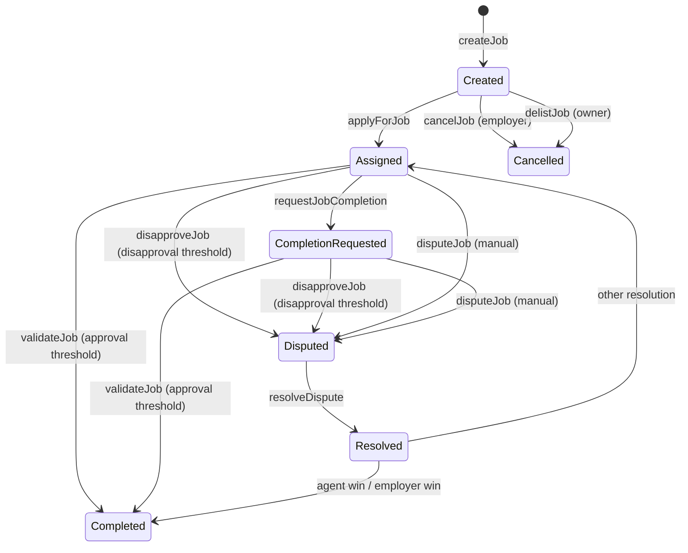
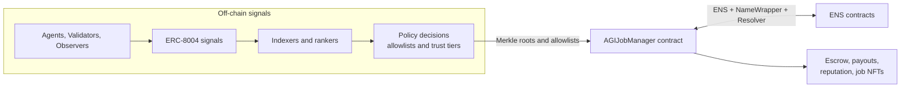

# AGIJobManager

[](LICENSE)
[](contracts/AGIJobManager.sol)
[](https://trufflesuite.com/)
[](https://github.com/MontrealAI/AGIJobManager/actions/workflows/ci.yml)

**AGIJobManager** is an on-chain job escrow and settlement contract for agent–employer workflows with validator review, dispute resolution, reputation updates, job NFT issuance, and a simple NFT listing/purchase flow.

> **Warning**: This is an experimental research system. Treat deployments as high-risk until you have completed independent security review and operational readiness checks.

## Quick links
- **Contract source**: [`contracts/AGIJobManager.sol`](contracts/AGIJobManager.sol)
- **How to deploy**: [Deployment](#deployment-truffle)
- **How to test**: [Testing](#testing)
- **Security**: [Security considerations](#security-considerations)
- **Historical v0 deployment (mainnet)**: https://etherscan.io/address/0x0178b6bad606aaf908f72135b8ec32fc1d5ba477
- **Docs index**: [`docs/README.md`](docs/README.md)

## What it is / What it isn’t

**What it is**
- **Job escrow + workflow engine**: employers escrow ERC-20 payouts; agents apply and are assigned; validators approve/disapprove; moderators resolve disputes. The contract enforces payouts/refunds and updates reputation on completion.
- **Reputation tracking**: on-chain reputation points for agents and validators based on job outcomes.
- **Job NFT issuance + marketplace**: successful completion mints an ERC-721 “job NFT” to the employer; those job NFTs can be listed and purchased in a simple, contract-native listing flow.
- **Eligibility gating**: agent/validator eligibility is determined by explicit allowlists plus Merkle proofs and ENS/NameWrapper/Resolver ownership checks.

**What it isn’t**
- **Not a full identity registry**: identity is gated by ENS and Merkle allowlists only; no global identity or reputation registry is included.
- **Not a generalized NFT marketplace**: listings are limited to job NFTs minted by this contract.
- **Not a decentralized court**: moderators have authority to resolve disputes and the owner has significant administrative power.

## Key concepts

### Roles
- **Owner**: pauses/unpauses, updates parameters and metadata, manages allowlists/blacklists, adds moderators and AGI types, withdraws escrowed ERC-20.
- **Moderator**: resolves disputes via `resolveDispute` (only canonical resolutions trigger payouts/refunds).
- **Employer**: creates and funds jobs, can cancel before assignment, can dispute jobs, receives job NFTs.
- **Agent**: applies for jobs, requests completion, earns payouts and reputation.
- **Validator**: approves/disapproves jobs, earns payout share and reputation for participation.

### Assets & value flows
- **ERC-20 token (configured at deployment; called `agiToken` in code)**: escrowed on job creation and used for payouts, validator rewards, and NFT purchases.
- **Job NFTs (ERC-721)**: minted to the employer on successful completion, with token URI derived from the job’s IPFS hash.
- **AGIType NFTs**: external ERC-721 collections mapped to payout percentages; the highest owned percentage determines agent payout.
- **Listings marketplace**: sellers list job NFTs without escrow; purchases transfer ERC-20 from buyer to seller and transfer the NFT.

### Authorization sources
- **Merkle allowlists** for agents and validators.
- **ENS / NameWrapper / Resolver** ownership checks as a fallback path.
- **Explicit allowlists / blacklists** controlled by the owner.

If a Merkle proof fails, the contract tries NameWrapper ownership and then ENS resolver lookup; failures emit `RecoveryInitiated` to aid off-chain monitoring.

## Architecture & illustrations

### Job lifecycle (state machine)


**State fields that change during the lifecycle**
- `assignedAgent`, `assignedAt`
- `completionRequested`
- `validatorApprovals`, `validatorDisapprovals`, per-validator approval/disapproval mappings
- `disputed`, `completed`

### Enforcement + identity architecture (on-chain / off-chain)


## Contract interface summary (high level)

| Function | Typical caller | Purpose | Key preconditions | Major side effects |
| --- | --- | --- | --- | --- |
| `createJob` | Employer | Create a job and escrow payout | `payout > 0`, `duration > 0`, within limits | Transfers ERC-20 into escrow, stores job | 
| `applyForJob` | Agent | Assign agent to a job | Job exists and unassigned; agent allowlisted or passes ownership check | Sets `assignedAgent`, `assignedAt` |
| `requestJobCompletion` | Assigned agent | Request completion and update IPFS hash | Agent assigned; still within job duration | Sets `completionRequested`, updates `ipfsHash` |
| `validateJob` | Validator | Approve job completion | Validator allowlisted/verified; not already voted | Records approval; completes job on threshold |
| `disapproveJob` | Validator | Disapprove job completion | Validator allowlisted/verified; not already voted | Records disapproval; marks `disputed` on threshold |
| `disputeJob` | Employer or agent | Open dispute manually | Job not completed; caller is employer or assigned agent | Sets `disputed = true` |
| `resolveDispute` | Moderator | Resolve dispute | Job is disputed | For `agent win` completes job; for `employer win` refunds and finalizes; clears `disputed` |
| `cancelJob` | Employer | Cancel before assignment | Caller is employer; job unassigned and not completed | Refunds escrow; deletes job |
| `delistJob` | Owner | Cancel before assignment | Job unassigned and not completed | Refunds escrow; deletes job |
| `listNFT` / `purchaseNFT` / `delistNFT` | NFT owner / buyer | List and trade job NFTs | Listing active for purchase; owner-only for list/delist | Transfers ERC-20 and NFT on purchase |
| `addAGIType` | Owner | Register payout boost NFTs | `nftAddress` non-zero; percentage in (0,100] | Updates AGIType table |
| `getJobStatus` | Anyone | Lightweight job polling | Job exists | Returns `completed`, `completionRequested`, and `ipfsHash` |
| `canAccessPremiumFeature` | Anyone | Check premium gating | None | Returns true if reputation ≥ threshold |
| `withdrawAGI` | Owner | Withdraw ERC-20 from contract | `amount > 0` and `amount <= balance` | Transfers ERC-20 to owner |
| `contributeToRewardPool` | Any | Add ERC-20 to contract | `amount > 0` | Transfers ERC-20 into contract |

### Events to index
High-signal events for indexers and analytics:
- **Lifecycle**: `JobCreated`, `JobApplied`, `JobCompletionRequested`, `JobValidated`, `JobDisapproved`, `JobDisputed`, `DisputeResolved`, `JobCompleted`, `JobCancelled`.
- **NFT marketplace**: `NFTIssued`, `NFTListed`, `NFTPurchased`, `NFTDelisted`.
- **Reputation**: `ReputationUpdated`.
- **Access signals**: `OwnershipVerified`, `RecoveryInitiated`.

## Installation (local development)

```bash
npm install
```

## Compilation

```bash
npm run build
```

## Testing

```bash
npm test
```

`npm test` runs the in-process Ganache tests defined in `truffle-config.js` and a standalone node regression runner.

## Environment configuration

`truffle-config.js` uses dotenv. See [`.env.example`](.env.example) for a safe template.

**Required for Sepolia/Mainnet deployments**
- `PRIVATE_KEYS`: comma-separated private keys (no spaces).
- One of:
  - `SEPOLIA_RPC_URL` / `MAINNET_RPC_URL`, or
  - `ALCHEMY_KEY` / `ALCHEMY_KEY_MAIN`, or
  - `INFURA_KEY`.

**Verification**
- `ETHERSCAN_API_KEY` for `truffle-plugin-verify`.

**Optional overrides**
- Gas and confirmations: `SEPOLIA_GAS`, `MAINNET_GAS`, `SEPOLIA_GAS_PRICE_GWEI`, `MAINNET_GAS_PRICE_GWEI`, `SEPOLIA_CONFIRMATIONS`, `MAINNET_CONFIRMATIONS`, `SEPOLIA_TIMEOUT_BLOCKS`, `MAINNET_TIMEOUT_BLOCKS`.
- Provider tuning: `RPC_POLLING_INTERVAL_MS`.
- Compiler settings: `SOLC_VERSION`, `SOLC_RUNS`, `SOLC_VIA_IR`, `SOLC_EVM_VERSION`.
- Local chain: `GANACHE_MNEMONIC`.

## Deployment (Truffle)

> **Important**: `migrations/2_deploy_contracts.js` hardcodes constructor parameters (token, ENS, NameWrapper, root nodes, Merkle roots). Update them before real deployments.

### Local development chain (Ganache)

```bash
npx ganache -p 8545
npx truffle migrate --network development
```

### Sepolia

```bash
npx truffle migrate --network sepolia
```

### Mainnet

```bash
npx truffle migrate --network mainnet
```

> Mainnet deployments are high-risk. Verify gas limits, addresses, and constructor parameters, and double-check key custody and funding.

### Verification (Etherscan)

```bash
npx truffle run verify AGIJobManager --network sepolia
```

## Troubleshooting
- **Missing RPC URL**: set `SEPOLIA_RPC_URL` / `MAINNET_RPC_URL` or provide `ALCHEMY_KEY(_MAIN)` / `INFURA_KEY`.
- **Missing private keys**: `PRIVATE_KEYS` must be set (comma-separated).
- **Verification failures**: ensure compiler settings match deployment (`SOLC_VERSION`, `SOLC_RUNS`, `SOLC_VIA_IR`, `SOLC_EVM_VERSION`).
- **Nonce conflicts**: avoid simultaneous deployments from the same key.
- **Out of gas**: increase `SEPOLIA_GAS` / `MAINNET_GAS` and verify `gasPrice` settings.

## Security considerations

**Trust model**
- **Owner powers**: can pause flows, adjust thresholds/limits, update token address and metadata fields, manage allowlists/blacklists, add AGI types, and withdraw escrowed ERC-20.
- **Moderator powers**: can resolve disputes; only `agent win` and `employer win` trigger payouts/refunds.

**Hardening vs historical v0**
- Phantom job IDs blocked.
- Pre-apply assignment takeover blocked.
- Double-complete flows blocked (employer-win dispute now finalizes the job).
- Division-by-zero avoided when no validators participated.
- Single-vote enforcement (no approve + disapprove from same validator).
- ERC-20 transfer/transferFrom return values are enforced.

**Responsible disclosure**
See [`SECURITY.md`](SECURITY.md).

## Project structure

```
contracts/      # Solidity contracts (AGIJobManager.sol)
migrations/     # Truffle deployment scripts
scripts/        # Utilities (ABI/interface generation)
integrations/   # Off-chain adapters
test/           # Truffle tests + regression runner
docs/           # Extended documentation
```

Compilation artifacts and ABIs are written to `build/contracts/`.

## Versioning & compatibility

- **Solidity version**: the contract uses `pragma solidity ^0.8.17`, while `truffle-config.js` defaults to `0.8.33` for compilation. Adjust `SOLC_VERSION` if you need a different compiler within the compatible range.
- **Optimizer**: enabled with `SOLC_RUNS` (default 200). Keep optimizer settings stable for reproducible bytecode and Etherscan verification.
- **EVM version**: defaults to `london` (`SOLC_EVM_VERSION`).

## Contributing & license

- Security policy: [`SECURITY.md`](SECURITY.md)
- License: [MIT](LICENSE)
- Contributing guide: none currently; please open an issue or PR with context.
