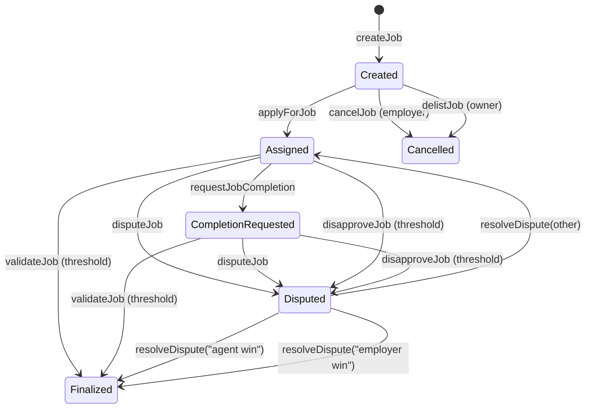

# AGIJobManager

[](LICENSE)
[](contracts/AGIJobManager.sol)
[](https://trufflesuite.com/)
[](https://github.com/MontrealAI/AGIJobManager/actions/workflows/ci.yml)

AGIJobManager is a **Full‑Stack Trust Layer for AI Agents**: an on-chain escrow and settlement contract that enforces agent–employer workflows, validator approvals, dispute resolution, and reputation updates, plus job NFT issuance and marketplace listings. It is designed to be paired with **ERC‑8004** (off-chain identity/reputation signaling) to move from **signaling → enforcement** without changing this contract.

> **Status / Caution**
> This repository is **research/experimental**. Review the contract and tests, and do not deploy to production without independent security review.

## At a glance

**What it is**
- **Job escrow + workflow engine**: employers escrow ERC‑20 payouts, agents are assigned, validators approve/disapprove, and moderators resolve disputes.
- **Reputation mapping**: on-chain reputation points for agents and validators based on job outcomes.
- **Job NFT issuance + marketplace**: successful completion mints an ERC‑721 to the employer; listings and purchases are supported for those job NFTs.
- **Eligibility gating**: ENS NameWrapper/Resolver checks plus Merkle allowlists and explicit allowlists/blacklists for agents and validators.

**What it is not**
- **Not an on-chain ERC‑8004 registry**: ERC‑8004 is an off-chain signaling layer and is not implemented on-chain here.
- **Not a generalized NFT marketplace**: listings are only for job NFTs minted by this contract.
- **Not a decentralized court**: moderators have authority to resolve disputes; the owner retains strong administrative controls.

## MONTREAL.AI × ERC‑8004: From signaling → enforcement

**ERC‑8004 (signaling layer)** standardizes how identity, reputation, and validation signals are published off‑chain so indexers can rank and filter participants.

**AGIJobManager (enforcement layer)** is the on‑chain escrow anchor: it gates roles via ENS/Merkle checks, enforces validator thresholds, settles payouts/refunds, and updates reputation.

**Implemented in this repo**
- ENS / NameWrapper / Resolver ownership checks.
- Merkle allowlists for agents and validators.
- Validator‑gated escrow, payouts, and reputation updates.

**Recommended integration pattern (no contract changes required)**
1. Publish ERC‑8004 trust signals (identity, reputation, validation outcomes).
2. Index and rank those signals off‑chain.
3. Use ranked results to decide who may validate or be assigned work.
4. Encode those decisions via Merkle roots at deployment and explicit allowlists/blacklists during operation.

> **Important**: ERC‑8004 is not wired on‑chain in this repo. The integration is intentionally off‑chain; AGIJobManager remains the enforcement/settlement anchor.

## Architecture + illustrations

### Job lifecycle (state machine)


> **Notes**:
> - `resolveDispute("employer win")` marks the job as completed without minting a job NFT or paying the agent.
> - `resolveDispute(other)` clears the dispute while preserving the underlying in‑progress flags (e.g., `completionRequested` remains set if it was set before the dispute).

### Full‑stack trust layer (signaling → enforcement)
```mermaid
flowchart LR
    subgraph Off-chain trust signaling
        A[Agents / Validators / Observers] --> B[ERC-8004 signals]
        B --> C[Indexers & rankers]
        C --> D[Policy decisions
(allowlists / trust tiers)]
    end

    D -->|Merkle roots & allowlists| E[AGIJobManager (on-chain)]
    E <-->|ENS NameWrapper/Resolver| F[ENS contracts]
    E --> G[Escrow, payouts, reputation,
job NFT issuance]
```

## Roles & permissions

| Role | Capabilities (summary) |
| --- | --- |
| **Owner** | Pause/unpause, set thresholds, update token address, manage allowlists/blacklists, add moderators, add AGI types, withdraw escrowed ERC‑20. |
| **Moderator** | Resolve disputes. Only canonical strings (`agent win`, `employer win`) trigger payout/refund. |
| **Employer** | Create and fund jobs, cancel before assignment, dispute jobs, receive job NFTs. |
| **Agent** | Apply for jobs, request completion, earn payouts and reputation. |
| **Validator** | Approve/disapprove jobs, receive payouts and reputation when voting. |

## Documentation

- **Contract specification**: [`docs/AGIJobManager.md`](docs/AGIJobManager.md)
- **Deployment guide**: [`docs/Deployment.md`](docs/Deployment.md)
- **Security model**: [`docs/Security.md`](docs/Security.md)
- **ERC‑8004 integration**: [`docs/ERC8004.md`](docs/ERC8004.md)
- **ABI & interface reference**: [`docs/Interface.md`](docs/Interface.md)

## Quickstart

### Install
```bash
npm install
```

### Compile
```bash
npm run build
```

### Test
```bash
npm test
```

### Local chain (Ganache)
```bash
npx ganache -p 8545
npx truffle migrate --network development
```

## Deployment & verification (Truffle)

> Full details: [`docs/Deployment.md`](docs/Deployment.md)

**Environment variables (from `truffle-config.js`)**
- **RPC + keys**: `PRIVATE_KEYS`, `SEPOLIA_RPC_URL`, `MAINNET_RPC_URL`, `ALCHEMY_KEY`, `ALCHEMY_KEY_MAIN`, `INFURA_KEY`.
- **Verification**: `ETHERSCAN_API_KEY`.
- **Optional tuning**: `SEPOLIA_GAS`, `MAINNET_GAS`, `SEPOLIA_GAS_PRICE_GWEI`, `MAINNET_GAS_PRICE_GWEI`, `SEPOLIA_CONFIRMATIONS`, `MAINNET_CONFIRMATIONS`, `SEPOLIA_TIMEOUT_BLOCKS`, `MAINNET_TIMEOUT_BLOCKS`, `RPC_POLLING_INTERVAL_MS`.
- **Compiler**: `SOLC_VERSION`, `SOLC_RUNS`, `SOLC_VIA_IR`, `SOLC_EVM_VERSION`.

**Deploy**
```bash
npx truffle migrate --network sepolia
npx truffle migrate --network mainnet
```

**Verify (Etherscan)**
```bash
npx truffle run verify AGIJobManager --network sepolia
```

> ⚠️ The migration script (`migrations/2_deploy_contracts.js`) hardcodes constructor parameters. Update token + ENS addresses, roots, and Merkle roots before production deployments.

## Security considerations

- **Centralization risk**: the owner can pause flows, change allowlists, update token address, and withdraw escrowed ERC‑20.
- **Moderator power**: moderators resolve disputes; only `agent win` or `employer win` trigger on‑chain settlement.
- **Reputation is deterministic but not sufficient**: it is an on‑chain signal, not a substitute for off‑chain validation or auditing.

See [`docs/Security.md`](docs/Security.md) for the full threat model and limitations.

## Ecosystem links

- **Contract source**: [`contracts/AGIJobManager.sol`](contracts/AGIJobManager.sol)
- **Docs index**: [`docs/README.md`](docs/README.md)
- **ERC‑8004 spec (EIP‑8004)**: https://eips.ethereum.org/EIPS/eip-8004
- **ERC‑8004 deck (framing)**: https://github.com/MontrealAI/AGI-Alpha-Agent-v0/blob/main/docs/presentation/MONTREALAI_x_ERC8004_v0.pdf
- **Historical mainnet deployment (v0)**: https://etherscan.io/address/0x0178b6bad606aaf908f72135b8ec32fc1d5ba477
- **OpenSea (historical contract)**: https://opensea.io/assets/ethereum/0x0178b6bad606aaf908f72135b8ec32fc1d5ba477
- **Related repos**:
  - https://github.com/MontrealAI/AGI-Alpha-Agent-v0
  - https://github.com/MontrealAI/AGIJobManager

## Project structure

```
contracts/      # Solidity contracts (AGIJobManager.sol)
migrations/     # Truffle deployment scripts
scripts/        # Utilities
integrations/   # Off-chain adapters (ERC-8004)
test/           # Truffle + regression tests
/docs/          # Extended documentation
```

Artifacts and ABIs are written to `build/contracts/` after compilation.

## Contributing and license

- Security: see [`SECURITY.md`](SECURITY.md)
- License: [MIT](LICENSE)
