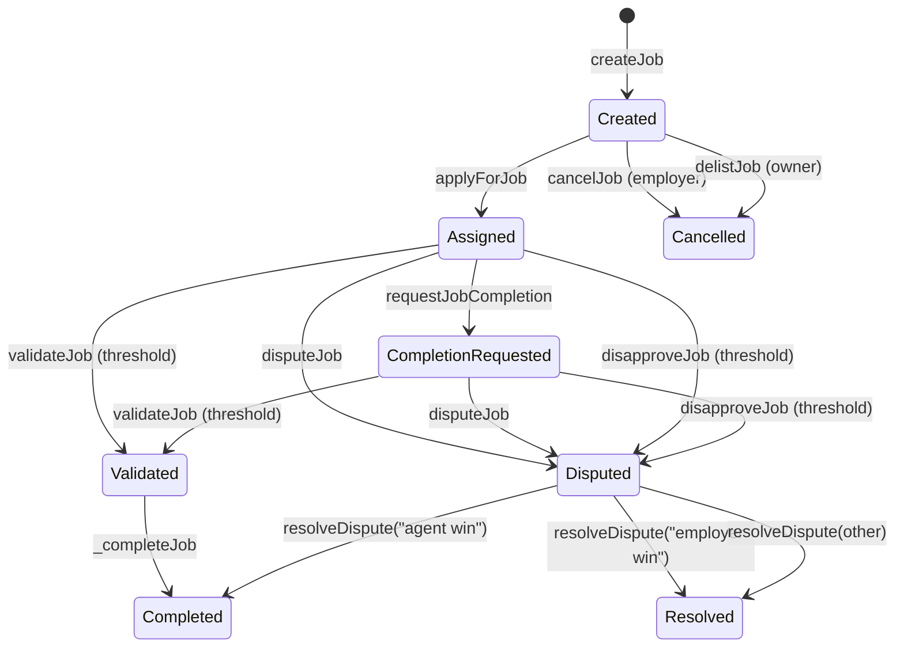
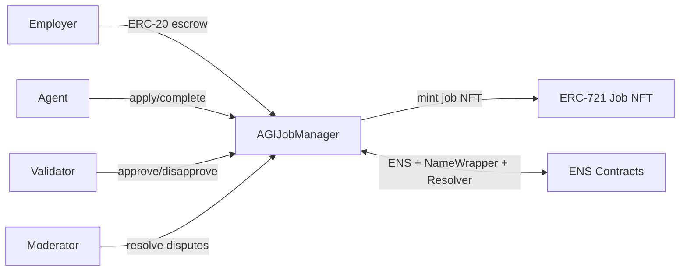

# AGIJobManager

AGIJobManager is a single-contract escrow and workflow engine for employer–agent jobs, validation, dispute resolution, reputation, and job NFT issuance on Ethereum-compatible networks.

> **Warning**: This is an experimental/research system. Use caution and conduct your own review before production deployment.

## Quick links
- Contract source: [`contracts/AGIJobManager.sol`](contracts/AGIJobManager.sol)
- How to Deploy: [Deployment](#deployment-truffle)
- How to Test: [Testing](#testing)
- Security: [Security considerations](#security-considerations)
- Deployed v0 (historical): [Etherscan 0x0178b6bad606aaf908f72135b8ec32fc1d5ba477](https://etherscan.io/address/0x0178b6bad606aaf908f72135b8ec32fc1d5ba477)
- Docs: [`docs/`](docs/)

---

## What it is / what it isn’t

**What it is**
- **Job escrow + workflow**: employers lock ERC-20 funds into jobs, agents are assigned, validators review outcomes, and disputes are resolved on-chain.
- **Reputation tracking**: on-chain reputation for agents and validators, derived from payout amounts and completion time.
- **NFT issuance + marketplace**: a job completion mints an ERC-721 to the employer, which can be listed and purchased via a simple on-chain listing flow.
- **Eligibility gating**: validator/agent access is gated by Merkle roots and/or ENS NameWrapper + Resolver ownership checks.

**What it is not**
- **Not a generalized identity registry**: it does not implement an on-chain identity standard (e.g., ERC-8004 lives off-chain in this repo).
- **Not a full-featured marketplace**: listings apply only to job NFTs minted by this contract.
- **Not a permissionless validator marketplace**: validators are explicitly gated (Merkle/ENS/allowlists).

---

## Key concepts

**Roles**
- **Owner**: contract admin; can pause flows, tune parameters, update allowlists/blacklists, withdraw funds, and manage AGI types.
- **Moderator**: resolves disputes.
- **Employer**: creates jobs and funds escrow.
- **Agent**: applies to and completes jobs (if eligible).
- **Validator**: validates or disapproves jobs (if eligible).

**Assets & primitives**
- **AGI ERC-20 token**: escrowed for payouts and transfers.
- **Job NFTs (ERC-721)**: minted to the employer on completion, tokenURI = `baseIpfsUrl + "/" + job.ipfsHash`.
- **AGIType NFTs**: optional NFTs that increase agent payout percentage.
- **Listings marketplace**: a simple listing/purchase mechanism for job NFTs (no escrowed NFTs).

**Authorization sources**
- **Merkle roots**: agent and validator allowlists.
- **ENS + NameWrapper + Resolver**: ENS-based ownership checks for subdomains; resolver fallback is used when NameWrapper does not confirm ownership.

---

## Job lifecycle (state machine)



**State fields that change across the lifecycle**
- `assignedAgent`, `assignedAt`
- `completionRequested`
- `validatorApprovals`, `validatorDisapprovals`
- `disputed`, `completed`

---

## Contract interface summary (high-level)

| Function | Who calls | Purpose | Preconditions (high level) | Major side effects |
| --- | --- | --- | --- | --- |
| `createJob` | Employer | Create a job and escrow funds | payout/duration within limits | Transfers ERC-20 to contract; emits `JobCreated` |
| `applyForJob` | Agent | Assign self to job | job unassigned; agent eligible | Sets `assignedAgent/assignedAt`; emits `JobApplied` |
| `requestJobCompletion` | Agent | Submit completion | caller is assigned; before duration limit | Sets `completionRequested`; updates job IPFS hash; emits `JobCompletionRequested` |
| `validateJob` | Validator | Approve completion | eligible validator; not voted | Increments approvals; emits `JobValidated`; may complete job |
| `disapproveJob` | Validator | Disapprove completion | eligible validator; not voted | Increments disapprovals; emits `JobDisapproved`; may dispute job |
| `disputeJob` | Employer/Agent | Open dispute | not already disputed/completed | Sets `disputed`; emits `JobDisputed` |
| `resolveDispute` | Moderator | Resolve dispute | job is disputed | If "agent win" → complete; if "employer win" → refund + close; emits `DisputeResolved` |
| `cancelJob` | Employer | Cancel before assignment | unassigned & not completed | Refunds escrow; deletes job; emits `JobCancelled` |
| `delistJob` | Owner | Admin cancel | unassigned & not completed | Refunds escrow; deletes job; emits `JobCancelled` |
| `listNFT` | NFT owner | List job NFT | owns token; price > 0 | Creates listing; emits `NFTListed` |
| `purchaseNFT` | Buyer | Buy listed NFT | listing active | Transfers ERC-20; transfers NFT; emits `NFTPurchased` |
| `delistNFT` | Seller | Remove listing | listing active and seller | Deactivates listing; emits `NFTDelisted` |

### Critical events (indexing guide)
- **Job creation/flow**: `JobCreated`, `JobApplied`, `JobCompletionRequested`, `JobValidated`, `JobDisapproved`, `JobDisputed`, `DisputeResolved`, `JobCompleted`, `JobCancelled`.
- **Reputation**: `ReputationUpdated` (emitted for agents and validators during completion).
- **NFTs & marketplace**: `NFTIssued`, `NFTListed`, `NFTPurchased`, `NFTDelisted`.
- **Access signals**: `OwnershipVerified`, `RecoveryInitiated`.

---

## Installation & local development

> This repo is Truffle-based. Use the scripts in `package.json`.

```bash
npm install
```

Compile:
```bash
npm run build
```

### Testing
```bash
npm test
```

If you only need a compile sanity check, `npm run build` is sufficient.

---

## Environment configuration

Truffle loads environment variables via `dotenv` (`.env` locally). The following variables are used in `truffle-config.js`:

### Required for deployments
- `PRIVATE_KEYS`: comma-separated private keys (no spaces).
- **RPC configuration** (choose one per network):
  - `SEPOLIA_RPC_URL` / `MAINNET_RPC_URL`, or
  - `ALCHEMY_KEY` (Sepolia), `ALCHEMY_KEY_MAIN` (Mainnet), or
  - `INFURA_KEY` (fallback for both).

### Optional deployment tuning
- `SEPOLIA_GAS`, `MAINNET_GAS`
- `SEPOLIA_GAS_PRICE_GWEI`, `MAINNET_GAS_PRICE_GWEI`
- `SEPOLIA_CONFIRMATIONS`, `MAINNET_CONFIRMATIONS`
- `SEPOLIA_TIMEOUT_BLOCKS`, `MAINNET_TIMEOUT_BLOCKS`
- `RPC_POLLING_INTERVAL_MS`

### Compiler settings
- `SOLC_VERSION` (default `0.8.33`)
- `SOLC_RUNS` (default `200`)
- `SOLC_VIA_IR` (`true`/`false`)
- `SOLC_EVM_VERSION` (default `london`)

### Verification
- `ETHERSCAN_API_KEY`

### Local test chain (optional)
- `GANACHE_MNEMONIC` (defaults to the standard Ganache test mnemonic if unset)

A minimal example is provided in [`.env.example`](.env.example).

---

## Deployment (Truffle)

### Local development (Ganache)
1. Start a local chain (Ganache) on `127.0.0.1:8545`.
2. Deploy:
   ```bash
   npx truffle migrate --network development
   ```

### Sepolia
1. Set env vars for Sepolia (see [Environment configuration](#environment-configuration)).
2. Deploy:
   ```bash
   npx truffle migrate --network sepolia
   ```

### Mainnet (use caution)
1. Set env vars for Mainnet (see [Environment configuration](#environment-configuration)).
2. Deploy:
   ```bash
   npx truffle migrate --network mainnet
   ```

### Verification (Etherscan)
If `truffle-plugin-verify` is configured with `ETHERSCAN_API_KEY`:
```bash
npx truffle run verify AGIJobManager --network sepolia
```

#### Troubleshooting
- **Missing RPC URL**: ensure `SEPOLIA_RPC_URL`/`MAINNET_RPC_URL` or provider keys are set.
- **Insufficient funds / gas**: confirm deployer account balance and gas settings.
- **Nonce conflicts**: ensure only one deployer process is running; consider clearing pending txs.
- **Verification failures**: confirm compiler settings (`SOLC_VERSION`, optimizer runs) match deployment.

---

## Security considerations

**Trust model**
- **Owner powers**: pause/unpause flows, change token address, update thresholds/limits, manage allowlists/blacklists, set metadata fields, add AGI types, withdraw escrowed funds.
- **Moderator powers**: resolve disputes. Only canonical resolution strings trigger on-chain payouts/refunds.

**Key hardenings vs. historical v0** (current contract behavior)
- Prevents phantom job ID access via `_job` checks.
- Prevents reassignment after an agent is set.
- Prevents double-completion paths when disputes resolve to employer win.
- Avoids division-by-zero when validator count is zero.
- Enforces one vote per validator (no approve+disapprove).
- Checks ERC-20 transfer return values and reverts on failure.

**Responsible disclosure**
- Please report security issues privately. See [SECURITY.md](SECURITY.md).

---

## Architecture (illustration)



---

## Project structure

```
contracts/      # Solidity contracts (AGIJobManager.sol)
migrations/     # Truffle deployment scripts
scripts/        # Utilities (e.g., ERC-8004 tools)
test/           # Truffle + regression tests
integrations/   # ERC-8004 off-chain adapter
/docs/          # Extended documentation
```

Artifacts/ABIs are written to `build/contracts/` after compilation.

---

## Versioning & compatibility

- Solidity pragma in `AGIJobManager.sol`: `^0.8.17`.
- Truffle compiler default: `0.8.33` with optimizer enabled and `runs=200` (configurable via env vars).
- Bytecode size and optimizer settings can impact mainnet deployment; ensure verification settings match your deployed compiler configuration.

---

## Additional documentation

- Contract overview: [`docs/AGIJobManager.md`](docs/AGIJobManager.md)
- Interface reference: [`docs/AGIJobManager_Interface.md`](docs/AGIJobManager_Interface.md)
- Operator guide: [`docs/AGIJobManager_Operator_Guide.md`](docs/AGIJobManager_Operator_Guide.md)
- Security notes: [`docs/AGIJobManager_Security.md`](docs/AGIJobManager_Security.md)
- ERC-8004 integration: [`docs/ERC8004.md`](docs/ERC8004.md)

---

## Contributing & license

- Contributing: no `CONTRIBUTING.md` is present; please open an issue to discuss changes.
- License: [MIT](LICENSE)
