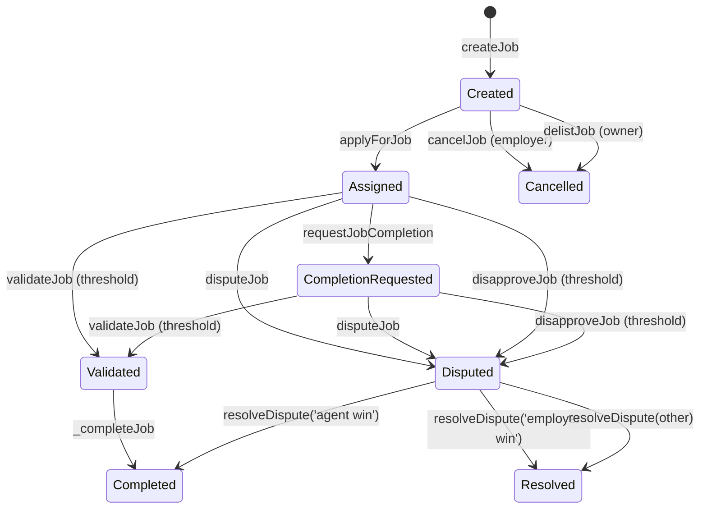
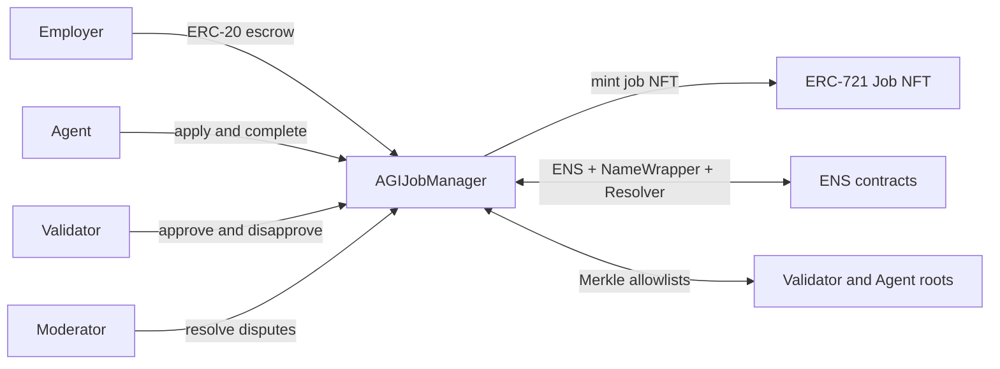

# AGIJobManager

AGIJobManager is a single-contract escrow and workflow engine for employer–agent jobs, validation, dispute resolution, reputation, and job NFT issuance on Ethereum-compatible networks.

[](LICENSE)
[](contracts/AGIJobManager.sol)
[](https://trufflesuite.com/)
[](https://github.com/MontrealAI/AGIJobManager/actions/workflows/ci.yml)

> **Status / Caution**
> This repository is **research/experimental**. Use caution, review the contract and tests, and do not deploy to production without independent security review.

## Quick links

| Resource | Link |
| --- | --- |
| Contract source | [`contracts/AGIJobManager.sol`](contracts/AGIJobManager.sol) |
| Docs index | [`docs/README.md`](docs/README.md) |
| Deployment guide | [`docs/Deployment.md`](docs/Deployment.md) |
| Security notes | [`docs/Security.md`](docs/Security.md) |
| Interface reference (ABI-derived) | [`docs/Interface.md`](docs/Interface.md) |
| Original mainnet contract (historical v0) | [0x0178b6bad606aaf908f72135b8ec32fc1d5ba477](https://etherscan.io/address/0x0178b6bad606aaf908f72135b8ec32fc1d5ba477) |

---

## What it is / what it is not

**What it is**
- **Job escrow + workflow**: employers lock ERC‑20 funds into jobs, agents are assigned, validators review outcomes, and disputes are resolved on-chain.
- **Reputation tracking**: on-chain reputation updates for agents and validators based on payout and completion time.
- **Job NFT issuance + marketplace**: successful completion mints an ERC‑721 to the employer, which can be listed and purchased via a simple listing flow.
- **Eligibility gating**: agents and validators are gated by Merkle roots and ENS NameWrapper + Resolver ownership checks.

**What it is not**
- **Not a generalized identity registry**: no on-chain ERC‑8004 registry is implemented here.
- **Not a full-featured marketplace**: listings apply only to job NFTs minted by this contract.
- **Not a permissionless validator network**: validators are gated by allowlists and ownership checks.

---

## Concepts and roles

**Roles**
- **Owner**: contract administrator (pausing, parameters, allowlists/blacklists, AGI types, withdrawals).
- **Moderator**: resolves disputes.
- **Employer**: creates and funds jobs.
- **Agent**: applies for and completes jobs.
- **Validator**: approves or disapproves jobs.

**Core primitives**
- **Job**: escrowed payout + metadata + lifecycle state.
- **Reputation mapping**: on-chain reputation points stored per address.
- **AGI types**: optional ERC‑721 NFTs that raise the agent payout percentage.
- **Job NFTs**: ERC‑721 tokens minted to employers when a job completes.
- **Marketplace listing**: non-escrow listing/purchase for job NFTs.

---

## Job lifecycle (state machine)



**State variables and flags that encode stages**
- **Created**: `assignedAgent == address(0)`, `completed=false`, `disputed=false`.
- **Assigned**: `assignedAgent != address(0)`, `assignedAt > 0`.
- **CompletionRequested**: `completionRequested=true` (and `ipfsHash` updated).
- **Validated**: `validatorApprovals >= requiredValidatorApprovals` (triggers `_completeJob`).
- **Disputed**: `disputed=true` set by disapprove threshold or manual dispute.
- **Completed**: `completed=true` (set by `_completeJob` or employer-win resolution).
- **Convenience helper**: `getJobStatus(jobId)` returns `(completed, completionRequested, ipfsHash)` for lightweight polling.

---

## Architecture overview



---

## Quickstart

### Install
```bash
npm install
```

### Compile
```bash
npm run build
```

### Test
```bash
npm test
```

### Local chain (Ganache)
```bash
npx ganache -p 8545
npx truffle migrate --network development
```

---

## Deployment and verification (Truffle)

> Full details: [`docs/Deployment.md`](docs/Deployment.md)

**Environment variables (from `truffle-config.js`)**
- **RPC + keys**: `PRIVATE_KEYS` (comma-separated), `SEPOLIA_RPC_URL`, `MAINNET_RPC_URL`, `ALCHEMY_KEY`, `ALCHEMY_KEY_MAIN`, `INFURA_KEY`.
- **Verification**: `ETHERSCAN_API_KEY`.
- **Optional tuning**: `SEPOLIA_GAS`, `MAINNET_GAS`, `SEPOLIA_GAS_PRICE_GWEI`, `MAINNET_GAS_PRICE_GWEI`, `SEPOLIA_CONFIRMATIONS`, `MAINNET_CONFIRMATIONS`, `SEPOLIA_TIMEOUT_BLOCKS`, `MAINNET_TIMEOUT_BLOCKS`, `RPC_POLLING_INTERVAL_MS`.
- **Compiler**: `SOLC_VERSION`, `SOLC_RUNS`, `SOLC_VIA_IR`, `SOLC_EVM_VERSION`.

**Deploy**
```bash
npx truffle migrate --network sepolia
npx truffle migrate --network mainnet
```

**Verify (Etherscan)**
```bash
npx truffle run verify AGIJobManager --network sepolia
```

> ⚠️ The migration script (`migrations/2_deploy_contracts.js`) hardcodes constructor parameters. Edit before deploying to production networks.

---

## Security model (high-signal)

**Trust assumptions**
- **Owner powers**: can pause flows, update token address, thresholds, allowlists/blacklists, metadata fields, add AGI types, and withdraw ERC‑20 from escrow.
- **Moderator powers**: can resolve disputes. Only the canonical strings `agent win` and `employer win` trigger on-chain payout or refund.

**Hardened evolution vs. historical v0** (see `docs/REGRESSION_TESTS.md`)
- Prevents phantom job ID access via `_job` checks.
- Prevents reassignment after an agent is set.
- Prevents double completion after employer-win dispute resolution.
- Avoids division-by-zero when no validators voted.
- Enforces one vote per validator (approve or disapprove).
- Checks ERC‑20 transfer return values and reverts on failure.

**Responsible disclosure**
- Report security issues privately. See [`SECURITY.md`](SECURITY.md).

---

## ABI and events (indexer notes)

**High-value events**
- **Job lifecycle**: `JobCreated`, `JobApplied`, `JobCompletionRequested`, `JobValidated`, `JobDisapproved`, `JobDisputed`, `DisputeResolved`, `JobCompleted`, `JobCancelled`.
- **Reputation**: `ReputationUpdated` (agents and validators).
- **NFT and marketplace**: `NFTIssued`, `NFTListed`, `NFTPurchased`, `NFTDelisted`.
- **Access signals**: `OwnershipVerified`, `RecoveryInitiated`.

Most job events are not indexed, so indexers should scan by block range and build their own derived indices. See the ABI-derived event list in [`docs/Interface.md`](docs/Interface.md).

---

## Ecosystem and related projects

- **Legacy v0 contract**: historical deployment at `0x0178b6bad606aaf908f72135b8ec32fc1d5ba477` (for comparison and regression tests).
- **ERC‑8004 adapter**: off-chain adapter and docs in [`integrations/erc8004/`](integrations/erc8004/).
- **ERC‑8004 overview**: [`docs/Integrations.md`](docs/Integrations.md).

---

## Project structure

```
contracts/      # Solidity contracts (AGIJobManager.sol)
migrations/     # Truffle deployment scripts
scripts/        # Utilities
integrations/   # Off-chain adapters (ERC-8004)
test/           # Truffle + regression tests
/docs/          # Extended documentation
```

Artifacts and ABIs are written to `build/contracts/` after compilation.

---

## Contributing and license

- Security: see [`SECURITY.md`](SECURITY.md)
- License: [MIT](LICENSE)
