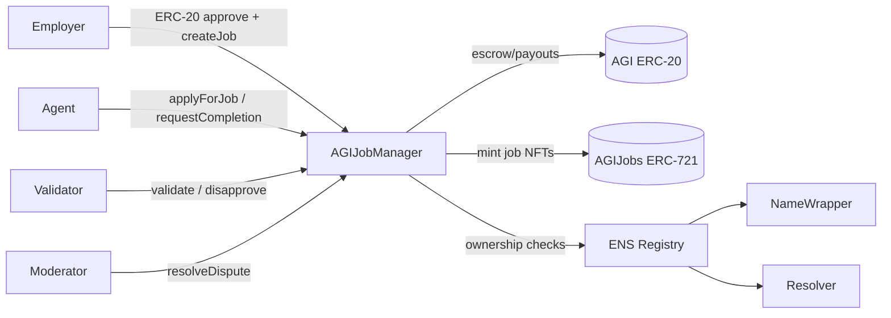
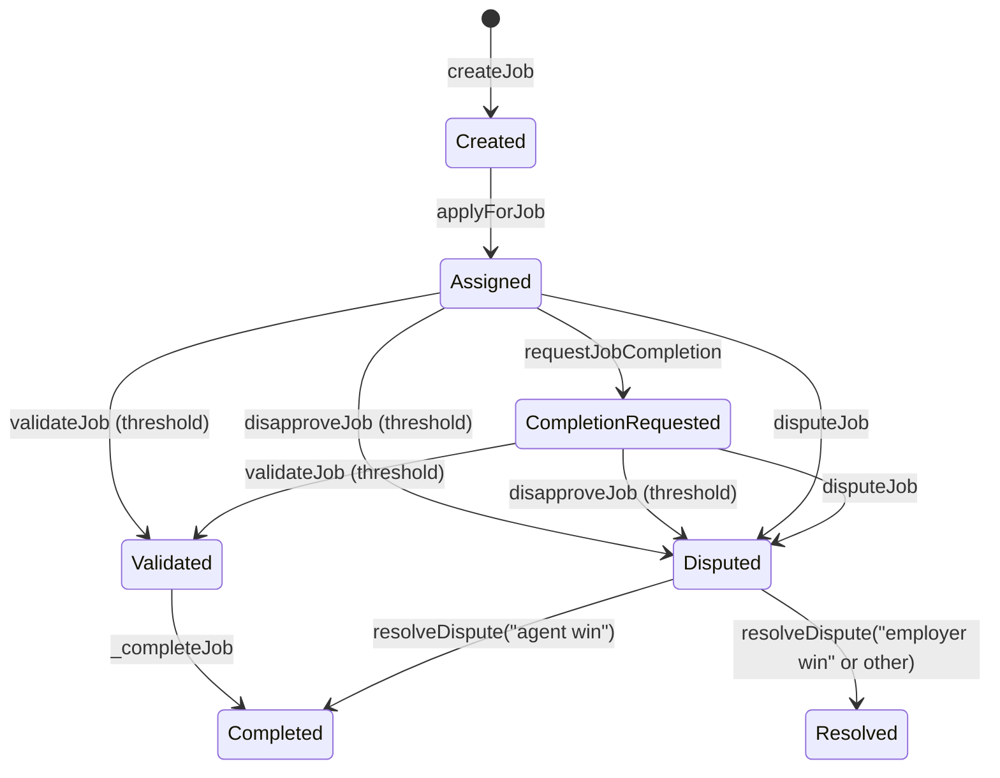

# AGIJobManager

**AGIJobManager** is a single-contract escrow and workflow system for employer → agent jobs, validator review, dispute resolution, reputation tracking, and job NFT issuance on Ethereum-compatible networks.

> ⚠️ **Experimental / research system.** This repository is provided for research and integration testing. Exercise production caution, perform your own reviews, and treat on-chain parameters and trust assumptions explicitly.

## Quick links
- Contract source: [`contracts/AGIJobManager.sol`](contracts/AGIJobManager.sol)
- [How to Deploy (Truffle)](#how-to-deploy-truffle)
- [How to Test](#how-to-test)
- [Security](#security)
- Deployed v0 (mainnet, legacy reference only): <https://etherscan.io/address/0x0178b6bad606aaf908f72135b8ec32fc1d5ba477>
- Docs folder: [`docs/`](docs/)

## What it is / What it isn’t
**What it is**
- **Escrowed job manager**: employers fund ERC-20 escrow; payouts happen on completion or dispute outcome.
- **Assignment + validation workflow**: agents are assigned, validators approve/disapprove, disputes can be resolved by moderators.
- **On-chain reputation**: agents and validators accrue reputation points based on payouts and completion timing.
- **Job NFTs + marketplace**: ERC-721 job NFTs are minted on completion and can be listed/purchased within the contract.
- **Eligibility gates**: agent/validator authorization uses Merkle roots and/or ENS ownership checks.

**What it isn’t**
- **Not an identity registry** or universal reputation standard.
- **Not a permissionless validator marketplace**; eligibility is gated by allowlists or ENS ownership.
- **Not a general NFT marketplace**; listings are for AGIJobManager-minted job NFTs only.

## Key concepts
### Roles
- **Owner**: administrative control (pause, parameter updates, allowlists, moderators, token address, withdrawals).
- **Moderator**: resolves disputes via canonical resolutions.
- **Employer**: creates jobs, funds escrow, can cancel pre-assignment, can dispute jobs.
- **Agent**: applies for jobs, requests completion.
- **Validator**: approves/disapproves jobs and earns validator rewards.

### Assets
- **AGI ERC-20 token**: escrow and payout currency.
- **Job NFTs (ERC-721)**: minted to the employer on completion (`AGIJobs` / `Job`).
- **AGIType NFTs**: optional ERC-721s that boost agent payout percentage.
- **Listings**: in-contract listings for job NFTs (no escrow; NFT stays with seller until purchase).

### Authorization sources
Eligibility for agents/validators comes from:
- **Merkle proof allowlists** (agentMerkleRoot / validatorMerkleRoot), or
- **ENS ownership** via **NameWrapper** with a **resolver fallback** path.

## Architecture overview


## Job lifecycle (state machine)


**State fields that change** per job:
- `assignedAgent`, `assignedAt`
- `completionRequested`
- `validatorApprovals`, `validatorDisapprovals`
- `disputed`, `completed`

## Contract interface summary (high level)
A full, function-by-function interface map lives in [`docs/AGIJobManager_Interface.md`](docs/AGIJobManager_Interface.md).

| Function | Who calls | Purpose | Key preconditions | Major side effects |
| --- | --- | --- | --- | --- |
| `createJob` | Employer | Create job + escrow payout | Not paused; payout/duration within limits; `transferFrom` succeeds | Escrows ERC-20; emits `JobCreated` |
| `applyForJob` | Agent | Assign self to job | Not paused; job exists & unassigned; eligible; not blacklisted | Sets `assignedAgent/assignedAt`; emits `JobApplied` |
| `requestJobCompletion` | Assigned agent | Submit completion request | Not paused; job exists; caller is assigned; within duration | Updates `ipfsHash`, `completionRequested`; emits `JobCompletionRequested` |
| `validateJob` | Validator | Approve job | Not paused; job assigned; eligible; no prior vote | Increments approvals; may complete job; emits `JobValidated` |
| `disapproveJob` | Validator | Disapprove job | Not paused; job assigned; eligible; no prior vote | Increments disapprovals; may dispute job; emits `JobDisapproved`/`JobDisputed` |
| `disputeJob` | Employer/Agent | Manual dispute | Not paused; job exists; not completed/disputed | Sets `disputed`; emits `JobDisputed` |
| `resolveDispute` | Moderator | Resolve dispute | Job disputed; caller is moderator | On "agent win" completes; on "employer win" refunds; emits `DisputeResolved` |
| `cancelJob` | Employer | Cancel before assignment | Job exists; caller is employer; unassigned | Refunds escrow; deletes job; emits `JobCancelled` |
| `listNFT` / `purchaseNFT` | NFT owner / buyer | List and purchase job NFTs | Listing active; price > 0 | Transfers ERC-20 + NFT; emits listing events |

### Critical events for indexers
- **`JobCreated`**: canonical job creation signal.
- **`JobApplied`**: assignment signal; sets the agent.
- **`JobCompletionRequested`**: completion intent + final IPFS hash.
- **`JobValidated` / `JobDisapproved`**: validator votes (each validator emits once).
- **`JobCompleted`**: completion + payouts + reputation updates.
- **`JobDisputed` / `DisputeResolved`**: dispute lifecycle tracking.
- **`NFTIssued` / `NFTListed` / `NFTPurchased` / `NFTDelisted`**: job NFT marketplace activity.

## Installation & local development
**Requirements**
- Node.js 18+ and npm 9+
- Truffle + Ganache (installed via `devDependencies`)

**Install + build**
```bash
npm install
npm run build
```

## How to Test
```bash
npm test
```
`npm test` runs `truffle test --network test` followed by a Node-based ABI smoke test.

## Environment configuration
Truffle loads environment variables via `dotenv`. Create a local `.env` (not committed) with the values needed for your target network.

A minimal example is provided in [`.env.example`](.env.example).

### Required for deployments
- `PRIVATE_KEYS` — comma-separated private keys (no spaces). Used by `@truffle/hdwallet-provider`.
- **One RPC source**:
  - `SEPOLIA_RPC_URL` / `MAINNET_RPC_URL` **or**
  - `ALCHEMY_KEY` / `ALCHEMY_KEY_MAIN` **or**
  - `INFURA_KEY`

### Optional (deployment tuning)
- `MAINNET_GAS`, `SEPOLIA_GAS`
- `MAINNET_GAS_PRICE_GWEI`, `SEPOLIA_GAS_PRICE_GWEI`
- `MAINNET_CONFIRMATIONS`, `SEPOLIA_CONFIRMATIONS`
- `MAINNET_TIMEOUT_BLOCKS`, `SEPOLIA_TIMEOUT_BLOCKS`
- `RPC_POLLING_INTERVAL_MS`

### Compiler configuration
- `SOLC_VERSION` (default `0.8.33`)
- `SOLC_RUNS` (default `200`)
- `SOLC_VIA_IR` (`true`/`false`)
- `SOLC_EVM_VERSION` (default `london`)

### Verification
- `ETHERSCAN_API_KEY` — required by `truffle-plugin-verify`.

## How to Deploy (Truffle)
### 1) Local development chain
Start Ganache (or any JSON-RPC dev chain) on `127.0.0.1:8545`, then run:
```bash
npx truffle migrate --network development
```

### 2) Sepolia deployment
```bash
npx truffle migrate --network sepolia
```

### 3) Mainnet deployment (use caution)
```bash
npx truffle migrate --network mainnet
```

### Contract verification (optional)
If you set `ETHERSCAN_API_KEY`:
```bash
npx truffle run verify AGIJobManager --network sepolia
```

### Troubleshooting
- **Missing RPC URL**: set `SEPOLIA_RPC_URL` / `MAINNET_RPC_URL`, or `ALCHEMY_KEY` / `INFURA_KEY`.
- **Missing private keys**: set `PRIVATE_KEYS` (comma-separated, no spaces).
- **Nonce/gas errors**: adjust `*_GAS` or `*_GAS_PRICE_GWEI` values.
- **Verification failures**: confirm `ETHERSCAN_API_KEY`, the network name, and that the contract was deployed with the same compiler settings.
- **Insufficient funds**: ensure the deployer address is funded for the target chain.

## Security
### Trust model
- **Owner powers**: pause core flows, change token address, tune parameters, manage allowlists, add moderators, and withdraw ERC-20 funds.
- **Moderator powers**: resolve disputes using canonical resolution strings.

### Hardenings vs. the original deployed v0
The repo’s regression tests document safety improvements over v0 (deployed at the address linked above), including:
- Blocking phantom job ID takeovers (non-existent jobs revert).
- Blocking double-completion flows after disputes.
- Avoiding division-by-zero on zero-validator agent wins.
- Enforcing single-vote per validator (no approve+disapprove).
- Checking ERC-20 `transfer` / `transferFrom` return values.

### Responsible disclosure
See [SECURITY.md](SECURITY.md).

## Project structure
```
contracts/          # Solidity source (AGIJobManager.sol)
migrations/         # Truffle deployment scripts
scripts/            # Utility scripts (e.g., ERC-8004 adapter tooling)
integrations/       # Integration code (ERC-8004 adapter)
test/               # Regression + ABI smoke tests
build/              # Truffle artifacts (generated after build)
docs/               # Extended contract docs, operator guide, security notes
```

## Versioning & compatibility
- **Solidity compiler**: configured in `truffle-config.js` (default `0.8.33`) while the contract uses `pragma solidity ^0.8.17`.
- **Optimizer**: enabled with `SOLC_RUNS` (default `200`); `SOLC_VIA_IR` toggles via-IR compilation.
- **EVM target**: `SOLC_EVM_VERSION` (default `london`).

Bytecode size and optimizer settings matter for mainnet deployments; adjust via env vars if needed.

## Additional documentation
- [Contract overview](docs/AGIJobManager.md)
- [Interface reference (full ABI)](docs/AGIJobManager_Interface.md)
- [Operator guide](docs/AGIJobManager_Operator_Guide.md)
- [Security considerations](docs/AGIJobManager_Security.md)
- [ERC-8004 integration](docs/ERC8004.md)
- [Regression suite](docs/REGRESSION_TESTS.md)

## Contributing
No CONTRIBUTING.md is present in this repository. If you plan to contribute, please open an issue to align on scope and expectations first.

## License
[MIT](LICENSE)
