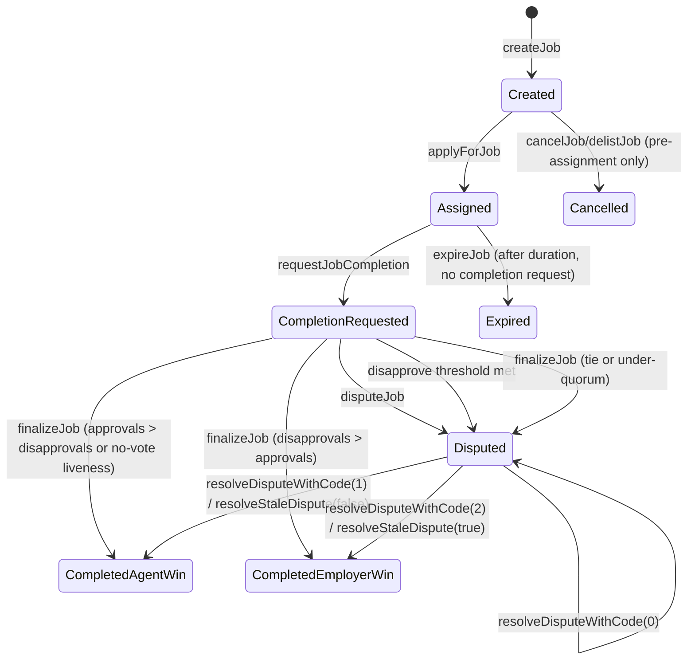
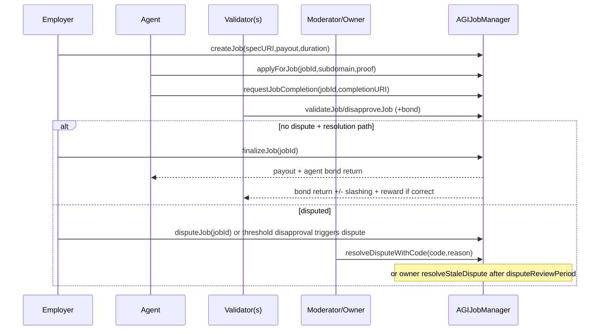
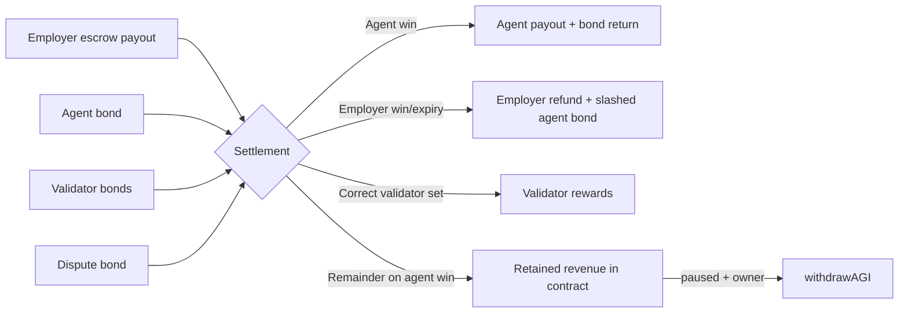

# AGIJobManager Deep Reference

## Job lifecycle

## Economic flows

| Flow | Source | Destination | Trigger |
|---|---|---|---|
| Escrow deposit | Employer | Contract (`lockedEscrow += payout`) | `createJob` |
| Agent bond | Agent | Contract (`lockedAgentBonds += bond`) | `applyForJob` |
| Validator bond | Each validator | Contract (`lockedValidatorBonds += bond`) | first vote stores per-job bond, every voter posts same amount |
| Dispute bond | Disputant (agent/employer) | Contract (`lockedDisputeBonds += bond`) | `disputeJob` |
| Agent-win settlement | Escrow | Agent payout + validator budget + retained remainder | `_completeJob` |
| Employer-win settlement | Escrow | Employer refund (less validator budget if validators exist) | `_refundEmployer` |
| Retained revenue | Escrow remainder | stays in contract | `_completeJob` emits `PlatformRevenueAccrued` |
| Owner treasury withdrawal | Contract free balance | Owner | `withdrawAGI` when paused and only up to `withdrawableAGI()` |

## Invariants and guardrails
- Escrow solvency: withdrawals must not reduce below locked totals (`lockedEscrow + locked*Bonds`).
- Identity rewiring setters that affect trust roots/token require empty locked balances (`_requireEmptyEscrow`) and are blocked after `lockIdentityConfiguration`.
- Settlement kill-switch: `settlementPaused` blocks settlement-sensitive paths via `whenSettlementNotPaused`.
- Pause semantics: `whenNotPaused` blocks new participation actions; some settlement operations intentionally remain available.
- ENS hooks are non-blocking best-effort (`_callEnsJobPagesHook`).

## Event reference (operations-focused)

| Event | Emitted when | Indexed fields | Monitor for |
|---|---|---|---|
| `JobCreated` | new escrow created | `jobId`, `payout`, `duration` | intake volume, large escrow alerts |
| `JobApplied` | agent assignment | `jobId`, `agent` | assignment liveness |
| `JobCompletionRequested` | completion requested | `jobId`, `agent` | review window start |
| `JobValidated` / `JobDisapproved` | validator vote | `jobId`, `validator` | turnout, abnormal vote patterns |
| `JobDisputed` | dispute opened | `jobId`, `disputant` | incident workflow trigger |
| `DisputeResolvedWithCode` | moderator action | `jobId`, `resolver`, `resolutionCode` | policy/audit trail |
| `JobCompleted` | terminal agent-win or employer-win via completion path | `jobId`, `agent`, `reputationPoints` | settlement completion |
| `JobExpired` / `JobCancelled` | terminal expiry/cancel | indexed job/employer/payout | stale jobs / pre-assignment cancellations |
| `PlatformRevenueAccrued` | retained amount booked | `jobId`, `amount` | treasury accounting |
| `AGIWithdrawn` | owner withdrew treasury | `to`, `amount`, `remainingWithdrawable` | privileged treasury action |
| `SettlementPauseSet` | settlement gate changed | `setter`, `paused` | emergency state |
| `EnsHookAttempted` | ENS hook attempted | `hook`, `jobId`, `target` | ENS integration health |

## Error reference

| Error | Meaning | Common causes |
|---|---|---|
| `NotModerator` | caller lacks moderator role | calling dispute resolution as non-moderator |
| `NotAuthorized` | caller not eligible for action | role/ownership proof failure, burn fuses by non-owner |
| `Blacklisted` | caller blacklisted | agent/validator blacklists enabled |
| `InvalidParameters` | bad input | zero/oversized values, invalid URI, bad config bounds |
| `InvalidState` | state-machine violation | wrong lifecycle stage, window not elapsed, repeated actions |
| `JobNotFound` | missing job id | unknown/deleted job ID |
| `ValidatorLimitReached` | validator cap reached | > `MAX_VALIDATORS_PER_JOB` attempts |
| `InvalidValidatorThresholds` | invalid threshold config | approvals/disapprovals exceed max or sum too high |
| `IneligibleAgentPayout` | agent lacks eligible AGI type | no qualifying NFT payout tier |
| `InsufficientWithdrawableBalance` | owner withdraw too large | requested amount > `withdrawableAGI()` |
| `InsolventEscrowBalance` | accounting inconsistency | token balance < locked totals |
| `ConfigLocked` | identity config frozen | calling `whenIdentityConfigurable` setter after lock |
| `SettlementPaused` | settlement guard active | protected function called while paused flag is true |
| `DeprecatedParameter` | deprecated setter called | `setAdditionalAgentPayoutPercentage` |

## Operational notes
1. **Emergency freeze**: call `pause()` and (if needed) `setSettlementPaused(true)`.
2. **Keep exits intentional**: `pause()` blocks intake; `settlementPaused` blocks settlement/dispute actions.
3. **Treasury withdrawal preconditions**: `withdrawAGI` requires `pause()==true` and `settlementPaused==false`.
4. **Safe shutdown posture**: pause, wait/resolve open disputes, verify lock ledgers, then withdraw only `withdrawableAGI()`.
