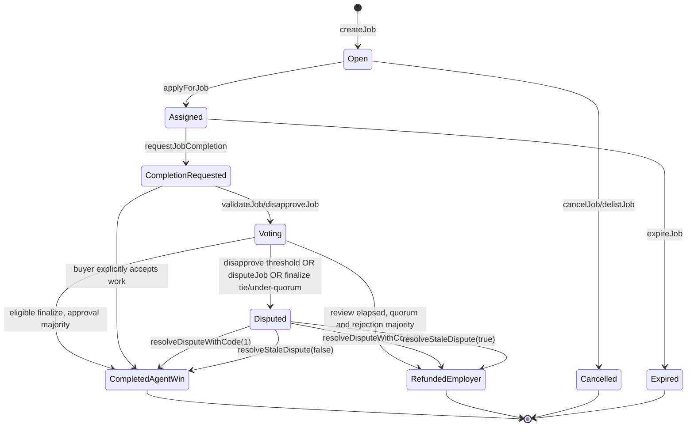

# AGIJobManager Deep Reference

> Current guide for this source checkout. See [release identity and deployment commands](RELEASE_GUIDE.md).

Primary source: [`contracts/AGIJobManager.sol`](../contracts/AGIJobManager.sol). Native USDC funds every escrow, reward and bond; ETH pays transaction gas. The deployed token and fixed 30%/10% gross-cost shares are immutable. Recipient wallets can rotate only with intake paused and all live job escrow and bonds zero; see [owner controls](OWNER_CONTROLS.md).

Assignment is immediate on the first successful eligible application. Approval votes do not automatically settle: someone must call finalization or dispute resolution. The validator budget (1–60%, default 8%) is fixed at posting; agent and validator bonds are fixed at assignment and first vote respectively. The approval challenge must strictly elapse once latched, even if the full review window ends sooner.

## Job lifecycle

```mermaid
stateDiagram-v2
    [*] --> Open: createJob
    Open --> Assigned: applyForJob
    Open --> Cancelled: cancelJob/delistJob

    Assigned --> CompletionRequested: requestJobCompletion
    Assigned --> Expired: expireJob

    CompletionRequested --> Voting: validateJob/disapproveJob
    Voting --> Disputed: disapprove threshold OR disputeJob OR finalize tie/under-quorum
    Voting --> CompletedAgentWin: eligible finalize, approval majority
    Voting --> RefundedEmployer: review elapsed, quorum and rejection majority
    CompletionRequested --> CompletedAgentWin: buyer explicitly accepts work

    Disputed --> CompletedAgentWin: resolveDisputeWithCode(1)
    Disputed --> RefundedEmployer: resolveDisputeWithCode(2)
    Disputed --> CompletedAgentWin: resolveStaleDispute(false)
    Disputed --> RefundedEmployer: resolveStaleDispute(true)

    CompletedAgentWin --> [*]
    RefundedEmployer --> [*]
    Cancelled --> [*]
    Expired --> [*]
```

### Core settlement sequence

```mermaid
sequenceDiagram
    participant E as Employer
    participant A as Agent
    participant V as Validators
    participant M as AGIJobManager

    E->>M: createJob(jobSpecURI,payout,duration,details)
    A->>M: applyForJob(jobId, subdomain, proof) + agent bond
    A->>M: requestJobCompletion(jobId, completionURI)
    loop Review window
      V->>M: validateJob/disapproveJob + validator bond
    end

    alt No dispute and finalizable
      E->>M: finalizeJob(jobId), callable by anyone
      alt quorum approval majority or explicit buyer acceptance
        M-->>V: settle validator rewards/slash
        Note over M: Pay 30% and 10% wallets
        M-->>A: remaining USDC + bond return
      else disapprovals dominate
        M-->>E: full escrow refund; reviewer rewards use forfeited collateral
      end
    else Disputed
      Note over E,M: Moderator resolves directly with typed code 1 or 2
    end
```

### Dispute and stale-dispute paths

- `disputeJob`: employer or assigned agent can dispute after submission through the displayed settlement cutoff, before settlement and while undisputed; dispute bond is transferred and locked.
- `resolveDisputeWithCode`: moderators resolve to agent win (`1`), employer win (`2`), or no-action (`0`, dispute remains active).
- `resolveStaleDispute`: owner can resolve an active dispute strictly after `getJobDeadlines(jobId).ownerResolutionAfter`, including settlement-pause extensions.

## Economic flows

### Funds and lock buckets

| Bucket | Increases when | Decreases when |
|---|---|---|
| `lockedEscrow` | `createJob` payout transfer | Successful settlement, cancellation, expiry or refund |
| `lockedAgentBonds` | `applyForJob` agent bond | Return or forfeiture under the outcome rules |
| `lockedValidatorBonds` | Validator votes transfer bond | Return or slashing under the outcome rules |
| `lockedDisputeBonds` | `disputeJob` bond | Outcome distribution or neutral return |
| `lockedClaims` | Failed outgoing USDC payment becomes a reserved claim | Successful `claimUSDC(beneficiary)` retry to the original beneficiary |

### Agent-win payout decomposition

See [USDC payout distribution](USDC_PAYOUT_SPLIT.md). Pay validators using the posting-time budget (8% default), then 30% and 10% of the original cost to `wallet30` and `wallet10`, then all remaining USDC to the agent. Bond returns/slashing are accounted separately. Rounding and unused validator rewards reach the agent; no job-cost remainder is retained.

## Invariants and guardrails

- Escrow/bond solvency enforced by lock accounting and withdrawal checks.
- A job cannot be settled twice (`_requireJobUnsettled`).
- `applyForJob` restricted by allowlist or Merkle/ENS verification, blacklist checks, max active jobs per agent, and an eligible NFT credential when `jobAgentNftRequired(jobId)` is true, in addition to identity authorization; NFT scores do not alter payout percentages.
- Votes are one-per-validator-per-job and only inside `completionReviewPeriod`.
- Validator participation is hard-capped by `MAX_VALIDATORS_PER_JOB`.
- Finalization has liveness branches:
  - no votes => dispute after full review and any longer challenge,
  - tie/under-quorum => dispute.
- ENS integration is best-effort; settlement logic does not revert if hook calls fail.

## Event reference (operations-focused)

| Event | When emitted | Indexed fields | Monitor for |
|---|---|---|---|
| `JobCreated` | New job escrowed | `jobId,payout,duration` | Throughput, escrow growth |
| `JobApplied` | Agent assignment | `jobId,agent` | Assignment rate |
| `JobCompletionRequested` | Completion submitted | `jobId,agent` | Review-window SLA start |
| `JobValidated` / `JobDisapproved` | Validator votes | `jobId,validator` | Participation / vote skew |
| `JobDisputed` | Dispute activated | `jobId,disputant` | Incident trigger |
| `DisputeResolvedWithCode` | Moderator decision/no-action | `jobId,resolver,resolutionCode` | Moderator audit trail |
| `JobCompleted` | Agent-win settlement | `jobId,agent,reputationPoints` | Successful completions |
| `JobExpired` | Timeout before completion request | `jobId,employer,payout` | Liveness failures |
| `JobCancelled` | Unassigned cancellation | `jobId` | Unassigned churn |
| `JobPayoutDistributed` | Successful USDC distribution | `jobId` | Recipient payments; amounts are non-indexed data |
| `USDCWithdrawn` | Owner surplus withdrawal | `to,amount` | Unreserved USDC; remaining balance is non-indexed data |
| `SettlementPauseSet` | Settlement gate toggled | `setter,paused` | Emergency mode changes |
| `EnsHookAttempted` | Hook call attempted | `hook,jobId,target` | ENS integration health |

## Custom error reference

| Error | Meaning | Typical cause |
|---|---|---|
| `NotModerator` | Caller is not moderator | dispute resolution by unauthorized account |
| `NotAuthorized` | Caller not eligible | role/ownership checks fail |
| `Blacklisted` | Caller blocked | blacklisted agent/validator |
| `InvalidParameters` | Bad input/param | out-of-range percentages, zero addresses, invalid URIs |
| `InvalidState` | Wrong state/time | duplicate votes, early finalize, invalid transitions |
| `JobNotFound` | Job not initialized | bad job id |
| `TransferFailed` | token transfer helper failure | non-compliant token / transfer failure |
| `ValidatorLimitReached` | max validators hit | additional vote after cap |
| `InvalidValidatorThresholds` | thresholds violate cap constraints | approvals/disapprovals > max or sum > max |
| `IneligibleAgentPayout` | Job requires an enabled AGI-type NFT credential | Read `jobAgentNftRequired(jobId)` and check the approved collection balance |
| `InsufficientWithdrawableBalance` | owner withdraw request too high | amount > `withdrawableUSDC` |
| `InsolventEscrowBalance` | accounting shortfall | token balance < locked totals |
| `ConfigLocked` | identity config frozen | setters used after `lockIdentityConfiguration` |
| `SettlementPaused` | settlement gate active | calling settlement-gated method while paused |

## Operational notes: `pause` vs `settlementPaused`

- `pause` (`Pausable`) blocks `whenNotPaused` entrypoints (create/apply) but does not block all settlement-related paths.
- `settlementPaused` blocks methods with `whenSettlementNotPaused` (including create/apply, completion, votes, finalize/cancel/expire, dispute/resolution, and USDC withdrawal).
- `withdrawUSDC` additionally requires `paused == true`, so treasury withdrawal is only possible during paused mode and while settlement is not paused.

### Safe shutdown sequence

1. `pause()` to stop new activity.
2. Optionally keep `settlementPaused=false` to let existing jobs settle.
3. Reconcile lock buckets and run `withdrawableUSDC()` checks.
4. Use `setSettlementPaused(true)` only for hard incident freeze.
