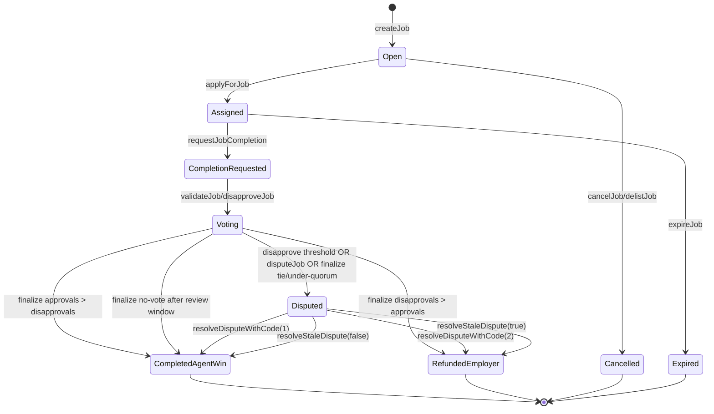
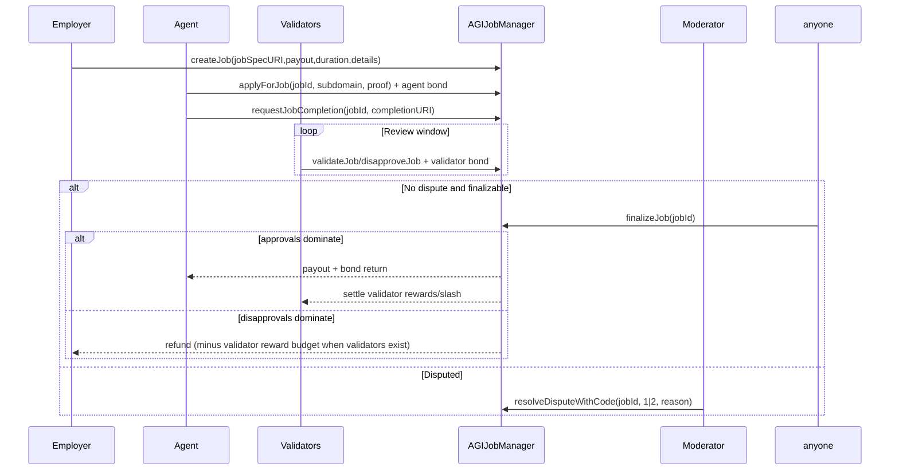
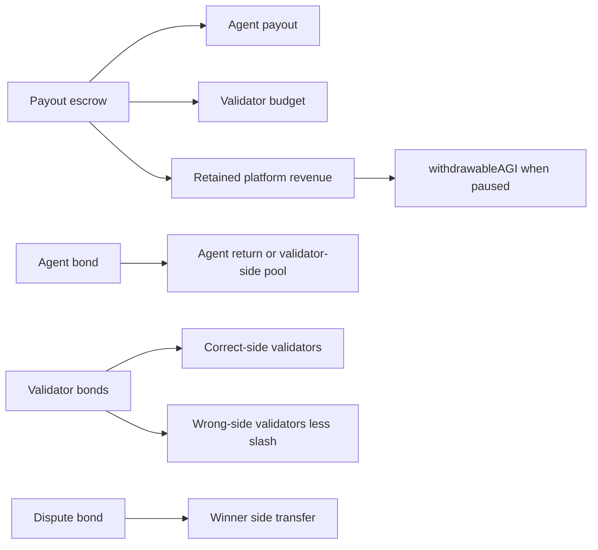

# AGIJobManager Deep Reference

Primary source: `contracts/AGIJobManager.sol`.

## Job lifecycle

### Core settlement sequence

### Dispute and stale-dispute paths

- `disputeJob`: employer or assigned agent can dispute during completion review window; dispute bond is transferred and locked.
- `resolveDisputeWithCode`: moderators resolve to agent win (`1`), employer win (`2`), or no-action (`0`, dispute remains active).
- `resolveStaleDispute`: owner can resolve an active dispute after `disputeReviewPeriod` has elapsed.

## Economic flows

### Funds and lock buckets

| Bucket | Increases when | Decreases when |
|---|---|---|
| `lockedEscrow` | `createJob` payout transfer | settlement/cancel/expire via `_releaseEscrow` |
| `lockedAgentBonds` | `applyForJob` agent bond | `_settleAgentBond` |
| `lockedValidatorBonds` | validator votes transfer bond | `_settleValidators` |
| `lockedDisputeBonds` | `disputeJob` bond | `_settleDisputeBond` |

### Agent-win payout decomposition

- `validatorBudget = payout * validationRewardPercentage / 100`
- `agentPayout = payout * agentPayoutPct / 100`
- `retained = payout - agentPayout - validatorBudget` (emits `PlatformRevenueAccrued`; retained stays in contract).

### `withdrawableAGI`

`withdrawableAGI = agiToken.balanceOf(this) - (lockedEscrow + lockedValidatorBonds + lockedAgentBonds + lockedDisputeBonds)`; if balance is below locked total, call reverts with `InsolventEscrowBalance`.

`withdrawAGI` requires:
- owner only,
- `whenSettlementNotPaused`,
- `whenPaused`,
- amount > 0,
- amount <= `withdrawableAGI`.

## Invariants and guardrails

- Escrow/bond solvency enforced by lock accounting and withdrawal checks.
- A job cannot be settled twice (`_requireJobUnsettled`).
- `applyForJob` restricted by allowlist or Merkle/ENS verification, blacklist checks, max active jobs per agent, and non-zero eligible payout profile.
- Votes are one-per-validator-per-job and only inside `completionReviewPeriod`.
- Validator participation is hard-capped by `MAX_VALIDATORS_PER_JOB`.
- Finalization has liveness branches:
  - no votes => deterministic agent win after review period,
  - tie/under-quorum => dispute.
- ENS integration is best-effort; settlement logic does not revert if hook calls fail.

## Event reference (operations-focused)

| Event | When emitted | Indexed fields | Monitor for |
|---|---|---|---|
| `JobCreated` | New job escrowed | `jobId,payout,duration` | Throughput, escrow growth |
| `JobApplied` | Agent assignment | `jobId,agent` | Assignment rate |
| `JobCompletionRequested` | Completion submitted | `jobId,agent` | Review-window SLA start |
| `JobValidated` / `JobDisapproved` | Validator votes | `jobId,validator` | Participation / vote skew |
| `JobDisputed` | Dispute activated | `jobId,disputant` | Incident trigger |
| `DisputeResolvedWithCode` | Moderator decision/no-action | `jobId,resolver,resolutionCode` | Moderator audit trail |
| `JobCompleted` | Agent-win settlement | `jobId,agent,reputationPoints` | Successful completions |
| `JobExpired` | Timeout before completion request | `jobId,employer,payout` | Liveness failures |
| `JobCancelled` | Unassigned cancellation | `jobId` | Unassigned churn |
| `PlatformRevenueAccrued` | Agent-win retained remainder | `jobId,amount` | Treasury accrual |
| `AGIWithdrawn` | Owner treasury withdrawal | `to,amount,remainingWithdrawable` | Governance-sensitive movement |
| `SettlementPauseSet` | Settlement gate toggled | `setter,paused` | Emergency mode changes |
| `EnsHookAttempted` | Hook call attempted | `hook,jobId,target` | ENS integration health |

## Custom error reference

| Error | Meaning | Typical cause |
|---|---|---|
| `NotModerator` | Caller is not moderator | dispute resolution by unauthorized account |
| `NotAuthorized` | Caller not eligible | role/ownership checks fail |
| `Blacklisted` | Caller blocked | blacklisted agent/validator |
| `InvalidParameters` | Bad input/param | out-of-range percentages, zero addresses, invalid URIs |
| `InvalidState` | Wrong state/time | duplicate votes, early finalize, invalid transitions |
| `JobNotFound` | Job not initialized | bad job id |
| `TransferFailed` | token transfer helper failure | non-compliant token / transfer failure |
| `ValidatorLimitReached` | max validators hit | additional vote after cap |
| `InvalidValidatorThresholds` | thresholds violate cap constraints | approvals/disapprovals > max or sum > max |
| `IneligibleAgentPayout` | no eligible AGI type payout | agent has no qualifying NFT balance |
| `InsufficientWithdrawableBalance` | owner withdraw request too high | amount > `withdrawableAGI` |
| `InsolventEscrowBalance` | accounting shortfall | token balance < locked totals |
| `ConfigLocked` | identity config frozen | setters used after `lockIdentityConfiguration` |
| `SettlementPaused` | settlement gate active | calling settlement-gated method while paused |
| `DeprecatedParameter` | intentionally removed setter | `setAdditionalAgentPayoutPercentage` |

## Operational notes: `pause` vs `settlementPaused`

- `pause` (`Pausable`) blocks `whenNotPaused` entrypoints (e.g., create/apply/vote/dispute) but does not block all settlement-related paths.
- `settlementPaused` blocks methods with `whenSettlementNotPaused` (e.g., finalize/cancel/expire/dispute resolution/withdraw).
- `withdrawAGI` additionally requires `paused == true`, so treasury withdrawal is only possible during paused mode and while settlement is not paused.

### Safe shutdown sequence

1. `pause()` to stop new activity.
2. Optionally keep `settlementPaused=false` to let existing jobs settle.
3. Reconcile lock buckets and run `withdrawableAGI()` checks.
4. Use `setSettlementPaused(true)` only for hard incident freeze.
