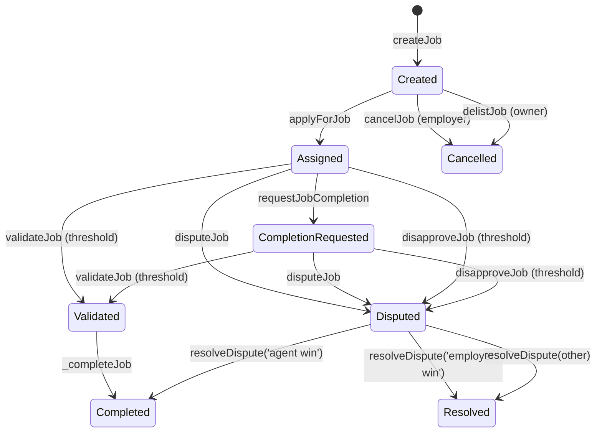
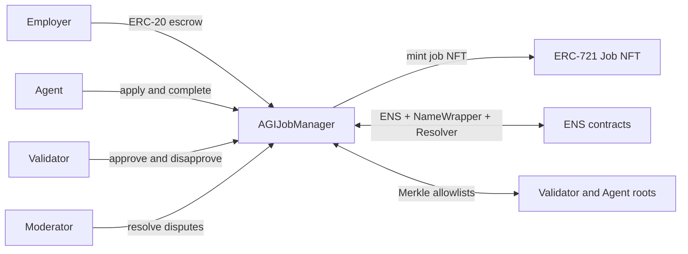

# AGIJobManager contract specification

This document describes the on-chain behavior of `AGIJobManager` as implemented in `contracts/AGIJobManager.sol`. It is descriptive only and should be read alongside the ABI-derived interface reference.

## Contents
- [Overview](#overview)
- [Roles and permissions](#roles-and-permissions)
- [Lifecycle state machine](#lifecycle-state-machine)
- [State variables and flags](#state-variables-and-flags)
- [Escrow and payout mechanics](#escrow-and-payout-mechanics)
- [Eligibility and identity checks](#eligibility-and-identity-checks)
- [NFT issuance and marketplace](#nft-issuance-and-marketplace)
- [Architecture overview](#architecture-overview)
- [References](#references)

## Overview
AGIJobManager coordinates employer-funded jobs, agent assignment, validator review, dispute resolution, reputation updates, and job NFT issuance. The contract holds ERC‑20 escrow for job payouts and mints an ERC‑721 to the employer when a job completes.

## Roles and permissions
- **Owner**: pause/unpause flows, update parameters, change ERC‑20 address, manage allowlists and blacklists, assign moderators, add AGI types, withdraw escrowed ERC‑20.
- **Moderator**: resolves disputes via `resolveDispute`.
- **Employer**: creates jobs, disputes jobs, cancels before assignment.
- **Agent**: applies to eligible jobs, requests completion.
- **Validator**: validates or disapproves eligible jobs.

Refer to the ABI-derived access map in [`Interface.md`](Interface.md).

## Lifecycle state machine

## State variables and flags
Job state is encoded in the following fields:
- `assignedAgent` and `assignedAt` indicate assignment.
- `completionRequested` flips to true when the agent submits a completion request.
- `validatorApprovals` and `validatorDisapprovals` track votes.
- `disputed` and `completed` represent terminal or contested outcomes.

These flags are observable via the public `jobs(jobId)` getter and lifecycle events.

### Read-only helpers
- `getJobStatus(jobId)` returns `(completed, completionRequested, ipfsHash)` for lightweight polling.
- `jobs(jobId)` returns the fixed fields of the `Job` struct (it omits the internal validator list and approval mappings).

## Escrow and payout mechanics
- **Escrow on creation**: `createJob` pulls the payout from the employer via `transferFrom`.
- **Agent payout**: on completion, the agent receives `job.payout * agentPayoutPercentage / 100`, where `agentPayoutPercentage` is the highest AGI type percentage owned by the agent. If no AGI types apply, this can be zero.
- **Validator payout**: when validators exist, `validationRewardPercentage` of the payout is split equally across all validators who voted (approvals and disapprovals both append to the validator list).
- **Residual funds**: any unallocated balance remains in the contract and is withdrawable by the owner.
- **Refunds**: `cancelJob` and `delistJob` refund the employer before assignment; `resolveDispute` with employer win refunds and closes the job.

## Eligibility and identity checks
Agents and validators must either:
- be explicitly allowlisted (`additionalAgents` or `additionalValidators`), or
- pass `_verifyOwnership`, which checks Merkle proofs or ENS ownership through NameWrapper and Resolver fallback paths.

If the ENS or NameWrapper calls fail, the contract emits `RecoveryInitiated` for observability and continues evaluation.

## NFT issuance and marketplace
- **Minting**: completion mints a job NFT to the employer, with `tokenURI = baseIpfsUrl + '/' + job.ipfsHash`.
- **Listings**: NFT owners can list tokens without escrow; listings live in the `listings` mapping.
- **Purchases**: `purchaseNFT` transfers ERC‑20 from buyer to seller and transfers the NFT.

## Architecture overview

## References
- **Interface reference (ABI-derived)**: [`Interface.md`](Interface.md)
- **Deployment guide**: [`Deployment.md`](Deployment.md)
- **Security model**: [`Security.md`](Security.md)
- **Integrations overview**: [`Integrations.md`](Integrations.md)
