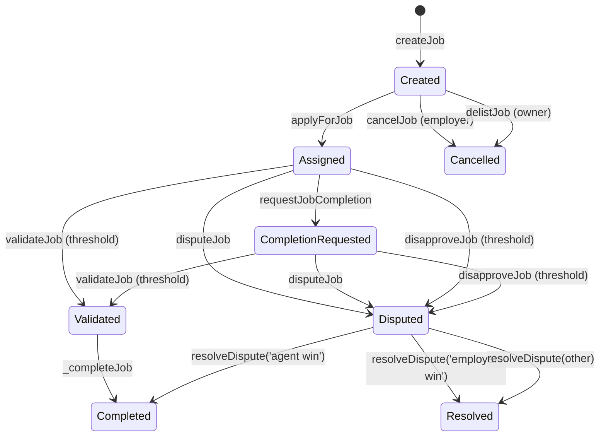

# AGIJobManager contract specification

This document describes the on-chain behavior of `AGIJobManager` as implemented in `contracts/AGIJobManager.sol`. It is descriptive only and should be read alongside the ABI-derived interface reference.

## Contents
- [Overview](#overview)
- [Roles and permissions](#roles-and-permissions)
- [Lifecycle state machine](#lifecycle-state-machine)
- [State variables and flags](#state-variables-and-flags)
- [Escrow and payout mechanics](#escrow-and-payout-mechanics)
- [Validation and dispute flow](#validation-and-dispute-flow)
- [Reputation mechanics](#reputation-mechanics)
- [Eligibility and identity checks](#eligibility-and-identity-checks)
- [NFT issuance and marketplace](#nft-issuance-and-marketplace)
- [Events](#events)
- [Error handling](#error-handling)
- [Invariants and constraints](#invariants-and-constraints)
- [References](#references)

## Overview
AGIJobManager coordinates employer-funded jobs, agent assignment, validator review, dispute resolution, reputation updates, and job NFT issuance. The contract holds ERC‑20 escrow for job payouts and mints an ERC‑721 to the employer when a job completes.

## Roles and permissions
| Role | Capabilities |
| --- | --- |
| **Owner** | Pause/unpause flows, update parameters, change ERC‑20 address, manage allowlists/blacklists, assign moderators, add AGI types, withdraw escrowed ERC‑20. |
| **Moderator** | Resolve disputes via `resolveDispute`. |
| **Employer** | Create jobs, cancel before assignment, dispute jobs, receive job NFTs. |
| **Agent** | Apply to eligible jobs, request completion, earn payouts and reputation. |
| **Validator** | Validate or disapprove jobs, earn payouts and reputation when voting. |

Refer to the ABI-derived access map in [`Interface.md`](Interface.md).

## Lifecycle state machine

## State variables and flags
Job state is encoded in the following fields:
- `assignedAgent` and `assignedAt` indicate assignment.
- `completionRequested` flips to true when the agent submits a completion request.
- `validatorApprovals` and `validatorDisapprovals` track votes.
- `disputed` and `completed` represent terminal or contested outcomes.

These flags are observable via the public `jobs(jobId)` getter and lifecycle events.

### Read-only helpers
- `getJobStatus(jobId)` returns `(completed, completionRequested, ipfsHash)` for lightweight polling.
- `jobs(jobId)` returns the fixed fields of the `Job` struct (it omits the internal validator list and approval mappings).

## Escrow and payout mechanics
- **Escrow on creation**: `createJob` transfers the payout from employer to the contract via `transferFrom`.
- **Agent payout**: on completion, the agent receives `job.payout * agentPayoutPercentage / 100`, where `agentPayoutPercentage` is the highest AGI type percentage owned by the agent (may be zero).
- **Validator payout**: if validators voted, `validationRewardPercentage` of the payout is split equally across all validators who voted (approvals and disapprovals both append to the validator list).
- **Residual funds**: any unallocated balance remains in the contract and is withdrawable by the owner.
- **Refunds**: `cancelJob` and `delistJob` refund the employer before assignment; `resolveDispute` with employer win refunds and closes the job.

## Validation and dispute flow
- `validateJob` increments approval count, records validator participation, and auto-completes when approvals reach the required threshold.
- `disapproveJob` increments disapproval count, records validator participation, and flips `disputed` when disapprovals reach the required threshold.
- `disputeJob` can be called by employer or assigned agent (if not already disputed or completed).
- `resolveDispute` accepts any resolution string but only two canonical strings trigger on-chain actions:
  - `agent win` → `_completeJob`
  - `employer win` → employer refund + job closed

## Reputation mechanics
- **Agent reputation**: derived from payout and completion time via `calculateReputationPoints`, then stored through `enforceReputationGrowth` (diminishing returns with a cap).
- **Validator reputation**: derived from agent reputation via `calculateValidatorReputationPoints` and updated for all validators who voted.
- **Premium access**: `canAccessPremiumFeature` gates on `premiumReputationThreshold`.

## Eligibility and identity checks
Agents and validators must either:
- be explicitly allowlisted (`additionalAgents` or `additionalValidators`), or
- pass `_verifyOwnership`, which checks Merkle proofs or ENS ownership through NameWrapper and Resolver fallback paths.

If ENS or NameWrapper calls fail, the contract emits `RecoveryInitiated` for observability and continues evaluation.

## NFT issuance and marketplace
- **Minting**: completion mints a job NFT to the employer, with `tokenURI = baseIpfsUrl + '/' + job.ipfsHash`.
- **Listings**: NFT owners can list tokens without escrow; listings live in the `listings` mapping.
- **Purchases**: `purchaseNFT` transfers ERC‑20 from buyer to seller and transfers the NFT.

## Events
High-signal events to index:
- **Lifecycle**: `JobCreated`, `JobApplied`, `JobCompletionRequested`, `JobValidated`, `JobDisapproved`, `JobDisputed`, `DisputeResolved`, `JobCompleted`, `JobCancelled`.
- **Reputation**: `ReputationUpdated` (agents and validators).
- **NFT marketplace**: `NFTIssued`, `NFTListed`, `NFTPurchased`, `NFTDelisted`.
- **Access signals**: `OwnershipVerified`, `RecoveryInitiated`.

See [`Interface.md`](Interface.md) for the complete ABI-derived list.

## Error handling
Custom errors and their intent:
- `NotModerator`: caller is not a moderator.
- `NotAuthorized`: caller lacks required role/ownership for the action.
- `Blacklisted`: caller is explicitly blacklisted.
- `InvalidParameters`: zero values, out-of-range percentages, or invalid constructor updates.
- `InvalidState`: invalid lifecycle transition (e.g., reapply, double complete, dispute after completion).
- `JobNotFound`: non-existent job ID.
- `TransferFailed`: ERC‑20 `transfer`/`transferFrom` returned false.

## Invariants and constraints
- Job IDs must exist (`JobNotFound`) before use.
- Jobs cannot be reassigned after `assignedAgent` is set.
- Completed jobs cannot be re-completed or re-disputed.
- Validator approvals and disapprovals are mutually exclusive per validator per job.
- `maxJobPayout` and `jobDurationLimit` cap job creation inputs.

## References
- **Interface reference (ABI-derived)**: [`Interface.md`](Interface.md)
- **Deployment guide**: [`Deployment.md`](Deployment.md)
- **Security model**: [`Security.md`](Security.md)
- **Integrations overview**: [`Integrations.md`](Integrations.md)
