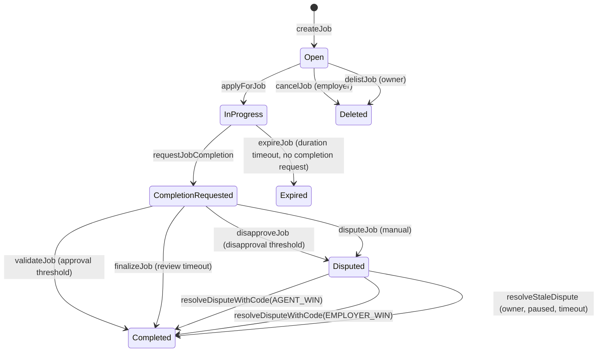

# AGIJobManager Contract Specification

This document provides a code‑accurate overview of the `AGIJobManager` contract. It targets engineers, integrators, reviewers, and operators. The ABI‑exact reference lives in [`Interface.md`](Interface.md).

## Scope and non‑goals

**AGIJobManager is:**
- An on‑chain job escrow manager for employer‑funded work, validator approval/disapproval, and moderator dispute resolution.
- A reputation tracker for agents and validators based on job outcomes.
- An ERC‑721 job NFT issuer and minimal marketplace (list/purchase/delist) for those NFTs.
- A role‑gated system with explicit allowlists, Merkle proofs, and ENS/NameWrapper/Resolver ownership checks.

**AGIJobManager is not:**
- An on‑chain ERC‑8004 registry or identity system.
- A generalized NFT marketplace.
- A permissionless validator DAO or decentralized court.

## Contract surface (high‑level)

**Job lifecycle**
- `createJob` → employer escrows ERC‑20 payout and defines job spec.
- `applyForJob` → a single agent is assigned; agent payout % is snapshotted.
- `requestJobCompletion` → agent submits completion metadata.
- `validateJob` / `disapproveJob` → validators approve/disapprove after completion request.
- `finalizeJob` → post‑review timeout settlement when validator thresholds aren’t met.
- `disputeJob` / `resolveDisputeWithCode` / `resolveStaleDispute` → moderator or owner dispute flow.
- `cancelJob` / `delistJob` → pre‑assignment cancellation.
- `expireJob` → employer refund if duration elapses before completion request.

**Marketplace**
- `listNFT`, `purchaseNFT`, `delistNFT` for job NFTs minted by this contract.

## Roles & permissions (summary)

| Role | Capabilities | Notes |
| --- | --- | --- |
| **Owner** | Pause/unpause, manage allowlists/blacklists, set parameters, add moderators and AGI types, withdraw surplus ERC‑20, resolve stale disputes while paused. | Highly privileged; operational risk if compromised. |
| **Moderator** | Resolve disputes via `resolveDisputeWithCode` (preferred) or legacy `resolveDispute`. | Central dispute authority. |
| **Employer** | Create jobs, cancel pre‑assignment, dispute, receive job NFTs, receive refunds on expiry/employer‑win. | Funds are escrowed until resolution. |
| **Agent** | Apply for jobs, submit completion, receive payouts and reputation. | Eligibility gated by allowlists/Merkle/ENS. |
| **Validator** | Approve/disapprove completions, receive payout share and reputation. | Eligibility gated by allowlists/Merkle/ENS. |

## Data model

**Job fields (selected)**
- `employer`, `assignedAgent`, `assignedAt`
- `jobSpecURI`, `jobCompletionURI`
- `payout`, `duration`
- `completionRequested`, `completionRequestedAt`
- `validatorApprovals`, `validatorDisapprovals`, `validators[]`
- `disputed`, `disputedAt`, `completed`, `expired`, `escrowReleased`
- `agentPayoutPct` (snapshotted on assignment)

**Reputation**
- `reputation[address]` stores a diminishing‑returns score updated at settlement.

**Marketplace**
- `listings[tokenId]` stores `price`, `seller`, `isActive`.

## Job lifecycle (state machine)

## Escrow & settlement semantics

- **Funding**: `createJob` transfers the payout into the contract and increments `lockedEscrow`.
- **Agent payout**: agent receives `job.payout * agentPayoutPct / 100`, with `agentPayoutPct` snapshotted at `applyForJob` based on AGI‑type NFT holdings.
- **Validator payout**: validators split `job.payout * validationRewardPercentage / 100` equally among those who voted; if no validators voted, the agent receives the validator share.
- **Refunds**:
  - `cancelJob`/`delistJob` return escrow if no agent was assigned.
  - `expireJob` returns escrow after duration elapses with no completion request.
  - Employer‑win dispute resolution and employer‑win finalization return escrow.
- **ERC‑20 safety**: transfers must succeed and match exact amounts; fee‑on‑transfer and rebasing tokens are not supported.

## ENS / Merkle role gating

Eligibility checks accept any of the following:
- **Explicit allowlists** (`additionalAgents`, `additionalValidators`).
- **Merkle proofs** against `agentMerkleRoot` or `validatorMerkleRoot` (leaf is `keccak256(abi.encodePacked(claimant))`).
- **ENS NameWrapper ownership** of the relevant subnode.
- **ENS Resolver ownership** of the relevant subnode.

Root nodes (`clubRootNode`, `agentRootNode`, `alphaClubRootNode`, `alphaAgentRootNode`) are configured at deployment and can be updated only while no jobs exist and no escrow is locked (or permanently locked after `lockConfiguration`).

## Events

**Job lifecycle**
- `JobCreated`, `JobApplied`, `JobCompletionRequested`
- `JobValidated`, `JobDisapproved`
- `JobCompleted`, `JobFinalized`, `JobExpired`, `JobCancelled`
- `JobDisputed`, `DisputeResolved`, `DisputeResolvedWithCode`, `DisputeTimeoutResolved`

**Reputation & gating**
- `ReputationUpdated`
- `OwnershipVerified`
- `AgentBlacklisted`, `ValidatorBlacklisted`
- `MerkleRootsUpdated`, `RootNodesUpdated`

**Marketplace**
- `NFTIssued`, `NFTListed`, `NFTPurchased`, `NFTDelisted`

**Configuration**
- `EnsRegistryUpdated`, `NameWrapperUpdated`, `ConfigurationLocked`
- `CompletionReviewPeriodUpdated`, `DisputeReviewPeriodUpdated`
- `AdditionalAgentPayoutPercentageUpdated`, `AGITypeUpdated`

**Treasury**
- `RewardPoolContribution`, `AGIWithdrawn`

See [`Interface.md`](Interface.md) for the full ABI and parameter signatures.

## Custom errors

The contract uses custom errors for gas efficiency. Key errors include:
- `NotModerator`, `NotAuthorized`, `Blacklisted`
- `InvalidParameters`, `InvalidState`, `JobNotFound`
- `TransferFailed`, `InsufficientWithdrawableBalance`, `InsolventEscrowBalance`
- `ValidatorLimitReached`, `InvalidValidatorThresholds`, `ValidatorSetTooLarge`
- `IneligibleAgentPayout`, `InvalidAgentPayoutSnapshot`
- `ConfigLocked`

## Invariants & safety properties (non‑exhaustive)

- **Completion requires metadata**: an agent can only be paid and a job NFT can only be minted after a completion request exists and the completion URI is valid.
- **Escrow conservation**: payouts/refunds always release escrow and must not exceed the job payout; withdrawals are limited to `withdrawableAGI()`.
- **Single‑vote per validator**: a validator cannot both approve and disapprove the same job.
- **Validator capacity bounded**: per‑job validator list is capped by `MAX_VALIDATORS_PER_JOB`; approval/disapproval thresholds must fit within this bound.
- **Dispute gating**: disputes can only be opened after completion is requested; once disputed, validator voting no longer advances settlement.

## Integration checklist (dApp)

1. Employer approves ERC‑20 and calls `createJob`.
2. Agent proves eligibility and calls `applyForJob`.
3. Agent submits completion metadata via `requestJobCompletion`.
4. Validators approve/disapprove (`validateJob` / `disapproveJob`).
5. Moderator resolves disputes with `resolveDisputeWithCode` if needed.
6. Employer receives job NFT; index `NFTIssued` and `JobCompleted` events.
