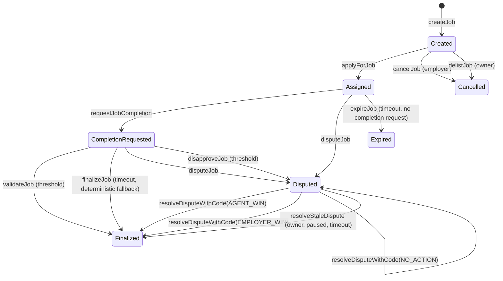

# AGIJobManager contract specification

This document describes the on-chain behavior of `AGIJobManager` as implemented in `contracts/AGIJobManager.sol`. It is descriptive only and should be read alongside the ABI‑derived interface reference.

## Contents
- [Overview](#overview)
- [Roles and permissions](#roles-and-permissions)
- [Core data structures](#core-data-structures)
- [Lifecycle state machine](#lifecycle-state-machine)
- [Escrow and payout mechanics](#escrow-and-payout-mechanics)
- [Validation and dispute flow](#validation-and-dispute-flow)
- [Reputation mechanics](#reputation-mechanics)
- [Eligibility and identity checks](#eligibility-and-identity-checks)
- [NFT issuance and marketplace](#nft-issuance-and-marketplace)
- [Reward pool contributions](#reward-pool-contributions)
- [Events](#events)
- [Error handling](#error-handling)
- [Invariants and constraints](#invariants-and-constraints)
- [References](#references)

## Overview
AGIJobManager coordinates employer‑funded jobs, agent assignment, validator review, dispute resolution, reputation updates, and job NFT issuance. It escrows ERC‑20 payouts and mints an ERC‑721 to the employer when a job completes successfully. This specification describes the *on‑chain enforcement layer* only; ERC‑8004 trust signals are consumed off‑chain and are not part of the on-chain interface.

## Roles and permissions
| Role | Capabilities |
| --- | --- |
| **Owner** | Pause/unpause flows, update parameters, change ERC‑20 address, manage allowlists/blacklists, assign moderators, add AGI types, withdraw surplus ERC‑20 (balance minus `lockedEscrow`). |
| **Moderator** | Resolve disputes via `resolveDisputeWithCode`. |
| **Employer** | Create jobs, cancel before assignment, dispute jobs, receive job NFTs. |
| **Agent** | Apply to eligible jobs, request completion, earn payouts and reputation. |
| **Validator** | Validate or disapprove jobs, earn payouts and reputation when voting. |

Refer to the ABI‑derived access map in [`Interface.md`](Interface.md).

## Core data structures

### Job
Each job is a struct containing:
- `id`, `employer`, `jobSpecURI`, `jobCompletionURI`, legacy `ipfsHash`, `payout`, `duration`, `assignedAgent`, `assignedAt`, `details`.
- State flags: `completed`, `completionRequested`, `disputed`, `expired`.
- Timestamps: `completionRequestedAt`, `disputedAt`.
- Validation: `validatorApprovals`, `validatorDisapprovals`, per‑validator `approvals` and `disapprovals`, plus the `validators` list.

Job entries are created in `createJob` and stored in `jobs(jobId)`.

### AGI types
`AGIType` entries map ERC‑721 collections to a payout percentage used for agent rewards. The agent’s **highest** applicable percentage is used to compute payouts.

### Listings
`Listing` entries represent non‑escrowed job NFT listings (tokenId, seller, price, isActive). The NFT remains in the seller’s wallet until purchase.

### Read‑only helpers
- `getJobStatus(jobId)` returns `(completed, completionRequested, statusURI)` for lightweight polling, where `statusURI` is the completion URI if present, otherwise the job spec URI.
- `getJobAgentPayoutPct(jobId)` returns the snapshotted agent payout percentage.
- `jobs(jobId)` returns the fixed fields of the `Job` struct (it omits the internal validator list and per‑validator mappings).
- `jobStatus(jobId)` returns the canonical `JobStatus` enum value for external consumers.
- `jobStatusString(jobId)` returns the human‑readable enum label.

### Canonical job status

`jobStatus(jobId)` returns a stable enum so UIs and indexers do not need to re‑derive lifecycle state.
Enum values (stable, do not reorder):

| Value | Status | Meaning |
| --- | --- | --- |
| 0 | `Deleted` | Job entry removed (`employer == address(0)`). |
| 1 | `Open` | Job exists, employer set, no assigned agent. |
| 2 | `InProgress` | Assigned agent, no completion request, not completed, not disputed. |
| 3 | `CompletionRequested` | Assigned agent requested completion. |
| 4 | `Disputed` | Dispute flag active. |
| 5 | `Completed` | Job finalized (`completed == true`). |
| 6 | `Expired` | Time‑based expiry (informational when not explicitly expired on‑chain). |

Precedence rules (applied in order):
1. If `jobId` is out of range (`jobId >= nextJobId`), revert `JobNotFound`.
2. If `completed`, return `Completed`.
3. If `employer == address(0)`, return `Deleted`.
4. If `disputed`, return `Disputed`.
5. If `assignedAgent == address(0)`, return `Open`.
6. If `completionRequested`, return `CompletionRequested`.
7. If `expired == true` **or** `block.timestamp > assignedAt + duration`, return `Expired` (informational for indexers/UI).
8. Otherwise, return `InProgress`.

Indexers and UIs should prefer `jobStatus()` over client‑side derivations to avoid drift as additional flags are added.

## Lifecycle state machine

**Finalized** means `completed = true`. An `employer win` finalizes the job *without* agent payout or NFT minting. `resolveDisputeWithCode(NO_ACTION)` only logs a reason and leaves the dispute active (in‑progress flags such as `completionRequested` remain set). Validators can call `validateJob`/`disapproveJob` only after `requestJobCompletion`. **Expired** means `expired = true` with the escrow refunded to the employer; expired jobs are terminal and cannot be completed later.

## Escrow and payout mechanics
- **Escrow on creation**: `createJob` transfers the payout from employer to the contract via `transferFrom`.
- **Agent payout**: on assignment, the agent’s payout percentage is snapshotted and stored on the job. On completion, the agent receives `job.payout * snapshottedAgentPayoutPercentage / 100`. Agents must hold an AGI‑type NFT with a nonzero payout tier at apply time; `additionalAgents` only bypass identity checks.
- **Validator payout**: when validators voted, `validationRewardPercentage` of the payout is split equally across all validators who voted (approvals and disapprovals both append to the validator list).
- **Locked escrow accounting**: `lockedEscrow` tracks total job payout escrow for unsettled jobs (currently job payouts only).
- **Residual funds**: any unallocated balance remains in the contract and is withdrawable by the owner via `withdrawAGI` while paused, which is restricted to `withdrawableAGI()` (balance minus `lockedEscrow`).
- **Refunds**: `cancelJob` and `delistJob` refund the employer before assignment; `resolveDisputeWithCode(EMPLOYER_WIN)` refunds and finalizes the job.
- **ERC‑20 compatibility**: token transfers accept ERC‑20s that return `bool` or return no data. Calls that revert, return `false`, or return malformed data revert with `TransferFailed`. Escrow deposits enforce exact amount received, so fee‑on‑transfer, rebasing, or other balance‑mutating tokens are not supported.

## Validation and dispute flow
- `validateJob` increments approval count, records validator participation, and auto‑completes when approvals reach the required threshold. It requires `completionRequested`.
- `disapproveJob` increments disapproval count, records participation, and flips `disputed` when disapprovals reach the required threshold; it requires `completionRequested`.
- Each job records at most `MAX_VALIDATORS_PER_JOB` unique validators; once the cap is reached, additional `validateJob`/`disapproveJob` calls revert.
- Owner‑set validator thresholds must each be ≤ the cap and their sum must not exceed the cap or the configuration reverts.
- `disputeJob` can be called by employer or assigned agent (if not already disputed or completed).
- `requestJobCompletion` is still allowed while disputed so agents can attach completion metadata before an agent‑win resolution.
- `finalizeJob` lets anyone finalize after `completionReviewPeriod` if the job is not disputed. The outcome is deterministic: validator thresholds are honored, silence defaults to agent completion, and otherwise approvals must strictly exceed disapprovals for agent payout (ties refund the employer).
- `resolveDisputeWithCode` accepts a typed action code and a freeform reason:
  - `NO_ACTION (0)` → log only; dispute remains active.
  - `AGENT_WIN (1)` → `_completeJob`.
  - `EMPLOYER_WIN (2)` → employer refund + `completed = true`.
- `resolveDispute` (string) is deprecated. It maps exact `agent win` / `employer win` strings to the corresponding action codes; any other string maps to `NO_ACTION`.
- `resolveStaleDispute` is an owner‑only, paused‑only escape hatch that allows settlement after `disputeReviewPeriod` if disputes would otherwise deadlock.

## Reputation mechanics
- **Agent reputation**: derived from payout and completion time via `calculateReputationPoints`, then stored through `enforceReputationGrowth` (diminishing returns with a cap).
- **Validator reputation**: derived from agent reputation via `calculateValidatorReputationPoints` and updated for all validators who voted.
- **Premium access**: `canAccessPremiumFeature` gates on `premiumReputationThreshold`.

## Eligibility and identity checks
Agents and validators must either:
- be explicitly allowlisted (`additionalAgents` or `additionalValidators`), or
- pass `_verifyOwnership`, which checks Merkle proofs or ENS ownership through NameWrapper and Resolver fallback paths.

If ENS or NameWrapper calls fail, the contract emits `RecoveryInitiated` for observability and continues evaluation.

## NFT issuance and marketplace
- **Minting**: completion mints a job NFT to the employer, with `tokenURI` pointing to the job completion metadata. The contract uses `jobCompletionURI` when set and falls back to the legacy `ipfsHash` for older jobs. Full URIs (e.g., `ipfs://...` or `https://...`) are accepted; otherwise `baseIpfsUrl` is prepended.
- **Listings**: NFT owners can list tokens without escrow; listings live in the `listings` mapping.
- **Purchases**: `purchaseNFT` transfers ERC‑20 from buyer to seller and transfers the NFT using ERC‑721 safe transfer semantics; contract buyers must implement `onERC721Received`.

Marketplace purchases rely on ERC‑721 safe transfers. If the buyer is a smart contract, it must implement
`IERC721Receiver` / `onERC721Received`, or the purchase will revert. EOAs are unaffected.

## Reward pool contributions
`contributeToRewardPool` allows any address to transfer ERC‑20 into the contract. These funds increase the contract’s balance and are withdrawable by the owner via `withdrawAGI` while paused.

## Events
High‑signal events to index:
- **Lifecycle**: `JobCreated`, `JobApplied`, `JobCompletionRequested`, `JobValidated`, `JobDisapproved`, `JobDisputed`, `DisputeResolvedWithCode`, `DisputeResolved`, `JobCompleted`, `JobCancelled`.
- **Timeouts**: `JobExpired`, `JobFinalized`, `DisputeTimeoutResolved`.
- **Reputation**: `ReputationUpdated` (agents and validators). Note that agent completion emits `ReputationUpdated` once via `enforceReputationGrowth` and again at the end of `_completeJob`.
- **NFT marketplace**: `NFTIssued`, `NFTListed`, `NFTPurchased`, `NFTDelisted`.
- **Access signals**: `OwnershipVerified`, `RecoveryInitiated`. (`RootNodeUpdated` and `MerkleRootUpdated` are defined but not emitted by current functions.)
- **Other**: `AGITypeUpdated`, `RewardPoolContribution`, `AGIWithdrawn`.
- **Parameter updates**: `CompletionReviewPeriodUpdated`, `DisputeReviewPeriodUpdated`, `AdditionalAgentPayoutPercentageUpdated`.

See [`Interface.md`](Interface.md) for the complete ABI‑derived list.

## Error handling
Custom errors and their intent:
- `NotModerator`: caller is not a moderator.
- `NotAuthorized`: caller lacks required role/ownership for the action.
- `Blacklisted`: caller is explicitly blacklisted.
- `InvalidParameters`: zero values, out‑of‑range percentages, or invalid constructor updates.
- `InvalidValidatorThresholds`: validator thresholds exceed the per‑job cap or their sum exceeds the cap.
- `InvalidState`: invalid lifecycle transition (e.g., reapply, double complete, dispute after completion).
- `IneligibleAgentPayout`: agent has a 0% payout tier at apply time.
- `InvalidAgentPayoutSnapshot`: snapshotted agent payout percentage is zero (defensive invariant).
- `InsufficientWithdrawableBalance`: withdrawal exceeds `withdrawableAGI()`.
- `InsolventEscrowBalance`: contract balance is below `lockedEscrow` (insolvency signal).
- `JobNotFound`: non‑existent job ID.
- `TransferFailed`: ERC‑20 `transfer`/`transferFrom` returned false or malformed data.
- `ValidatorLimitReached`: a validator action would exceed the per‑job cap.
- `ValidatorSetTooLarge`: settlement loops would exceed the per‑job cap.

## Invariants and constraints
- Job IDs must exist (`JobNotFound`) before use.
- Jobs cannot be reassigned after `assignedAgent` is set.
- Completed or expired jobs cannot be re‑completed or re‑disputed.
- Validator approvals and disapprovals are mutually exclusive per validator per job.
- **Escrow solvency:** the maximum configured agent payout percentage (highest `AGIType.payoutPercentage`) plus `validationRewardPercentage` must be ≤ 100. `addAGIType` and `setValidationRewardPercentage` enforce this to prevent settlement from exceeding escrow.
- `maxJobPayout` and `jobDurationLimit` cap job creation inputs.
- Job duration is enforced only when the agent calls `requestJobCompletion`; validators may still approve or disapprove after the nominal deadline, and `expireJob` can refund employers when no completion request was made.
- After `completionReviewPeriod`, `finalizeJob` deterministically settles any non‑disputed job to avoid indefinite escrow.
- The validator list for a job is capped at `MAX_VALIDATORS_PER_JOB`, and thresholds must fit within that cap.
- Root nodes and Merkle roots are immutable after deployment (no setters).

## References
- **Interface reference (ABI‑derived)**: [`Interface.md`](Interface.md)
