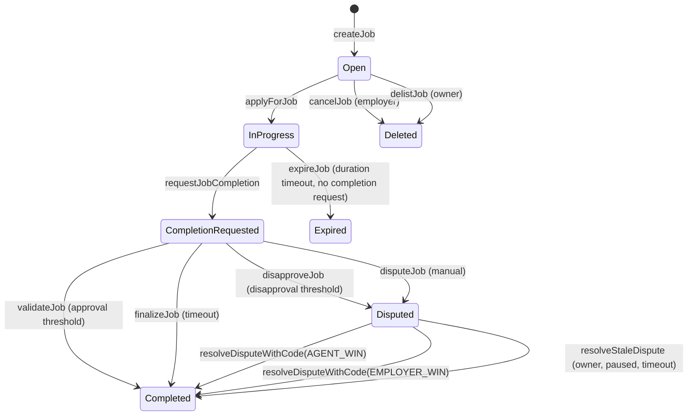

# AGIJobManager Contract Documentation

This document provides a comprehensive, code‑accurate overview of the `AGIJobManager` contract. It is intended for engineers, integrators, reviewers, and operators. The ABI‑exact reference lives in [`AGIJobManager_Interface.md`](AGIJobManager_Interface.md).

## High‑level overview

**What AGIJobManager is**
- An on‑chain **job escrow manager** where employers fund jobs in ERC‑20, agents perform work, validators approve/disapprove completion, and moderators resolve disputes.
- A **reputation tracker** for agents and validators, awarding points based on job payout and completion time.
- An **ERC‑721 job NFT issuer**: when a job completes, the employer receives an NFT that points to the completion metadata URI.
- No internal NFT marketplace; job NFTs are standard ERC‑721 tokens.
- A **role‑gated system** that enforces access via allowlists (explicit) or Merkle proofs and ENS/NameWrapper/Resolver ownership checks.

**What AGIJobManager is not**
- Not an on‑chain ERC‑8004 registry or identity system.
- Not a generalized NFT marketplace.
- Not a decentralized court or DAO (moderators and owner are privileged).

## Key components

- **Jobs**: funded by employers, assigned to a single agent, validated by a bounded set of validators, optionally disputed and resolved by moderators.
- **Agents**: apply for jobs if allowlisted/Merkle/ENS‑verified and not blacklisted. Agent payout is snapshotted at assignment time based on AGIType NFT holdings.
- **Validators**: approve/disapprove job completion if allowlisted/Merkle/ENS‑verified and not blacklisted. Validator payouts are a fixed percentage of job payout split evenly among participating validators.
- **Moderators**: resolve disputes with a typed resolution code.
- **NFT issuance**: on completion, a job NFT is minted to the employer.
- **Reputation**: updated on completion for agents and validators. Reputation saturates with a diminishing‑returns formula.

## Roles & permissions (overview)

- **Owner**: can pause/unpause; manage moderators, allowlists, and blacklists; update parameters; add AGI types; withdraw surplus ERC‑20; and resolve stale disputes while paused.
- **Moderator**: can resolve disputes (agent‑win or employer‑win) with typed codes.
- **Employer**: creates jobs; can cancel jobs before assignment; can dispute; receives job NFTs; receives refunds if a job expires or if dispute resolution favors the employer.
- **Agent**: applies for jobs (eligibility gated) and requests completion; receives payouts and reputation on successful completion.
- **Validator**: validates or disapproves completion requests; receives payout share and reputation if included.

A complete, per‑function access matrix is in the interface reference: [`AGIJobManager_Interface.md`](AGIJobManager_Interface.md).

## Job lifecycle (state machine)



**State flags / counters**
- `assignedAgent`, `assignedAt`: set on `applyForJob`.
- `completionRequested`, `completionRequestedAt`, `jobCompletionURI`: set on `requestJobCompletion`.
- `validatorApprovals`, `validatorDisapprovals`, `validators[]`: updated on `validateJob`/`disapproveJob`.
- `disputed`, `disputedAt`: set by `disputeJob` or when disapproval threshold is reached.
- `completed`, `escrowReleased`: set when settlement completes.
- `expired`: set by `expireJob` when duration has passed without a completion request.

## Events (audit-focused map)

| Event | Emitted on | Notes |
| --- | --- | --- |
| `JobCreated` | `createJob` | Emits job spec URI, payout, duration, and details. |
| `JobApplied` | `applyForJob` | Records assigned agent. |
| `JobCompletionRequested` | `requestJobCompletion` | Records completion metadata URI. |
| `JobValidated` | `validateJob` | One event per validator approval. |
| `JobDisapproved` | `disapproveJob` | One event per validator disapproval. |
| `JobCompleted` | `_completeJob` | Completion anchor; also emits `ReputationUpdated` per recipient. |
| `ReputationUpdated` | `_completeJob` | Fired for agent and validators when payouts complete. |
| `JobCancelled` | `cancelJob`/`delistJob` | Cancellation (employer) or owner delist of open job. |
| `JobDisputed` | `disputeJob` / disapproval threshold | Dispute opened. |
| `DisputeResolved` | `resolveDispute` | Legacy string-based resolution (deprecated). |
| `DisputeResolvedWithCode` | `resolveDisputeWithCode` | Canonical dispute resolution event. |
| `DisputeTimeoutResolved` | `resolveStaleDispute` | Owner resolution while paused + timeout. |
| `JobExpired` | `expireJob` | Expired without completion request. |
| `JobFinalized` | `finalizeJob` | Employer wins after review period with no approvals/dispute. |
| `EnsRegistryUpdated` / `NameWrapperUpdated` | owner updates | Only allowed before any jobs exist. |
| `RootNodesUpdated` / `MerkleRootsUpdated` | owner updates | Root node updates are restricted (no jobs/escrow). |
| `OwnershipVerified` | `_verifyOwnership` | Emits successful ENS/Merkle check. |
| `AGITypeUpdated` | `addAGIType` | Payout percentage per AGI type NFT. |
| `NFTIssued` | `_completeJob` | ERC‑721 minted to employer. |
| `RewardPoolContribution` | `contributeToRewardPool` | Additional reward pool contributions. |
| `CompletionReviewPeriodUpdated` / `DisputeReviewPeriodUpdated` | owner updates | Review period changes. |
| `AdditionalAgentPayoutPercentageUpdated` | owner update | Used for `additionalAgents` allowlist. |
| `AGIWithdrawn` | `withdrawAGI` | Withdraws only surplus over `lockedEscrow`. |
| `IdentityConfigurationLocked` | `lockIdentityConfiguration` | One‑way lock for ENS/token wiring. |
| `AgentBlacklisted` / `ValidatorBlacklisted` | owner updates | Eligibility gating. |

## Error handling (custom errors + typical causes)

The contract uses custom errors for gas‑efficient reverts. Common triggers:

| Error | Typical causes |
| --- | --- |
| `NotModerator` | Non‑moderator calls dispute resolution. |
| `NotAuthorized` | Wrong actor for a role‑gated action; invalid ENS/Merkle ownership. |
| `Blacklisted` | Agent/validator is blacklisted. |
| `InvalidParameters` | Zero/invalid payout, duration, URI, percentages, or parameter bounds. |
| `InvalidState` | Action not permitted in current lifecycle state. |
| `JobNotFound` | Job ID is not initialized or was deleted. |
| `TransferFailed` | ERC‑20 transfer/transferFrom failed or returned false. |
| `ValidatorLimitReached` | Validator cap reached for a job. |
| `InvalidValidatorThresholds` | Approval/disapproval thresholds exceed caps. |
| `ValidatorSetTooLarge` | Validator list exceeds `MAX_VALIDATORS_PER_JOB`. |
| `IneligibleAgentPayout` | Agent has 0% payout tier at apply time. |
| `InvalidAgentPayoutSnapshot` | Snapshot missing or inconsistent during settlement. |
| `InsufficientWithdrawableBalance` | Withdrawal exceeds `withdrawableAGI()`. |
| `InsolventEscrowBalance` | Contract balance < `lockedEscrow`. |
| `ConfigLocked` | Identity wiring already locked. |

## Core invariants (implementation expectations)

- **Escrow accounting**: `lockedEscrow` tracks total job escrow; withdrawals are limited to `balance - lockedEscrow`.
- **Completion gating**: payout + NFT mint require `completionRequested == true` and a valid `jobCompletionURI`.
- **Role gating**: agents/validators must pass allowlist/Merkle/ENS checks (or be in `additional*` allowlists) and not be blacklisted.
- **Single‑settlement**: a job can be completed, expired, or deleted once; settlement functions guard against double‑finalization.
- **Validator bounds**: approvals/disapprovals must remain within `MAX_VALIDATORS_PER_JOB` or settlement becomes unreachable.

## Token & escrow semantics

- **Funding**: `createJob` transfers the job payout into the contract and increments `lockedEscrow`.
- **Agent payout**: on completion, the agent receives `job.payout * agentPayoutPct / 100`, where `agentPayoutPct` is snapshotted on `applyForJob` based on the highest `AGIType` NFT percentage the agent holds.
- **Validator payout**: on completion, validators split `job.payout * validationRewardPercentage / 100` equally **only if** there is at least one validator.
- **Refunds**:
  - `cancelJob`/`delistJob` return the full escrow to the employer if no agent was assigned.
  - `expireJob` returns escrow after duration ends with no completion request.
  - Employer‑win dispute resolution or finalization returns escrow to the employer.
- **ERC‑20 safety**: the contract checks `transfer`/`transferFrom` return values and enforces **exact transfer amounts** (balances must increase by exactly `amount`), so fee‑on‑transfer tokens will revert.

## ENS / NameWrapper / Merkle ownership verification

Eligibility checks for agents and validators use `_verifyOwnership`, which accepts:
- **Merkle proof**: leaf = `keccak256(abi.encodePacked(claimant))`, checked against either `agentMerkleRoot` or `validatorMerkleRoot` depending on the root node passed.
- **ENS NameWrapper ownership**: `nameWrapper.ownerOf(uint256(subnode))` must equal `claimant`.
- **ENS Resolver ownership**: resolve `ens.resolver(subnode)` then call `resolver.addr(subnode)` and compare to `claimant`.

**Root nodes**
- `agentRootNode` and `clubRootNode` are the ENS root nodes for agents and validators respectively.
- `_verifyOwnership` chooses the Merkle root based on which root node is supplied (agent vs validator).

## NFT issuance & trading

- **Minting**: `NFTIssued` is emitted during `_completeJob`, minting a job NFT to the employer with `tokenURI = baseIpfsUrl + "/" + jobCompletionURI` unless the completion URI is already a full URI.
- **Trading**: job NFTs are standard ERC‑721 tokens and can be traded externally using standard approvals and transfers; the contract does not include an internal marketplace.

## dApp integration tips

1. **Employer**: approve ERC‑20 → call `createJob`.
2. **Agent**: prove eligibility → `applyForJob`.
3. **Agent**: submit completion metadata → `requestJobCompletion`.
4. **Validators**: approve/disapprove → `validateJob` / `disapproveJob`.
5. **Moderator** (if disputed): settle → `resolveDisputeWithCode`.
6. **Employer**: receive job NFT on completion (track `NFTIssued`).

For detailed call sequences, revert conditions, and events, see [`AGIJobManager_Interface.md`](AGIJobManager_Interface.md).

## Quickstart examples (Truffle + web3)

> These snippets assume a Truffle environment (`truffle exec` or test context) and that `agiToken` is a standard ERC‑20 with `approve`/`transferFrom`.

### Approve ERC‑20 then create a job (employer)

```javascript
const agi = await IERC20.at(agiTokenAddress);
const mgr = await AGIJobManager.at(agiJobManagerAddress);

const payout = web3.utils.toWei('100', 'ether');
const duration = 7 * 24 * 60 * 60;
await agi.approve(mgr.address, payout, { from: employer });
await mgr.createJob('ipfs://job-spec', payout, duration, 'details', { from: employer });
```

### Apply for a job (agent)

```javascript
const jobId = 0;
const subdomain = 'alice';
const proof = []; // Merkle proof if required; empty if using explicit allowlist
await mgr.applyForJob(jobId, subdomain, proof, { from: agent });
```

### Request completion (agent)

```javascript
await mgr.requestJobCompletion(jobId, 'ipfs://job-completion', { from: agent });
```

### Validate job (validator)

```javascript
const validatorProof = [];
await mgr.validateJob(jobId, 'validator', validatorProof, { from: validator });
```

### Dispute + moderator resolve

```javascript
await mgr.disputeJob(jobId, { from: employer });
// AGENT_WIN = 1, EMPLOYER_WIN = 2
await mgr.resolveDisputeWithCode(jobId, 1, 'work accepted', { from: moderator });
```

### Event subscriptions

```javascript
mgr.JobCreated({}).on('data', (ev) => console.log('JobCreated', ev.returnValues));
mgr.JobCompleted({}).on('data', (ev) => console.log('JobCompleted', ev.returnValues));
mgr.JobDisputed({}).on('data', (ev) => console.log('JobDisputed', ev.returnValues));
mgr.DisputeResolvedWithCode({}).on('data', (ev) => console.log('DisputeResolved', ev.returnValues));
```
