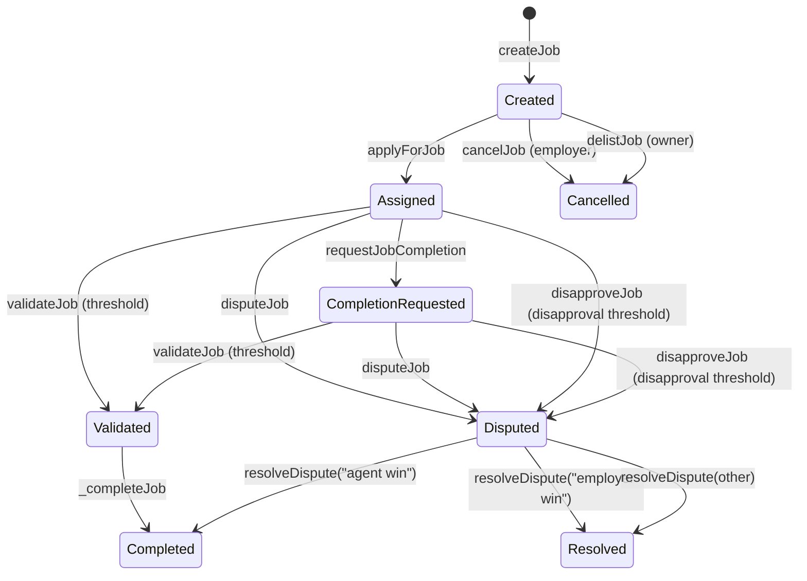

# AGIJobManager Contract Documentation

This documentation is derived from the compiled ABI (`build/contracts/AGIJobManager.json`) and the Solidity source at `contracts/AGIJobManager.sol`. It is intentionally descriptive only: the contract code is unchanged.

## Contents
- [High-level overview](#high-level-overview)
- [Key components](#key-components)
- [Roles & permissions](#roles--permissions)
- [Job lifecycle & state machine](#job-lifecycle--state-machine)
- [Token and accounting semantics](#token-and-accounting-semantics)
- [ENS / NameWrapper / Merkle verification](#ens--namewrapper--merkle-verification)
- [NFT issuance & marketplace](#nft-issuance--marketplace)
- [Quickstart examples](#quickstart-examples)
- [Further reference](#further-reference)

## High-level overview
**AGIJobManager** is a single-contract escrow + job workflow manager that coordinates employer-funded jobs, agent assignment, validator review, on-chain reputation, and NFT issuance for completed work. It also includes a simple listing/purchase flow for the ERC-721 job NFTs.

What it **is**:
- An **escrowed job manager**: employers lock ERC-20 funds into a job; payouts are released on completion or refunded on cancellation/dispute outcomes.
- An **on-chain reputation system**: reputation points accrue to agents and validators based on job payouts and completion time.
- An **ERC-721 issuer and marketplace**: upon completion, an NFT is minted to the employer and can be listed for sale.
- An **identity gate**: agent and validator eligibility is determined by Merkle roots and/or ENS ownership checks.

What it **is not**:
- **Not an ERC-8004 on-chain registry** (no in-contract ERC-8004 storage). The repo’s ERC-8004 adapter lives off-chain.
- **Not a generalized marketplace** (only job NFTs minted by this contract are listed).
- **Not a permissionless validator system**: validators are gated by Merkle/ENS or explicit allowlist.

## Key components
- **Jobs**: Created by employers with ERC-20 escrowed payouts, assigned to an agent, reviewed by validators, and completed or disputed.
- **Agents**: Eligible via Merkle root or ENS ownership checks; receive payouts and reputation for completed jobs.
- **Validators**: Eligible via Merkle root or ENS ownership checks; can approve or disapprove jobs and receive validation rewards and reputation.
- **Moderators**: Resolve disputes; only moderators can finalize disputes.
- **Disputes**: Triggered by employer/agent or by validator disapproval threshold; resolved by moderators with canonical resolution strings.
- **Reputation**: Calculated based on payout and completion time, capped and diminished to slow growth.
- **NFT issuance & listing**: Job completion mints an ERC-721 to the employer, with tokenURI built from a base IPFS URL + job IPFS hash.

## Roles & permissions
> Full function-by-function access rules, preconditions, and effects are in the [Interface reference](AGIJobManager_Interface.md).

- **Owner (contract owner)**
  - Can pause/unpause job flows.
  - Can configure parameters (payout limits, validator thresholds, reward percentages, base IPFS URL, metadata fields).
  - Can add/remove moderators, manage allowlists, blacklist agents/validators.
  - Can withdraw ERC-20 from the contract and rotate the ERC-20 token address.
  - Can add or update AGI types (NFT-based payout multipliers).
  - Can delist jobs before assignment (owner-only emergency cancel).

- **Moderator**
  - Can resolve disputes via `resolveDispute`.

- **Employer**
  - Can create jobs by locking ERC-20 into escrow.
  - Can cancel a job before assignment.
  - Can dispute a job.
  - Receives the NFT upon job completion.

- **Agent**
  - Can apply for a job (if eligible and not blacklisted).
  - Can request completion for assigned jobs within the duration limit.

- **Validator**
  - Can validate or disapprove jobs (if eligible and not blacklisted).
  - Their approvals/disapprovals contribute to dispute/completion thresholds.

## Job lifecycle & state machine
AGIJobManager tracks job progress through explicit state variables on each job: `assignedAgent`, `assignedAt`, `completionRequested`, `validatorApprovals`, `validatorDisapprovals`, `disputed`, and `completed`.



Key state transitions and flags:
- **Create**: `assignedAgent` is `address(0)`, `completed=false`, `disputed=false`.
- **Assign**: `assignedAgent` set, `assignedAt` captured.
- **Completion request**: `completionRequested=true`, updates `ipfsHash`.
- **Validate**: increments `validatorApprovals`; once approvals reach `requiredValidatorApprovals`, `_completeJob` runs.
- **Disapprove**: increments `validatorDisapprovals`; once disapprovals reach `requiredValidatorDisapprovals`, job becomes `disputed=true`.
- **Manual dispute**: employer or agent can set `disputed=true` before completion.
- **Resolve dispute**:
  - `"agent win"` triggers completion and payouts.
  - `"employer win"` refunds employer and marks job completed to prevent later completion.
  - Any other string closes the dispute without moving funds.

## Token and accounting semantics
- **Escrow on creation**: `createJob` pulls `_payout` from the employer using `transferFrom` and holds it in the contract.
- **Agent payout**: On completion, the agent receives `job.payout * agentPayoutPercentage / 100`, where `agentPayoutPercentage` is the highest percentage among AGI types (ERC-721s) held by the agent. If no AGI types exist or the agent holds none, this value is `0` and the agent receives **no payout**.
- **Validator payout**: If there are validators, `validationRewardPercentage` of the payout is split equally across the validators who voted (approval or disapproval). If there are **zero validators**, validator payouts are skipped entirely.
- **Residual funds**: Any unassigned portion of the payout remains in the contract balance (e.g., agent payout is 0 and there are no validators).
- **Refund paths**:
  - `cancelJob` (employer) and `delistJob` (owner) refund the employer and delete the job (only allowed before assignment).
  - `resolveDispute("employer win")` refunds the employer and marks the job complete.
- **ERC-20 behavior**: Transfers and transferFroms are checked for a `true` return value; otherwise the contract reverts with `TransferFailed`.

## ENS / NameWrapper / Merkle verification
The contract uses `_verifyOwnership` to gate agents and validators.

### Merkle proof path
- **Leaf**: `keccak256(abi.encodePacked(claimant))`.
- **Root choice**:
  - For agents, `rootNode == agentRootNode` and `agentMerkleRoot` is used.
  - For validators, `rootNode == clubRootNode` and `validatorMerkleRoot` is used.
- **Success**: emits `OwnershipVerified(claimant, subdomain)`.

### ENS NameWrapper path
- Computes `subnode = keccak256(abi.encodePacked(rootNode, keccak256(bytes(subdomain))))`.
- Tries `nameWrapper.ownerOf(uint256(subnode))`. If the result equals `claimant`, ownership is verified.
- Errors are caught and result in `RecoveryInitiated` events (`reason` or `"NW_FAIL"`).

### ENS resolver path
- If NameWrapper fails, the ENS resolver address is queried for `subnode`.
- If resolver exists, it tries `Resolver.addr(subnode)` and compares to `claimant`.
- Failures emit `RecoveryInitiated("RES_FAIL")` or `RecoveryInitiated("NO_RES")` if no resolver exists.

`RecoveryInitiated` is informational only; it does not alter authorization decisions.

## NFT issuance & marketplace
- **Minting**: On job completion, the contract mints an ERC-721 to the employer.
- **Token URI**: `tokenURI = baseIpfsUrl + "/" + job.ipfsHash`.
- **Listing**: Owner can call `listNFT(tokenId, price)` to list. The listing is stored in `listings` and does **not** escrow the NFT.
- **Purchase**: `purchaseNFT` pulls ERC-20 from the buyer and calls `_transfer` to transfer the NFT. The listing is then deactivated.
- **Delist**: Seller can deactivate a listing via `delistNFT`.

## Quickstart examples
> Examples use Truffle/web3 style. Replace addresses and IDs with real values.

### Approve ERC-20 and create a job
```javascript
const jobManager = new web3.eth.Contract(AGIJobManagerAbi, managerAddress);
const agiToken = new web3.eth.Contract(ERC20Abi, agiTokenAddress);

const payout = web3.utils.toWei("100", "ether");
await agiToken.methods.approve(managerAddress, payout).send({ from: employer });

await jobManager.methods.createJob(
  "QmJobSpecHash",
  payout,
  7 * 24 * 60 * 60, // duration in seconds
  "Job details summary"
).send({ from: employer });
```

### Agent applies for a job
```javascript
await jobManager.methods.applyForJob(jobId, "alice", agentProof).send({ from: agent });
```

### Agent requests completion
```javascript
await jobManager.methods.requestJobCompletion(jobId, "QmJobResultHash")
  .send({ from: agent });
```

### Validator approves a job
```javascript
await jobManager.methods.validateJob(jobId, "validator", validatorProof)
  .send({ from: validator });
```

### Dispute and resolve by moderator
```javascript
await jobManager.methods.disputeJob(jobId).send({ from: employer });
await jobManager.methods.resolveDispute(jobId, "agent win")
  .send({ from: moderator });
```

### Event subscriptions
```javascript
jobManager.events.JobCreated({ fromBlock: 0 })
  .on("data", (event) => console.log("Job created", event.returnValues));

jobManager.events.JobCompleted({ fromBlock: 0 })
  .on("data", (event) => console.log("Job completed", event.returnValues));

jobManager.events.JobDisputed({ fromBlock: 0 })
  .on("data", (event) => console.log("Job disputed", event.returnValues));

jobManager.events.DisputeResolved({ fromBlock: 0 })
  .on("data", (event) => console.log("Dispute resolved", event.returnValues));
```

## Further reference
- [Interface reference](AGIJobManager_Interface.md)
- [Operator guide](AGIJobManager_Operator_Guide.md)
- [Security considerations](AGIJobManager_Security.md)
