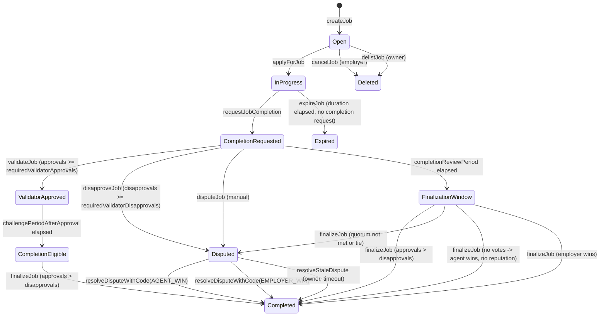

# AGIJobManager Contract Documentation — v0.9.3

This document provides a comprehensive, code‑accurate overview of the `AGIJobManager` contract. It is intended for engineers, integrators, reviewers, and operators. The ABI‑exact reference lives in [`AGIJobManager_Interface.md`](AGIJobManager_Interface.md).

## High‑level overview

**What AGIJobManager is**
- An on‑chain **job escrow manager** where employers fund jobs in native USDC, agents perform work, validators approve/disapprove completion, and moderators resolve disputes.
- A **reputation tracker** for agents and validators, awarding points based on payout and completion time (with diminishing returns).
- An **ERC‑721 job NFT issuer**: when a job completes, the employer receives an NFT that points to the completion metadata URI.
- A **role‑gated system** that enforces access via explicit allowlists, Merkle proofs, and ENS/NameWrapper/Resolver ownership checks.

**What AGIJobManager is not**
- Not an on‑chain ERC‑8004 registry or identity system.
- Not a generalized NFT marketplace; there are **no** `listNFT`/`purchaseNFT` functions in this contract.
- Not a decentralized court or DAO (moderators and owner are privileged).

## Key components

- **Jobs**: funded by employers, assigned immediately to the first successful eligible applicant, validated by a bounded set of validators, optionally disputed and resolved by moderators.
- **Agents**: apply for jobs if allowlisted/Merkle/ENS‑verified and not blacklisted. The validator rate and base agent remainder are snapshotted at job posting; an eligible NFT credential is required in addition to identity authorization and does not boost payments. Agents post a performance bond at apply time.
- **Validators**: approve/disapprove job completion if allowlisted/Merkle/ENS‑verified and not blacklisted. Validators post a bond per vote and are rewarded/slashed based on the final outcome.
- **Moderators**: resolve disputes using typed resolution codes.
- **Dispute bonds**: the disputant posts a bond that is paid to the winning side on resolution.
- **NFT issuance**: on completion, a job NFT is minted to the employer.
- **Reputation**: updated on completion for agents and validators; reputation grows with payout size and timeliness, capped by diminishing returns.

## Roles & permissions (overview)

- **Owner**: pause/unpause; manage moderators, allowlists, and blacklists; update parameters; add AGI types; update ENS wiring before lock and Merkle roots even after lock; withdraw only unreserved USDC with intake paused and settlement enabled; resolve stale disputes.
- **Moderator**: resolve disputes (agent‑win or employer‑win) with typed codes.
- **Employer**: creates jobs; can cancel jobs before assignment; can dispute; receives job NFTs; receives refunds if a job expires or if dispute resolution favors the employer.
- **Agent**: applies for jobs (eligibility gated) and requests completion; receives payouts and reputation on successful completion; posts agent bond.
- **Validator**: validates or disapproves completion requests; posts bond; receives rewards/reputation when its vote matches the final outcome and recovers its bond under the slashing rules.

A complete, per‑function access matrix is in the interface reference: [`AGIJobManager_Interface.md`](AGIJobManager_Interface.md).

## Job lifecycle (state machine)

```mermaid
stateDiagram-v2
    [*] --> Open: createJob
    Open --> InProgress: applyForJob
    InProgress --> CompletionRequested: requestJobCompletion

    CompletionRequested --> ValidatorApproved: validateJob (approvals >= requiredValidatorApprovals)
    ValidatorApproved --> CompletionEligible: challengePeriodAfterApproval elapsed
    CompletionEligible --> Completed: finalizeJob (approvals > disapprovals)

    CompletionRequested --> Disputed: disapproveJob (disapprovals >= requiredValidatorDisapprovals)
    CompletionRequested --> Disputed: disputeJob (manual)

    CompletionRequested --> FinalizationWindow: completionReviewPeriod elapsed
    FinalizationWindow --> Completed: finalizeJob (approvals > disapprovals)
    FinalizationWindow --> Disputed: finalizeJob (quorum not met or tie)
    FinalizationWindow --> Completed: finalizeJob (no votes -> agent wins, no reputation)
    FinalizationWindow --> Completed: finalizeJob (employer wins)

    Disputed --> Completed: resolveDisputeWithCode(AGENT_WIN)
    Disputed --> Completed: resolveDisputeWithCode(EMPLOYER_WIN)
    Disputed --> Completed: resolveStaleDispute (owner, timeout)

    InProgress --> Expired: expireJob (duration elapsed, no completion request)

    Open --> Deleted: cancelJob (employer)
    Open --> Deleted: delistJob (owner)
```

**State flags / counters**
- `assignedAgent`, `assignedAt`: set on `applyForJob`.
- `completionRequested`, `completionRequestedAt`, `jobCompletionURI`: set on `requestJobCompletion`.
- `validatorApprovals`, `validatorDisapprovals`, `validators[]`: updated on `validateJob`/`disapproveJob`.
- `validatorApproved`, `validatorApprovedAt`: set when approvals reach `requiredValidatorApprovals`.
- `disputed`, `disputedAt`, `disputeInitiator`, `disputeBondAmount`: set by `disputeJob` or when disapproval threshold is reached.
- `completed`, `escrowReleased`: set when settlement completes.
- `expired`: set by `expireJob` when duration has passed without a completion request.

## Events (audit‑focused map)

| Event | Emitted on | Notes |
| --- | --- | --- |
| `JobCreated` | `createJob` | Emits job spec URI, payout, duration, and details. |
| `JobApplied` | `applyForJob` | Records assigned agent. |
| `JobCompletionRequested` | `requestJobCompletion` | Records completion metadata URI. |
| `JobValidated` | `validateJob` | One event per validator approval. |
| `JobDisapproved` | `disapproveJob` | One event per validator disapproval. |
| `JobDisputed` | `disputeJob` / disapproval threshold | Dispute opened. |
| `DisputeResolvedWithCode` | `_resolveDispute` | Canonical dispute resolution event. |
| `JobCompleted` | `_completeJob` | Successful-work completion; employer-win refunds set terminal state without this event. |
| `JobPayoutDistributed` | `_completeJob` | Records validator budget, 30%/10% shares, and agent amount. |
| `SettlementWalletsUpdated` | constructor / wallet rotation | Validated recipient addresses; post-deployment rotation requires paused intake and empty reserves. |
| `ReputationUpdated` | `enforceReputationGrowth` | Fired for agent and validators when payouts complete. |
| `JobCancelled` | `cancelJob`/`delistJob` | Cancellation (employer) or owner delist of open job. |
| `JobExpired` | `expireJob` | Expired without completion request. |
| `EnsRegistryUpdated` / `NameWrapperUpdated` | owner updates | ENS wiring updates (before lock). |
| `RootNodesUpdated` / `MerkleRootsUpdated` | owner updates | Identity allowlist updates. |
| `AGITypeUpdated` | `addAGIType` | Eligibility score per AGI type NFT (legacy field name). |
| `NFTIssued` | `_mintCompletionNFT` | ERC‑721 minted to employer. |
| `CompletionReviewPeriodUpdated` / `DisputeReviewPeriodUpdated` | owner updates | Review period changes. |
| `ValidatorBondParamsUpdated` | `setValidatorBondParams` | Validator bond parameter changes. |
| `ChallengePeriodAfterApprovalUpdated` | `setChallengePeriodAfterApproval` | Validator approval challenge window updates. |
| `USDCWithdrawn` | `withdrawUSDC` | Withdraws only surplus over locked balances. |
| `IdentityConfigurationLocked` | `lockIdentityConfiguration` | One-way lock for protected ENS wiring; the token is already immutable. |
| `AgentBlacklisted` / `ValidatorBlacklisted` | owner updates | Eligibility gating. |

## Error handling (custom errors + typical causes)

The contract uses custom errors for gas‑efficient reverts. Common triggers:

| Error | Typical causes |
| --- | --- |
| `NotModerator` | Non‑moderator calls dispute resolution. |
| `NotAuthorized` | Wrong actor for a role‑gated action; invalid ENS/Merkle ownership. |
| `Blacklisted` | Agent/validator is blacklisted. |
| `InvalidParameters` | Zero/invalid payout, duration, URI, percentages, or parameter bounds. |
| `InvalidState` | Action not permitted in current lifecycle state. |
| `JobNotFound` | Job ID is not initialized or was deleted. |
| `TransferFailed` | ERC‑20 transfer/transferFrom failed or returned false or amount mismatch. |
| `ValidatorLimitReached` | Validator cap reached for a job. |
| `InvalidValidatorThresholds` | Approval/disapproval thresholds exceed caps. |
| `IneligibleAgentPayout` | Agent has no eligible NFT at apply time. |
| `InsufficientWithdrawableBalance` | Withdrawal exceeds `withdrawableUSDC()`. |
| `InsolventEscrowBalance` | Contract balance < locked totals. |
| `ConfigLocked` | Identity configuration already locked. |
| `SettlementPaused` | Settlement gate blocks the attempted action. |

## Core invariants (implementation expectations)

- **Escrow accounting**: `lockedEscrow` tracks total job escrow; withdrawals are limited to `balance - lockedEscrow - lockedAgentBonds - lockedValidatorBonds - lockedDisputeBonds`.
- **Completion gating**: payout + NFT mint require a valid, non‑empty completion URI submitted via `requestJobCompletion`.
- **Role gating**: agents/validators must pass allowlist/Merkle/ENS checks (or be in `additional*` allowlists) and not be blacklisted.
- **Single‑settlement**: a job can be completed, expired, or deleted once; settlement functions guard against double‑finalization.
- **Validator bounds**: approvals/disapprovals must remain within `MAX_VALIDATORS_PER_JOB` or settlement becomes unreachable.

## Token & escrow semantics

- **Funding**: `createJob` transfers the job payout into the contract and increments `lockedEscrow`.
- **Agent bond**: `applyForJob` transfers the agent bond into the contract and increments `lockedAgentBonds`. On agent win the bond is returned to the agent; on employer win the bond is refunded to the employer (or pooled for validators if disapproval threshold was reached).
- **Validator bond**: each validator vote transfers a bond (computed from `validatorBondBps`, `validatorBondMin`, `validatorBondMax`) and increments `lockedValidatorBonds`. Correct validators earn rewards; incorrect validators are slashed by `validatorSlashBps`.
- **Dispute bond**: `disputeJob` transfers a bond based on `DISPUTE_BOND_BPS` with min/max caps. The bond is paid to the winner on resolution.
- **Agent payout**: all USDC remaining after correct-side validator rewards, 30% and 10% of the original cost to the configured wallets. Those recipients may rotate only between jobs with intake paused and all reserves zero; the USDC token and percentages remain fixed. See [exact payout rules](USDC_PAYOUT_SPLIT.md).
- **Validator payout**: on completion, **correct‑side** validators split `floor(job.payout * job.validatorRewardPctSnapshot / 100)` plus any pooled bond amounts, **only if** there is at least one validator. Incorrect validators receive their bond minus the slashed portion, and if no validators participate no budget is deducted, leaving that amount with the agent on successful completion.
- **Refunds**:
  - `cancelJob`/`delistJob` return the full escrow to the employer if no agent was assigned.
  - `expireJob` returns escrow after duration ends with no completion request and slashes the agent bond to the employer.
  - Employer-win dispute resolution or finalization refunds escrow less the participating-validator budget, plus any residual reward/bond amounts assigned to the employer. It pays no 30%/10% shares and mints no completion NFT.
- **No‑vote liveness**: after `completionReviewPeriod` with zero votes, `finalizeJob` settles in favor of the agent **without** reputation updates (`repEligible = false`).
- **ERC‑20 safety**: the contract checks `transfer`/`transferFrom` return values and measures exact incoming amounts. Public-chain deployments are restricted to native USDC. Issuer pause/blocklist failures roll back the entire settlement, including previous transfers.

## ENS / NameWrapper / Merkle ownership verification

Identity routing uses `_isAuthorized` and the linked `ENSOwnership` library. After explicit `additionalAgents` / `additionalValidators` checks, it accepts:
- **Merkle proof**: leaf = `keccak256(abi.encodePacked(claimant))`, checked against `agentMerkleRoot` or `validatorMerkleRoot`.
- **ENS NameWrapper ownership**: the claimant owns the wrapped subnode or has a qualifying per-token/operator approval.
- **ENS Resolver ownership**: resolve `ens.resolver(subnode)` then call `resolver.addr(subnode)` and compare to `claimant`.

**Root nodes**
- `agentRootNode` and `clubRootNode` are the ENS root nodes for agents and validators respectively.
- `alphaAgentRootNode` and `alphaClubRootNode` are secondary roots that are also accepted.
- `ENSOwnership` root verification returns false if the provided root is `bytes32(0)`.

**Merkle root selection**
- Agents use `agentMerkleRoot`; validators use `validatorMerkleRoot`. The root chosen depends on which verification function is called.

**Events**
- This contract does **not** emit a `RecoveryInitiated` or `OwnershipVerified` event; ownership verification is purely internal.

## NFT issuance and (non‑)marketplace

- **Minting**: `NFTIssued` is emitted during `_completeJob`. A bounded optional ENS URI lookup precedes completion-URI fallback; a base prefix is applied when needed. A failing safe-mint callback falls back to ordinary minting so the employer still receives the receipt.
- **Marketplace**: there are **no** `listNFT`/`purchaseNFT`/`delistNFT` functions in the ABI; job NFTs are standard ERC‑721 tokens intended to trade externally via approvals/transfers.

## dApp integration tips

1. **Employer**: approve exact USDC escrow → call `createJob`; keep ETH for gas.
2. **Agent**: pass identity and NFT eligibility, approve the quoted USDC bond → `applyForJob` (assigns immediately).
3. **Agent**: submit completion metadata → `requestJobCompletion`.
4. **Validators**: approve the quoted USDC bond, then vote once using `validateJob` / `disapproveJob`; votes do not automatically pay the job.
5. **Moderator** (if disputed): settle → `resolveDisputeWithCode`.
6. **Anyone**: after review windows, `finalizeJob` can settle a job if not disputed.
7. **Employer**: receive job NFT on completion (track `NFTIssued`).

For detailed call sequences, revert conditions, and events, see [`AGIJobManager_Interface.md`](AGIJobManager_Interface.md).

## Quickstart entry points

Local regression tests use Hardhat 3 and Mocha through `npm test`; Truffle and Ganache have been removed. For current user transactions, use the [USDC console](../ui/agijobmanager-usdc.html) and [end-to-end walkthrough](user-guide/happy-path.md); for public-chain deployment, use [Hardhat](../hardhat/README.md). Avoid reusing historical constructor snippets or assuming test credentials/bond funding exist on a live chain.

## Owner maintenance and fixed rules

The contract is non-upgradeable. Native USDC and the fixed 30%/10% gross-cost shares are immutable. The validator budget is 8% by default and can be set to 1–60% for future postings. Agent bonds are fixed at assignment; validator bonds are fixed at a job's first vote. Rule changes affecting active settlement require empty reserves where specified in [Configuration](CONFIGURATION.md).

Recipient rotation requires intake paused and all reserves zero. Ownership changes require the proposed owner's acceptance; renunciation is disabled. Fresh deployments start with intake paused until commissioning.

`pause` blocks creation/application. `settlementPaused` additionally blocks completion, votes, disputes, settlement and withdrawals. Deadlines requiring elapsed windows use strict `>` comparisons. When the approval latch exists, its challenge must elapse even if the review window ends first. After that, an undisputed approval majority can settle early; otherwise the review-window quorum/tie/no-vote rules apply.
