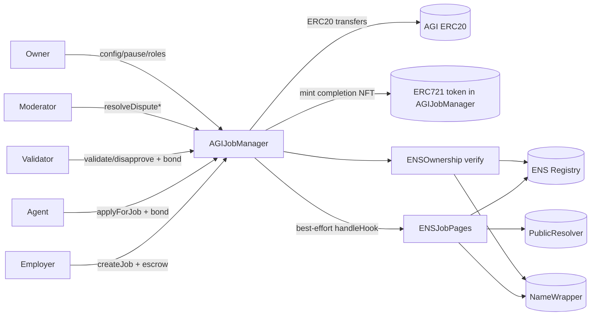
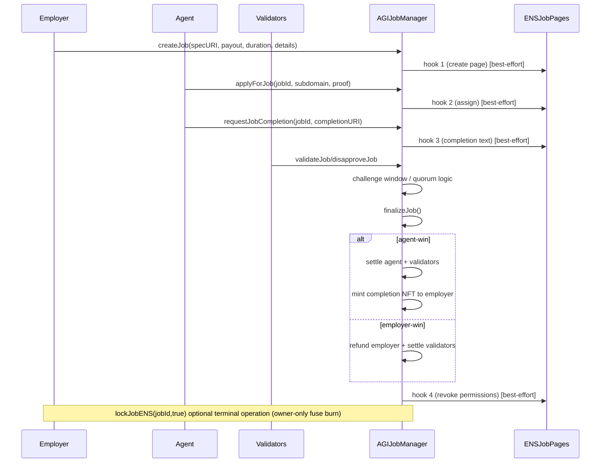
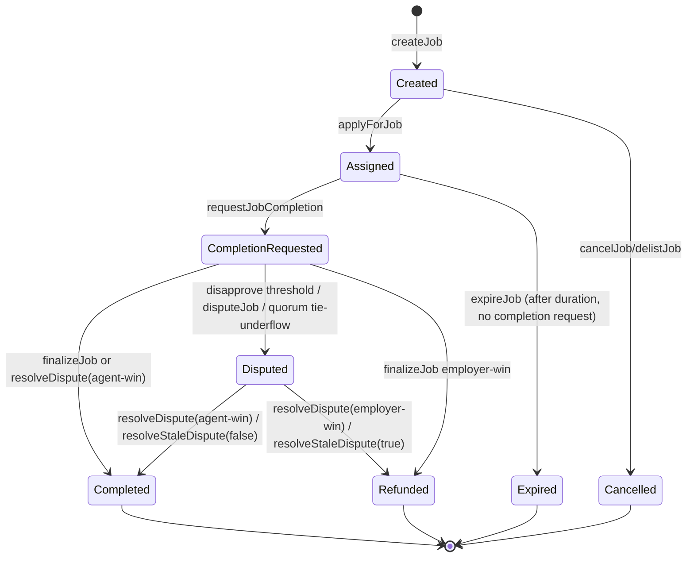

# Architecture

## System overview

`AGIJobManager` is an owner-operated escrow and settlement contract for employer-agent jobs with validator voting, moderator dispute resolution, optional ENS job-page hooks, and ERC-721 completion NFT minting.

### Components and responsibilities

| Component | Type | Responsibility |
|---|---|---|
| `AGIJobManager` | Core contract | Job escrow, assignment, completion requests, validator voting, settlement, disputes, NFT issuance, reputation, owner controls. |
| `ENSJobPages` | Optional helper contract | Creates/upgrades per-job ENS records and handles best-effort lifecycle hooks. |
| `BondMath` | Library | Computes validator/agent bond amounts from current parameters. |
| `ReputationMath` | Library | Computes reputation increments for agent/validator outcomes. |
| `TransferUtils` | Library | ERC20 transfer wrappers, including exact-transfer behavior. |
| `UriUtils` | Library | URI validation + optional `baseIpfsUrl` prefixing. |
| `ENSOwnership` | Library | ENS/NameWrapper ownership verification for role gating. |
| ENS contracts (`ENSRegistry`, `NameWrapper`, `PublicResolver`) | External dependencies | Name ownership and resolver records for ownership gating and ENS job pages. |

## Component interaction diagram

## Job lifecycle (happy path)

## Job state machine

## Trust boundaries

### External calls
- ERC20 transfers (`safeTransfer`, `safeTransferFromExact`) are external token interactions and can fail/revert.
- ENS interactions are external calls to `ensJobPages` (which itself calls ENS registry/wrapper/resolver).
- Token URI fallback may `staticcall` ENS helper when `useEnsJobTokenURI` is enabled.

### Best-effort ENS behavior
- ENS hooks are intentionally non-blocking (`_callEnsJobPagesHook` emits `EnsHookAttempted` with success/failure).
- Settlement and escrow flows continue even if ENS hook calls fail.
- Implication: ENS metadata consistency is operational, not consensus-critical; operators must monitor hook failures.
