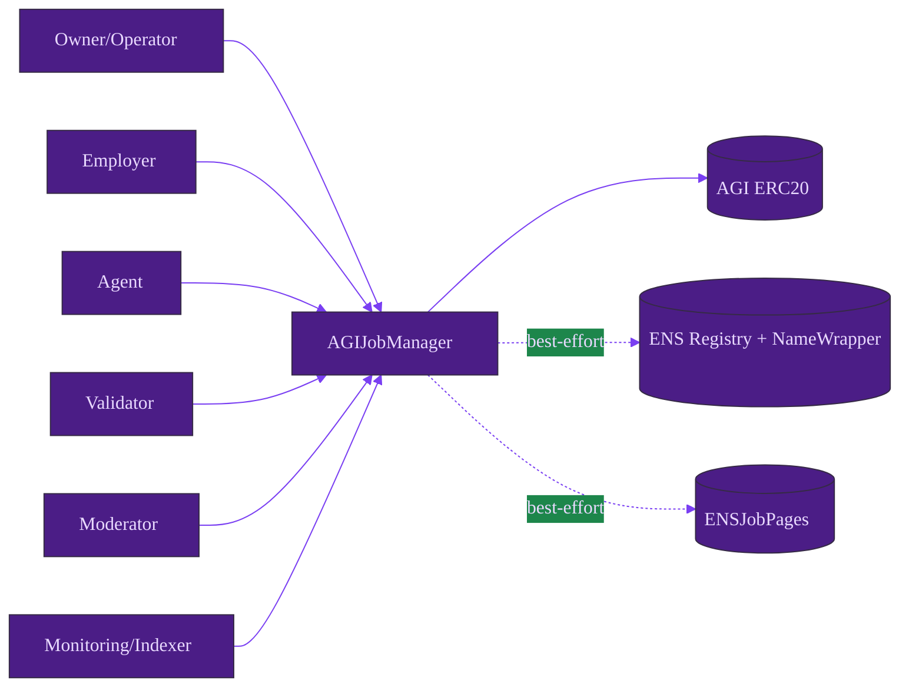
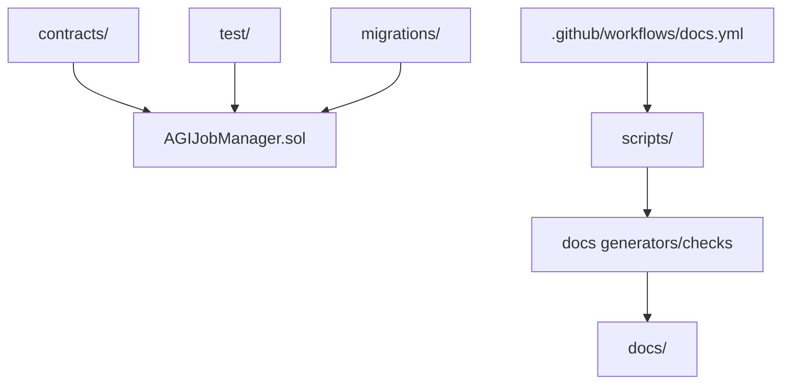

# Architecture

## System component flow

## Repository architecture flow

- Text-only visual assets: [palette.svg](./assets/palette.svg), [architecture-wireframe.svg](./assets/architecture-wireframe.svg)
