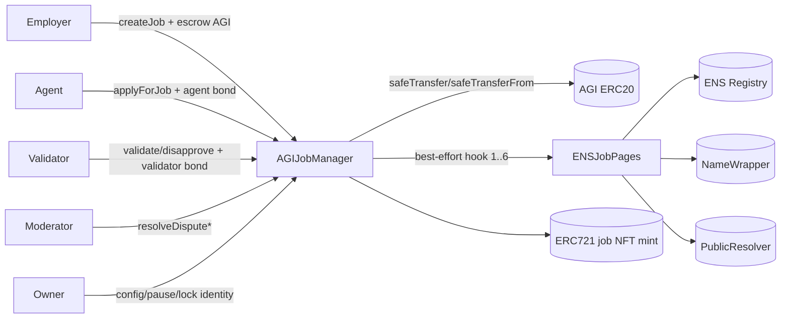
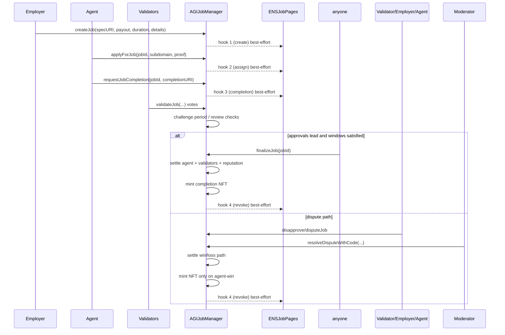
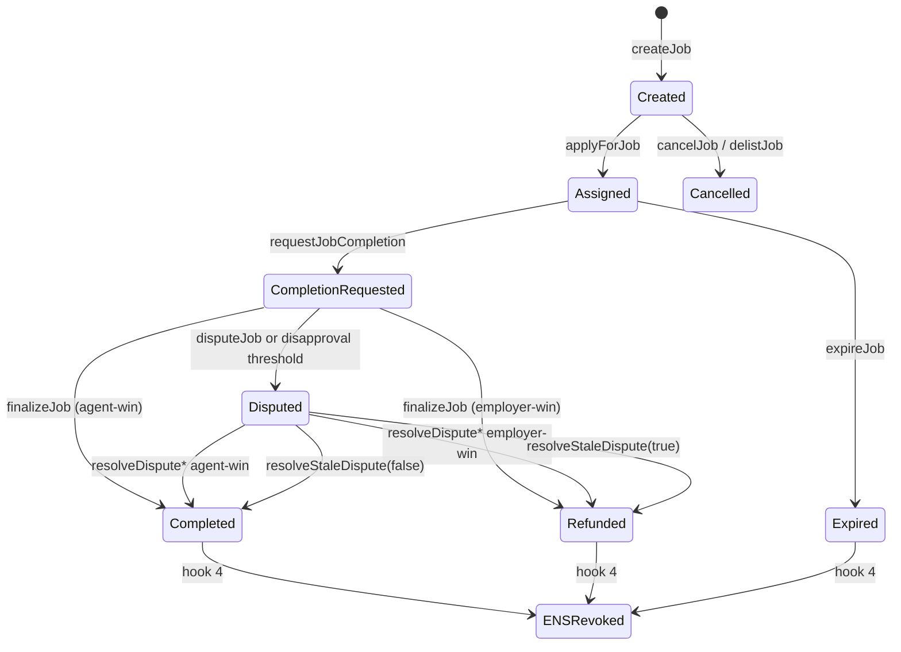

# AGIJobManager Architecture

## System overview

### Components and responsibilities
- **AGIJobManager (`contracts/AGIJobManager.sol`)**: core escrow, job lifecycle, bond accounting, validator voting, dispute handling, NFT issuance, reputation updates, pause controls, and owner configuration.
- **ENSJobPages (`contracts/ens/ENSJobPages.sol`)**: optional ENS mirror for job pages and metadata; invoked via best-effort lifecycle hooks.
- **Utility libraries (`contracts/utils/*.sol`)**:
  - `BondMath`: computes validator and agent bond sizes.
  - `ReputationMath`: computes bounded reputation growth points.
  - `ENSOwnership`: helper checks for ENS/NameWrapper/resolver ownership.
  - `TransferUtils`: strict ERC20 transfer wrappers.
  - `UriUtils`: URI validation and base IPFS prefix application.
- **External systems**:
  - ERC20 AGI token (`agiToken`) for escrow and bonds.
  - ENS registry + NameWrapper + PublicResolver used for identity gating and ENS pages.

## Component interaction diagram

## Happy-path job lifecycle (sequence)

## Job state machine

## Trust boundaries

### External calls
- **ERC20 transfers** are performed through `TransferUtils` wrappers and can revert settlement/withdraw flows if token transfers fail.
- **ENS hooks** are called with fixed gas (`ENS_HOOK_GAS_LIMIT`) and are deliberately best-effort (`call` return value emitted as `EnsHookAttempted`), so lifecycle operations continue if ENS integration fails.
- **ENS URI fetch for NFT minting** is optional and best-effort (`staticcall` + fallback to completion URI).

### Best-effort implications
- A job can settle correctly even if ENS hooks fail.
- ENS page state may lag or be incomplete; on-chain escrow/accounting remains canonical.
- Operators must monitor `EnsHookAttempted` and reconcile ENS issues operationally rather than expecting automatic rollback.
