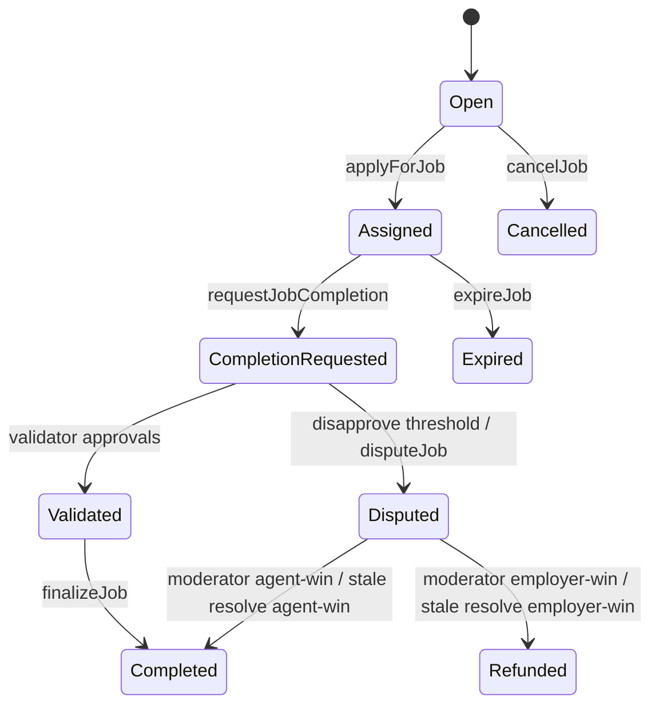

# Architecture

## Purpose
Document system boundaries, trust model, and component interactions for AGIJobManager.

## Audience
Auditors, integrators, and operators.

## Preconditions / assumptions
- AGIJobManager is non-upgradeable and owner-operated.
- ENS integration is optional and best-effort; escrow safety is independent of ENS writes.

## On-chain vs off-chain boundaries
| Domain | Responsibilities |
|---|---|
| On-chain (`AGIJobManager`) | Escrow/bond accounting, job state machine, validator voting, dispute settlement, reputation updates, completion NFT minting. |
| On-chain (`ENSJobPages`) | Optional ENS subname creation, resolver text records, auth delegation and lock hooks. |
| Off-chain (UI/backends/operators) | Job content creation, URI storage, validator/moderator operations, monitoring and alerts. |

## Trust model
- Owner controls pausing, operational parameters, allowlists/blacklists, moderator membership, and identity wiring until lock.
- Moderators can resolve disputes.
- Validators are permissioned participants with bonded votes.
- Employer/agent/validator role gating can rely on additional allowlists, Merkle roots, and ENS ownership checks.

## Component diagram
```mermaid
flowchart TD
  subgraph Users
    EMP[Employer]
    AG[Agent]
    VAL[Validator]
    MOD[Moderator]
    OWN[Owner]
  end

  subgraph Contracts
    AJM[AGIJobManager]
    ENSP[ENSJobPages]
    ENSR[ENS Registry]
    NMW[NameWrapper]
    PR[Public Resolver]
    AGI[AGI ERC20]
  end

  EMP -->|create/cancel/dispute| AJM
  AG -->|apply/request completion| AJM
  VAL -->|validate/disapprove + bond| AJM
  MOD -->|resolve dispute| AJM
  OWN -->|config/pause/lock/withdraw| AJM

  AJM -->|transferFrom/transfer| AGI
  AJM -->|hook calls (best effort)| ENSP
  ENSP --> ENSR
  ENSP --> NMW
  ENSP --> PR
```

**Legend:** solid arrows indicate direct calls; ENS hook failures do not revert AGIJobManager settlement logic.

## Job + dispute states


## Gotchas / failure modes
- `pause()` blocks new activity but does not imply settlement halt; `settlementPaused` is separate.
- Identity lock freezes ENS/token/root/merkle wiring but not operational parameters.
- Completion NFT URI may source from ENS URI mode when enabled.

## References
- [`../contracts/AGIJobManager.sol`](../contracts/AGIJobManager.sol)
- [`../contracts/ens/ENSJobPages.sol`](../contracts/ens/ENSJobPages.sol)
- [`./contracts/AGIJobManager.md`](./contracts/AGIJobManager.md)
