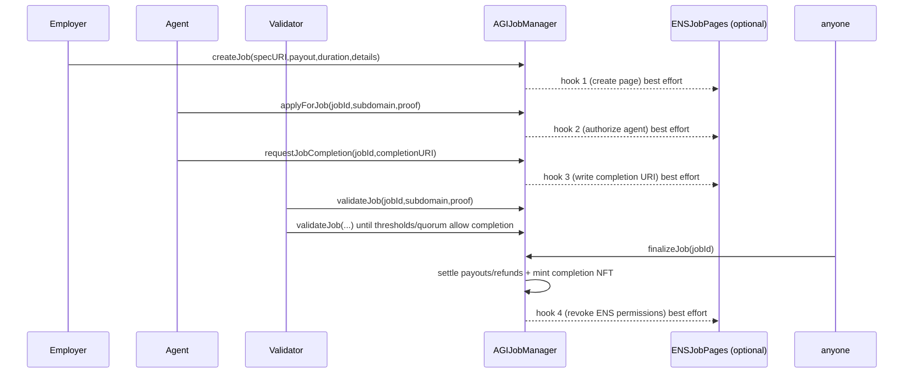
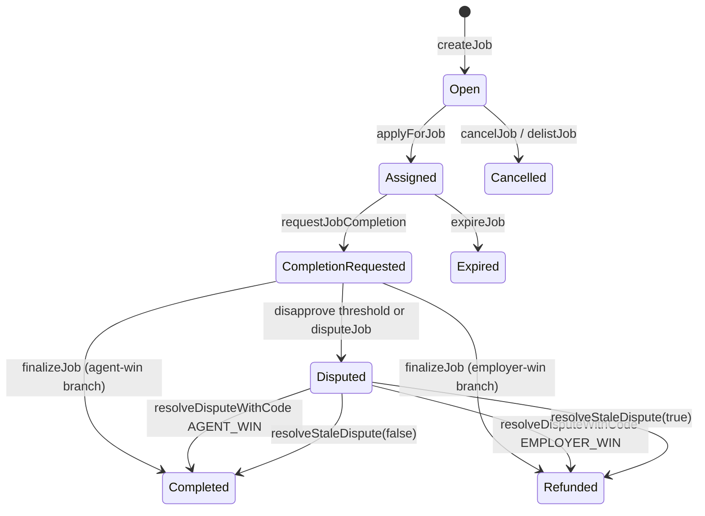

# Architecture

## System overview

`AGIJobManager` is the core owner-operated escrow and settlement contract. It handles job creation, assignment, completion, validator voting, disputes, payout/refund settlement, and ERC-721 completion NFT minting.

`ENSJobPages` is an optional companion contract invoked through best-effort hooks from `AGIJobManager` to create/update ENS job pages and optionally lock permissions/fuses.

Supporting utility libraries:
- `TransferUtils` for exact/defensive ERC-20 transfers.
- `BondMath` for validator and agent bond sizing.
- `ReputationMath` for reputation score increments.
- `ENSOwnership` for ENS + NameWrapper ownership checks.

## Component interaction diagram

```mermaid
flowchart LR
    E[Employer] -->|createJob + payout escrow| AJM[AGIJobManager]
    A[Agent] -->|applyForJob + agent bond| AJM
    V[Validator] -->|validate/disapprove + validator bond| AJM
    M[Moderator] -->|resolveDispute| AJM
    O[Owner] -->|configure/pause/withdraw| AJM

    AJM -->|ERC-20 transfers| T[(AGI ERC-20)]
    AJM -->|mint tokenURI| N[(ERC-721 Job NFT)]
    AJM -->|handleHook(hook,jobId)| ENSJP[ENSJobPages optional]

    ENSJP --> ENS[(ENS Registry)]
    ENSJP --> NW[(NameWrapper)]
    ENSJP --> PR[(Public Resolver)]
```

## Happy-path job lifecycle sequence



## Job state machine



## Trust boundaries

1. **External token transfers**: all escrow/bond/payout/refund transfers rely on ERC-20 behavior and defensive transfer wrappers.
2. **External ENS hooks**: `AGIJobManager` uses low-level calls with a fixed gas cap. Hook failures are emitted via `EnsHookAttempted` but do not block core settlement.
3. **ENS resolver/namewrapper writes**: `ENSJobPages` uses best-effort `try/catch` for resolver authorization/text updates and fuse burning.
4. **Owner/moderator trust**: owner controls configuration and emergency operations; moderators decide manual dispute outcomes.
