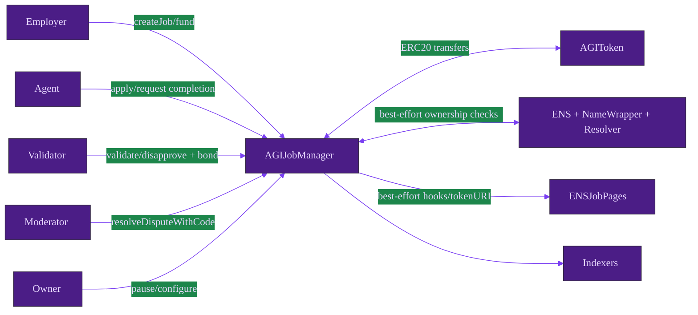
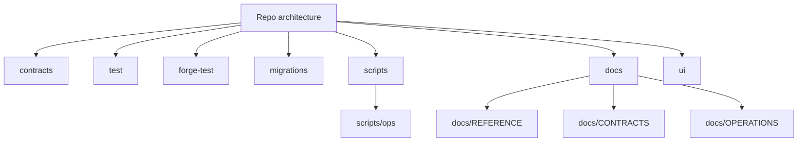

# Architecture

## System architecture

## Repo architecture

- Text-only wireframe asset: [assets/architecture-wireframe.svg](./assets/architecture-wireframe.svg)
- Generated inventory: [REPO_MAP.md](./REPO_MAP.md)
