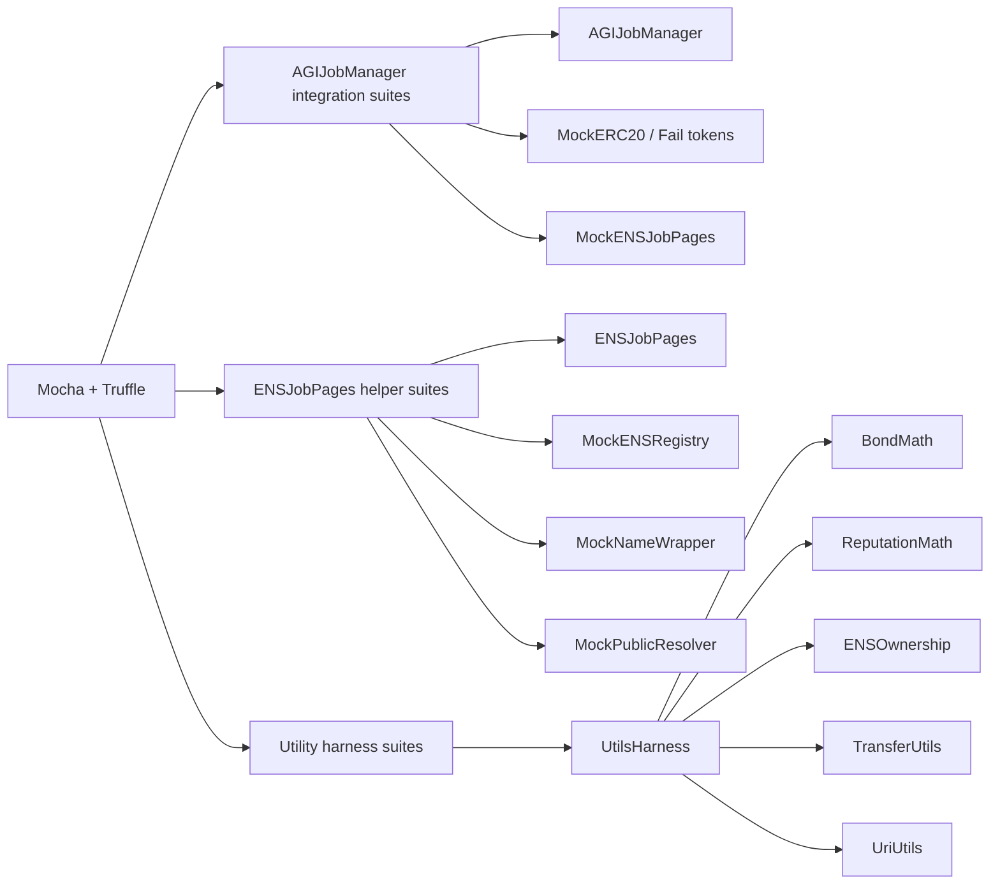
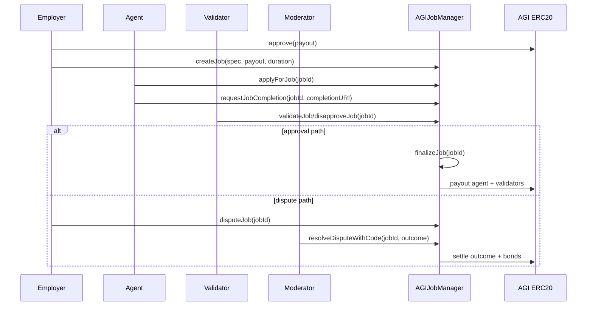
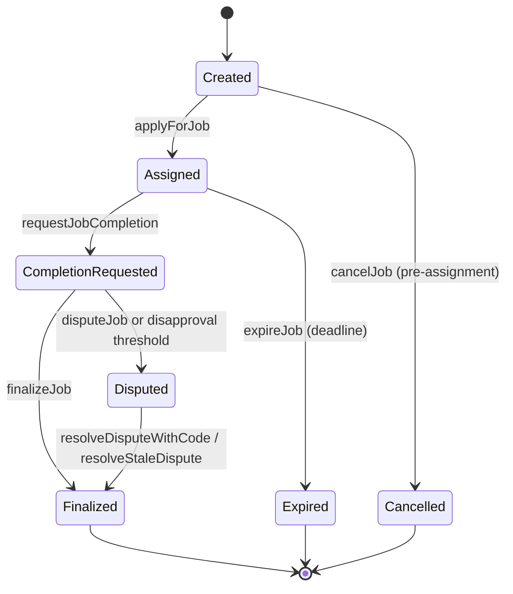
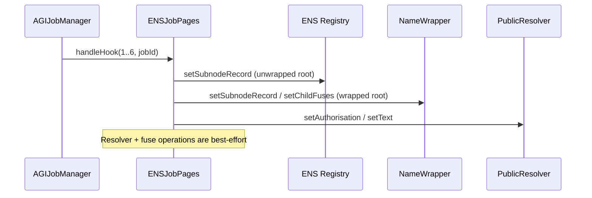

# Test Architecture

## Harness overview

## Primary lifecycle sequence

## Job state machine (tested)

## ENS hook flow

## Roles and permissions matrix

| Role | Core tested capabilities | Representative suites |
|---|---|---|
| Owner | Pause/unpause, config updates, lock identity config, treasury withdrawal (paused) | `adminOps`, `economicSafety` |
| Moderator | Resolve disputes | `disputeHardening`, `securityRegression` |
| Employer | Create/cancel job, dispute, finalize in allowed windows | `happyPath`, `livenessTimeouts` |
| Agent | Apply, request completion, bond participation | `agentPayoutSnapshot`, `incentiveHardening` |
| Validator | Vote/disapprove with bond accounting and role gating | `validatorCap`, `escrowAccounting` |

## Failure-mode matrix

| Failure mode | Expected behavior | Covered by |
|---|---|---|
| ENS hook target reverts | Core lifecycle continues (best-effort hook) | `ensJobPagesHooks` |
| ENS resolver write fails | No lifecycle bricking; hook call remains non-critical | `ensJobPagesHelper` |
| NameWrapper fuse burn reverts | Emits lock event with `fusesBurned=false`; no revert | `ensJobPagesHelper` |
| ERC20 transfer returns false/reverts | Revert with `TransferFailed`; no partial accounting | `AGIJobManager.*`, `utils.transfer_uri` |
| Attempted double release/settlement | Blocked by terminal flags/accounting guards | `securityRegression`, `completionSettlementInvariant` |
