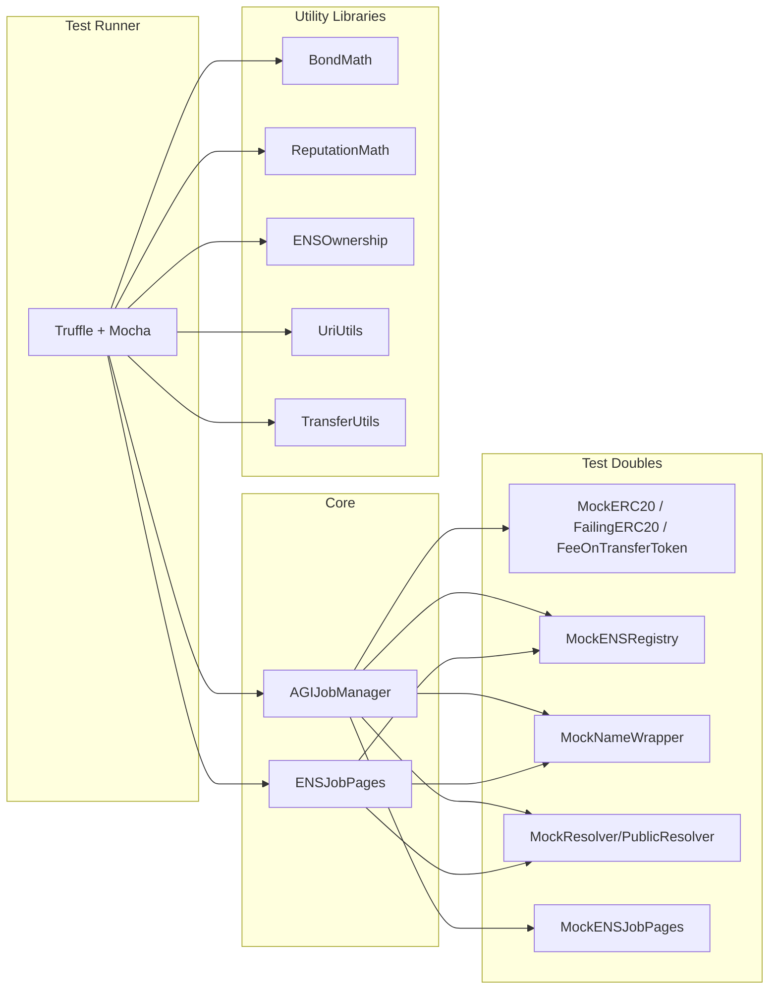
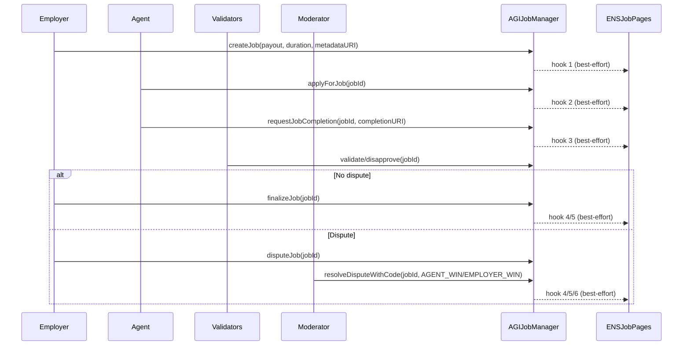
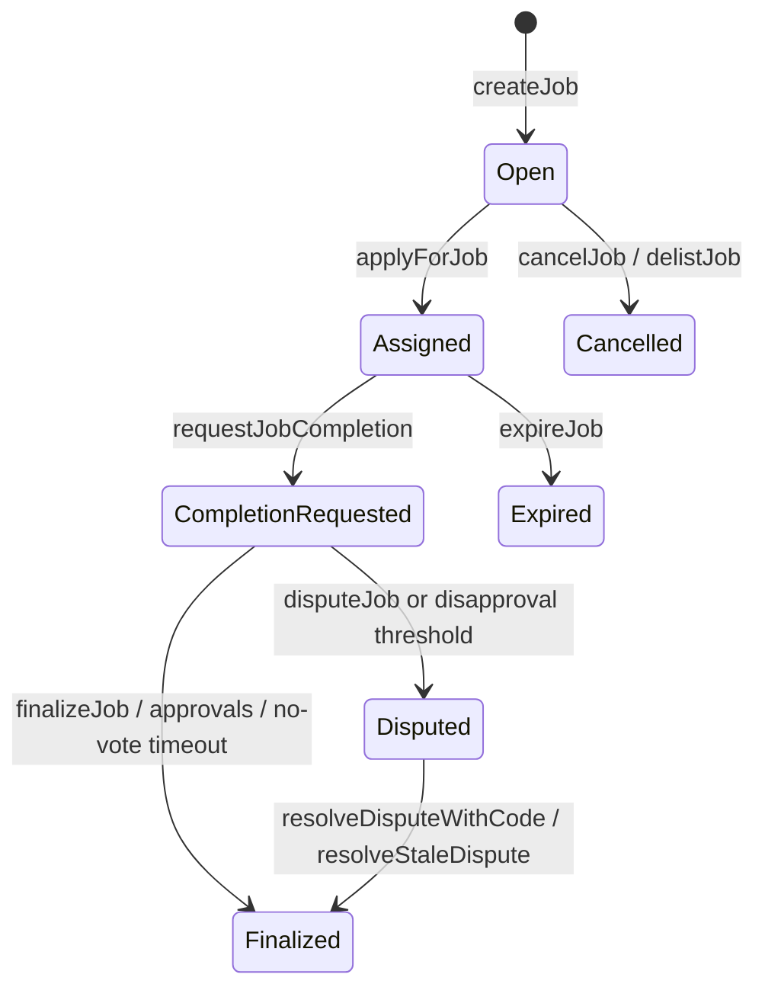
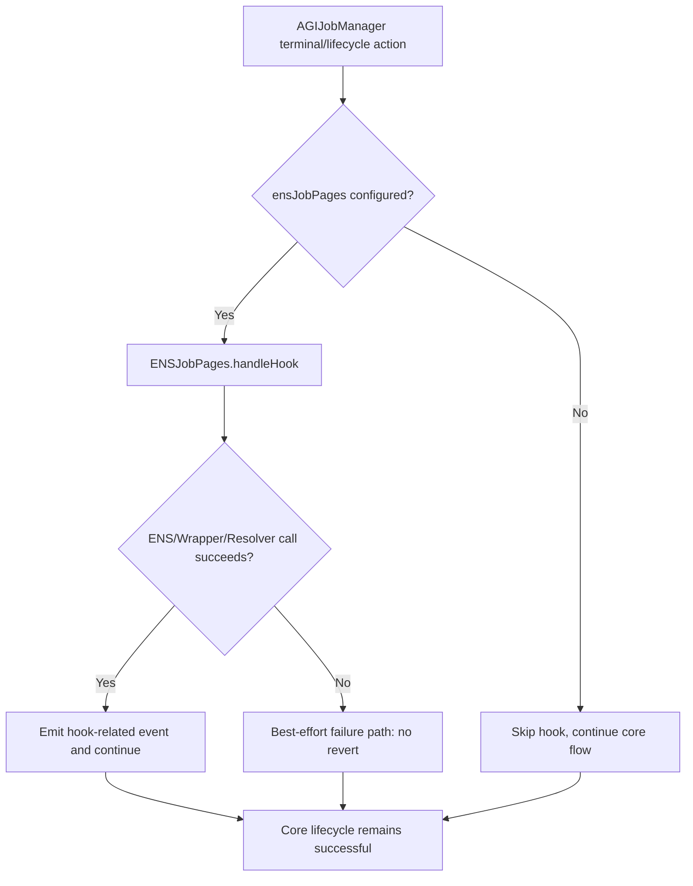

# Test Architecture and Operational Reliability

## Test harness architecture

## Primary lifecycle sequence

## Job state model used by tests

## ENS hook flow

## Roles and permissions matrix

| Role | High-impact actions |
| --- | --- |
| Owner | Pause/unpause, parameter updates, allow/deny lists, treasury withdraw (paused only), identity config lock |
| Moderator | Resolve disputes |
| Employer | Create/cancel jobs, dispute, finalize where applicable |
| Agent | Apply, request completion |
| Validator | Validate/disapprove with bond and eligibility checks |

## Failure-mode matrix

| Failure mode | Expected behavior (tested) |
| --- | --- |
| ENS hook target reverts | Core AGIJobManager action proceeds (best-effort hook). |
| Resolver write failure in ENSJobPages | Hook emits failure signal path, core flow remains live. |
| ERC20 returns `false` | Transfer wrappers revert `TransferFailed`. |
| ERC20 fee-on-transfer under-delivers | `safeTransferFromExact` reverts. |
| Stale dispute not yet timed out | `resolveStaleDispute` reverts until review period elapses. |
| Insolvent withdrawal attempt | `withdrawableAGI`/withdraw paths reject unsafe extraction. |
