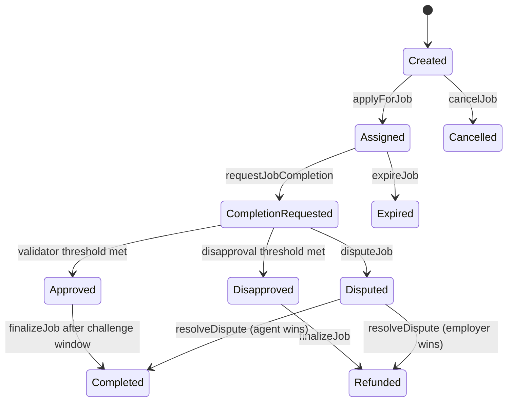
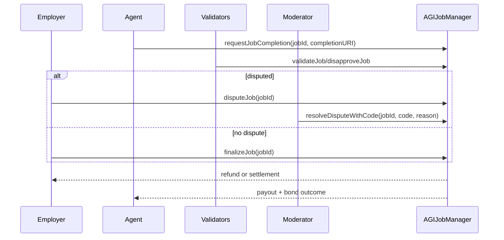

# AGIJobManager Contract Guide

## Permissions matrix

| Action | Owner | Moderator | Employer | Agent | Validator | Anyone |
| --- | --- | --- | --- | --- | --- | --- |
| Create/cancel own job |  |  | ✅ |  |  |  |
| Apply/request completion |  |  |  | ✅ |  |  |
| Validate/disapprove |  |  |  |  | ✅ (eligible) |  |
| Resolve dispute |  | ✅ |  |  |  |  |
| Emergency controls / param updates | ✅ |  |  |  |  |  |
| Expire eligible jobs |  |  |  |  |  | ✅ |

## Lifecycle

## Dispute + finalize sequence

## Bonds, accounting, and timing

- Escrow: employer payout locked at job creation.
- Agent bond: posted on apply; returned/slashed at settlement.
- Validator bond: posted per vote and settled by final outcome.
- Dispute bond: posted by disputant and settled by resolution.
- Timing windows: job duration, completion review period, dispute review period, post-approval challenge window.

> **Safety warning**
> Operators should monitor `withdrawableAGI()` and lock variables before treasury operations.
