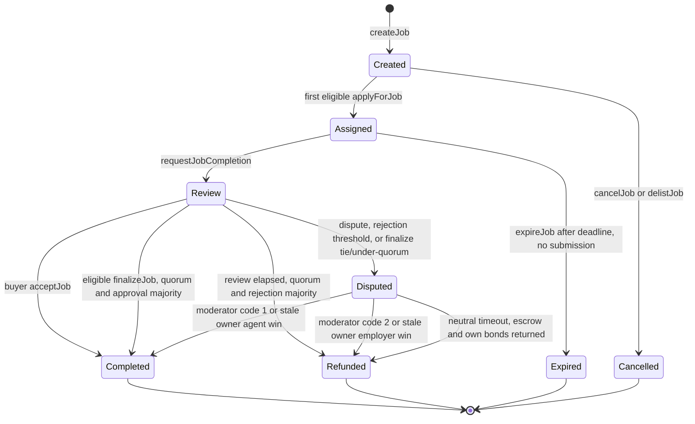
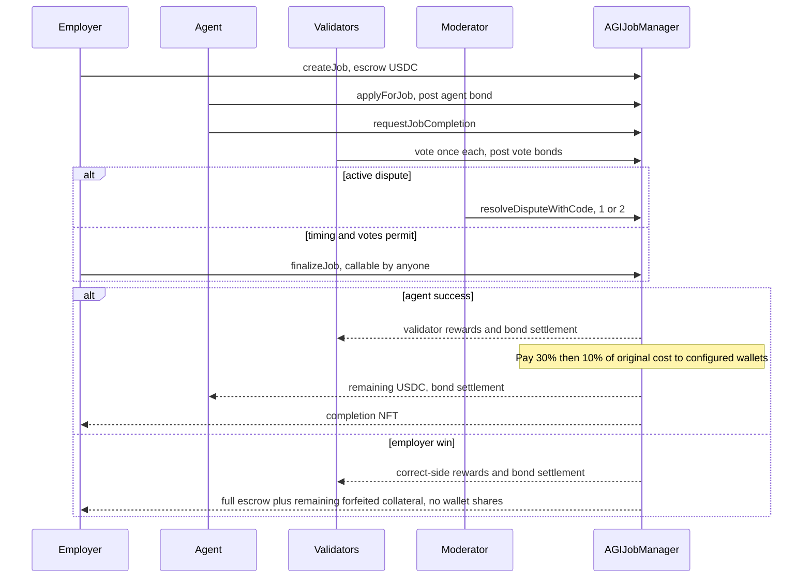

# AGIJobManager Contract Guide — v1.0.3

Source of truth: [`contracts/AGIJobManager.sol`](../../contracts/AGIJobManager.sol). Every escrow, reward and bond uses native USDC; ETH pays gas. Successful settlement pays validators first, then 30% and 10% of the original job cost to the two configured wallets, then the remainder to the agent. See [exact economics](../USDC_PAYOUT_SPLIT.md).

## Permissions matrix

Roles can overlap across jobs. A job's buyer and assigned agent cannot vote; its parties, voters and recorded validator controllers cannot adjudicate it. A checkmark indicates the authority required for that action. Anyone includes owners, moderators, employers, agents and validators when timing/state conditions allow.

| Action | Owner | Moderator | Employer | Agent | Validator | Anyone |
| --- | --- | --- | --- | --- | --- | --- |
| Pause / unpause | Yes | — | — | — | — | — |
| Set parameters / roots / allowlists | Yes | — | — | — | — | — |
| Create / cancel own job | — | — | Yes | — | — | — |
| Apply / completion request | — | — | — | Yes | — | — |
| Validate / disapprove | — | — | — | — | Yes | — |
| Manual dispute after submission | — | — | Yes | Yes | — | — |
| Resolve active dispute | — | Yes | — | — | — | — |
| Resolve stale dispute after deadline | Yes | — | — | — | — | — |
| Expire/finalize in eligible states | — | — | — | — | — | Yes |

## Lifecycle

The first successful eligible application assigns the job. Agents need identity authorization plus an eligible NFT credential when the job requires one; both agent application and validator votes require any applicable USDC bond. Votes do not automatically pay the job.

```mermaid
stateDiagram-v2
  [*] --> Created: createJob
  Created --> Assigned: first eligible applyForJob
  Created --> Cancelled: cancelJob or delistJob
  Assigned --> Review: requestJobCompletion
  Assigned --> Expired: expireJob after deadline, no submission
  Review --> Completed: buyer acceptJob
  Review --> Completed: eligible finalizeJob, quorum and approval majority
  Review --> Refunded: review elapsed, quorum and rejection majority
  Review --> Disputed: dispute, rejection threshold, or finalize tie/under-quorum
  Disputed --> Completed: moderator code 1 or stale owner agent win
  Disputed --> Refunded: moderator code 2 or stale owner employer win
  Disputed --> Refunded: neutral timeout, escrow and own bonds returned
  Completed --> [*]
  Refunded --> [*]
  Expired --> [*]
  Cancelled --> [*]
```

Ordinary finalization requires the full review and any longer approval challenge to end, plus quorum and a strict majority. No votes, under-quorum votes or a tie open a dispute. The buyer may explicitly accept submitted work immediately. Use `getJobDeadlines` for pause-adjusted dates; see [buyer protection](../BUYER_PROTECTION.md).

## Settlement and dispute sequence

```mermaid
sequenceDiagram
  participant E as Employer
  participant A as Agent
  participant V as Validators
  participant M as Moderator
  participant C as AGIJobManager

  E->>C: createJob, escrow USDC
  A->>C: applyForJob, post agent bond
  A->>C: requestJobCompletion
  V->>C: vote once each, post vote bonds
  alt active dispute
    M->>C: resolveDisputeWithCode, 1 or 2
  else timing and votes permit
    E->>C: finalizeJob, callable by anyone
  end
  alt agent success
    C-->>V: validator rewards and bond settlement
    Note over C: Pay 30% then 10% of original cost to configured wallets
    C-->>A: remaining USDC, bond settlement
    C-->>E: completion NFT
  else employer win
    C-->>V: correct-side rewards and bond settlement
    C-->>E: full escrow plus remaining forfeited collateral, no wallet shares
  end
```

Moderator resolution itself settles the job; it does not require a subsequent finalization call. Numeric code `0` only records a note. Failed outgoing transfers become protected claims for their original recipients.

## Config catalog

| Parameter | Purpose | Safe range guidance | Operational note | Where set |
| --- | --- | --- | --- | --- |
| `validationRewardPercentage` | Validator gross-cost budget | 1–60, default 8 | Fixed at posting; changes affect new jobs | owner setter |
| `wallet30`, `wallet10` | Successful-job recipients | Distinct valid addresses | Intake paused and all live job escrow and bonds zero; shares fixed at 30%/10% | owner setter |
| `requiredValidatorApprovals` | Early-approval latch | 0–50; threshold sum ≤50 | Empty job escrow and bonds required; zero disables latch | owner setter |
| `requiredValidatorDisapprovals` | Dispute trigger | 0–50; threshold sum ≤50 | Empty job escrow and bonds required; zero disables trigger | owner setter |
| `voteQuorum` | Full-review outcome quorum | 1–50 | Empty job escrow and bonds required | owner setter |
| `completionReviewPeriod` | Voting/manual-dispute window | Positive, ≤365 days | Empty job escrow and bonds required | owner setter |
| `disputeReviewPeriod` | Stale-dispute delay | Positive, ≤365 days | Empty job escrow and bonds required | owner setter |
| `challengePeriodAfterApproval` | Approval settlement delay | Positive, ≤365 days | Empty job escrow and bonds required | owner setter |
| Agent/validator bond parameters | Funded participation | Contract-enforced bps/min/max rules | Existing agent bonds fixed at assignment; validator bonds at first vote | owner setter |
| `validatorSlashBps` | Incorrect-vote bond slash | 0–10000 | Empty job escrow and bonds required | owner setter |
| `jobDurationLimit` | New-job duration cap | Positive, ≤365 days | Also affects later agent-bond sizing | owner setter |

See [Configuration](../CONFIGURATION.md) and [owner controls](../OWNER_CONTROLS.md) for the complete guards.

## Operational invariants

- `withdrawableUSDC()` excludes job escrow, all bond reserves and pending payment claims. Owner withdrawals require intake paused and settlement enabled.
- USDC and the fixed 30%/10% shares are immutable. The manager has no implementation upgrade switch.
- Successful cost distribution leaves no job-cost treasury remainder; bond settlement is separate. Refund/expiry/cancellation do not pay wallet shares.
- All outstanding randomized job states must remain settleable once their valid timing/outcome conditions are met; paused/blocked USDC remains an external liveness dependency.
- Agent-win settlement requires submitted completion metadata and an eligible unsettled state; double settlement is rejected.
- Identity configuration lock is irreversible for its protected setters; operational Merkle-root updates remain available.
- Fresh deployment starts intake-paused. Ownership handover requires the proposed owner to accept; renunciation is disabled.
