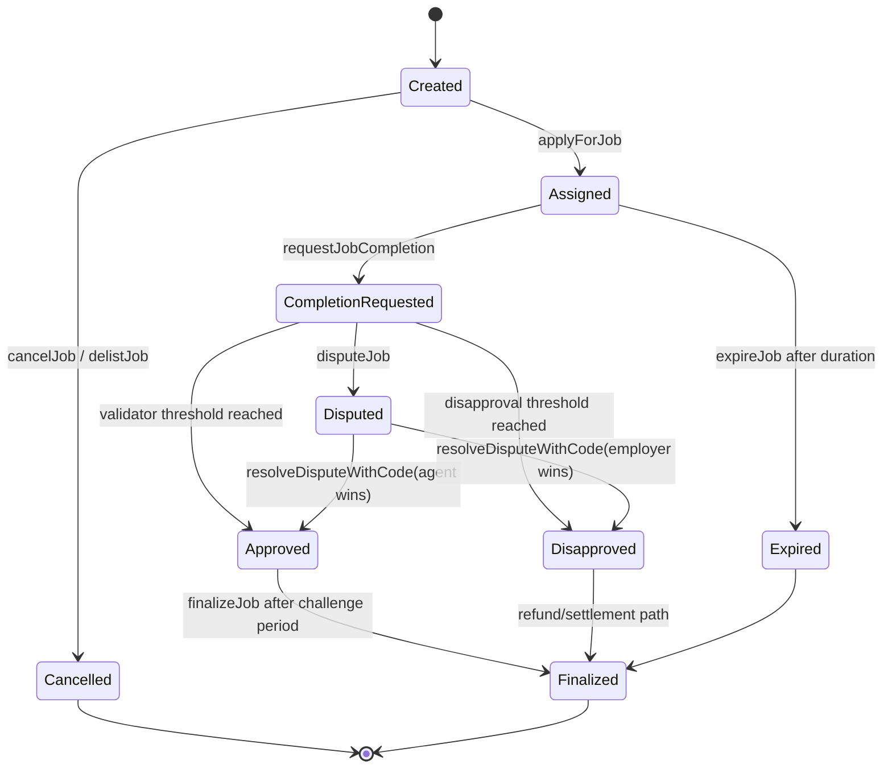
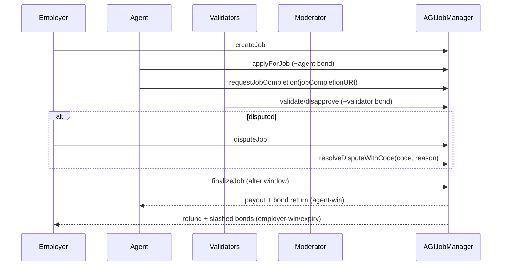

# AGIJobManager Contract Guide

Source of truth: [`contracts/AGIJobManager.sol`](../../contracts/AGIJobManager.sol).

## Permissions matrix

| Action | Owner | Moderator | Employer | Agent | Validator | Anyone |
| --- | --- | --- | --- | --- | --- | --- |
| Pause / unpause | ✅ | ❌ | ❌ | ❌ | ❌ | ❌ |
| Set parameters / roots / allowlists | ✅ | ❌ | ❌ | ❌ | ❌ | ❌ |
| Create / cancel own job | ❌ | ❌ | ✅ | ❌ | ❌ | ❌ |
| Apply / completion request | ❌ | ❌ | ❌ | ✅ | ❌ | ❌ |
| Validate / disapprove | ❌ | ❌ | ❌ | ❌ | ✅ | ❌ |
| Dispute | ❌ | ❌ | ✅ | ✅ | ❌ | ❌ |
| Resolve dispute | ❌ | ✅ | ❌ | ❌ | ❌ | ❌ |
| Expire/finalize in eligible states | ❌ | ❌ | ✅ | ✅ | ❌ | ✅ |

## Lifecycle

## Settlement and dispute sequence

## Config catalog

| Parameter | Purpose | Safe range guidance | Operational note | Where set |
| --- | --- | --- | --- | --- |
| `requiredValidatorApprovals` | Approval threshold | >0 and coherent with quorum/cap | Too high harms liveness | owner setter |
| `requiredValidatorDisapprovals` | Disapproval threshold | >0 and coherent with quorum/cap | Too low increases false negatives | owner setter |
| `completionReviewPeriod` | Voting window | Non-zero, operationally realistic | Affects finalize latency | owner setter |
| `disputeReviewPeriod` | Moderator stale-dispute window | Non-zero with responder SLA | Needed for stale-dispute path | owner setter |
| `challengePeriodAfterApproval` | Delay before finalize on approval | Non-zero and known to users | Protects against immediate closure | owner setter |
| Agent/validator bond params | Anti-spam and incentive alignment | Must avoid unaffordable participation | Validate with ops script | owner setter |

## Operational invariants

- `withdrawableAGI()` excludes locked escrow and all lock buckets.
- Agent-win payout requires completion request metadata and settled state.
- Disputes freeze validator voting effects until moderator/owner stale resolution.
- Identity configuration lock is irreversible.
