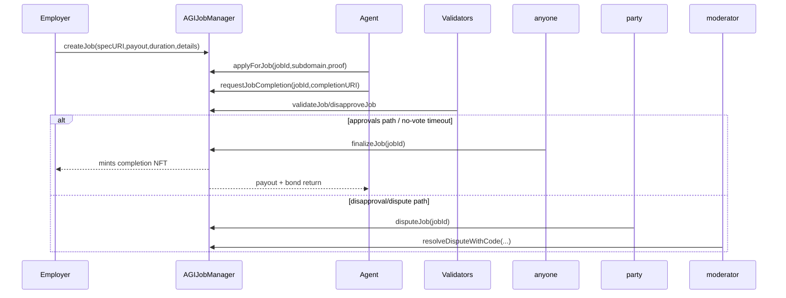
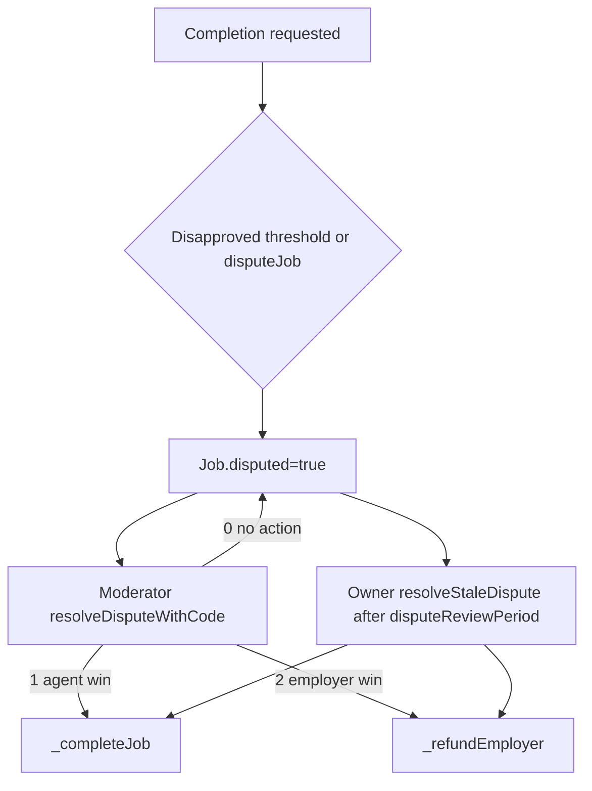

# Contracts Overview

## Main contracts
- `AGIJobManager.sol`: escrow lifecycle, disputes, validator economics, reputation, and completion NFT.
- `ens/ENSJobPages.sol`: optional ENS publication and permission management for per-job pages.
- `utils/*`: URI validation/base IPFS composition, ERC20 transfer wrappers, bond math, reputation math, ENS ownership checks.

## Job lifecycle (user + operator)

Checklist:
- Employer approves AGI allowance before creating jobs.
- Agent must pass allowlist checks and AGIType payout gating.
- Completion URI must be non-empty and URI-valid.
- Finalization can happen via fast challenge-window path after threshold approvals or the review-window path.

## Dispute lifecycle

## ENS hook lifecycle
- Hook 1 (`create`): create subname + set schema/spec text + authorize employer.
- Hook 2 (`assign`): authorize assigned agent.
- Hook 3 (`completion`): publish completion text.
- Hook 4 (`revoke`): revoke employer and agent permissions.
- Hook 5/6 (`lock`/`lock+burn`): lock permissions; optional fuse burn when wrapped root and owner-authorized.

All hooks are best-effort in `AGIJobManager` (`_callEnsJobPagesHook`) and non-blocking.

## Completion NFT lifecycle
- Minted only in `_completeJob`.
- Receiver is employer.
- URI source:
  1. `jobCompletionURI` by default.
  2. ENS URI override if `useEnsJobTokenURI=true` and ENSJobPages returns non-empty URI.
  3. `UriUtils.applyBaseIpfs` prepends base URL for URI values without `://` scheme.
