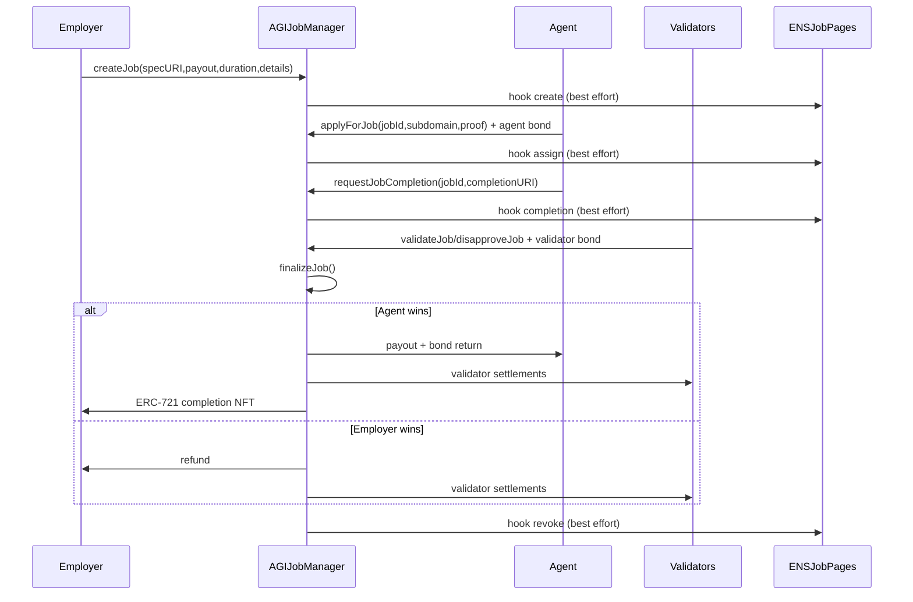
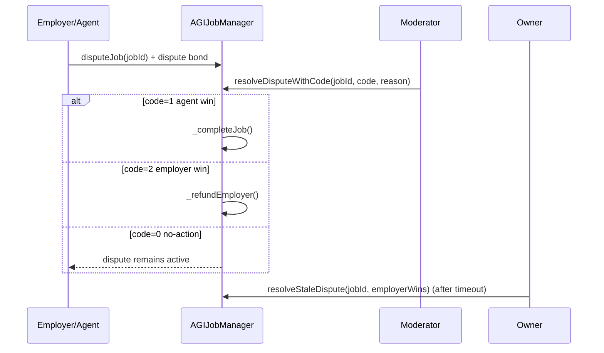

# Contracts Overview

## Primary contracts
- `contracts/AGIJobManager.sol` — core escrow and lifecycle engine.
- `contracts/ens/ENSJobPages.sol` — optional ENS job page manager.

## Supporting libraries
- `contracts/utils/UriUtils.sol`
- `contracts/utils/TransferUtils.sol`
- `contracts/utils/BondMath.sol`
- `contracts/utils/ReputationMath.sol`
- `contracts/utils/ENSOwnership.sol`

## External-facing interfaces
- `contracts/ens/IENSRegistry.sol`
- `contracts/ens/IPublicResolver.sol`
- `contracts/ens/INameWrapper.sol`
- `contracts/ens/IENSJobPages.sol`

## End-to-end workflow: job lifecycle

## End-to-end workflow: disputes

## ENS hooks and NFT URI behavior
- AGIJobManager emits low-level best-effort calls (`handleHook`) to ENSJobPages for create/assign/completion/revoke/lock flows.
- If `useEnsJobTokenURI=true` and ENSJobPages returns a non-empty URI, completion NFTs use that URI; otherwise job completion URI is used.

## Next references
- [AGIJobManager contract reference](./contracts/AGIJobManager.md)
- [ENSJobPages contract reference](./contracts/ENSJobPages.md)
- [Utilities](./contracts/Utilities.md)
- [Interfaces](./contracts/Interfaces.md)
