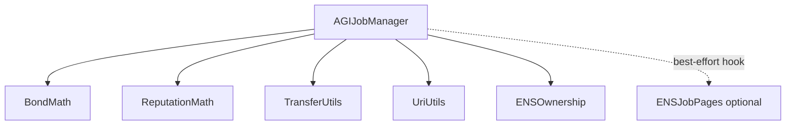
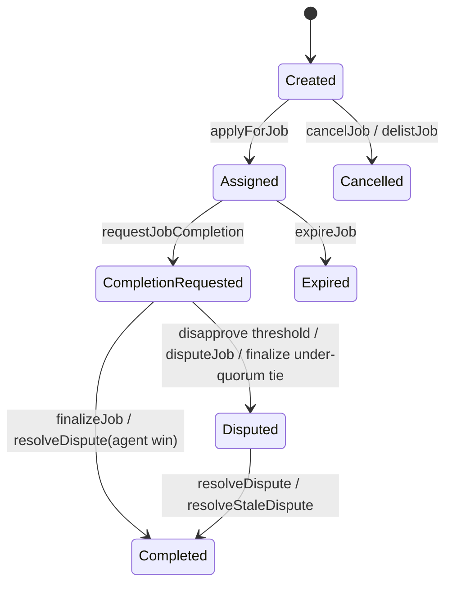

# Contracts Overview

## Purpose
Map contracts, dependencies, and major call paths.

## Audience
Engineers and auditors.

## Preconditions
Understand Truffle deployment and linked-library model.

## Contract Inventory
- Core: `contracts/AGIJobManager.sol`
- ENS metadata extension: `contracts/ens/ENSJobPages.sol`
- Libraries: `contracts/utils/{BondMath,ENSOwnership,ReputationMath,TransferUtils,UriUtils}.sol`
- ENS interfaces: `contracts/ens/I*.sol`
- Test mocks/harnesses: `contracts/test/*`

## High-level Call Graph

## Workflow State Snapshot

## Key Operational Invariants
- Escrow solvency must hold: AGI balance >= lockedEscrow + all locked bond pools.
- Validator loops are bounded by `MAX_VALIDATORS_PER_JOB`.
- `tokenURI` for completion NFTs is minted once at completion and stored.

## Gotchas
- ENS hook calls never revert escrow flow; check `EnsHookAttempted` for metadata failures.
- `setAdditionalAgentPayoutPercentage` is deprecated and always reverts.

## References
- [`contracts/AGIJobManager.sol`](../contracts/AGIJobManager.sol)
- [`contracts/ens/ENSJobPages.sol`](../contracts/ens/ENSJobPages.sol)
- [`migrations/2_deploy_contracts.js`](../migrations/2_deploy_contracts.js)
