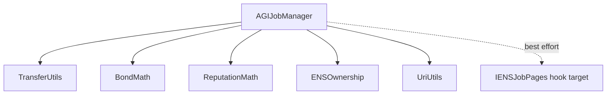
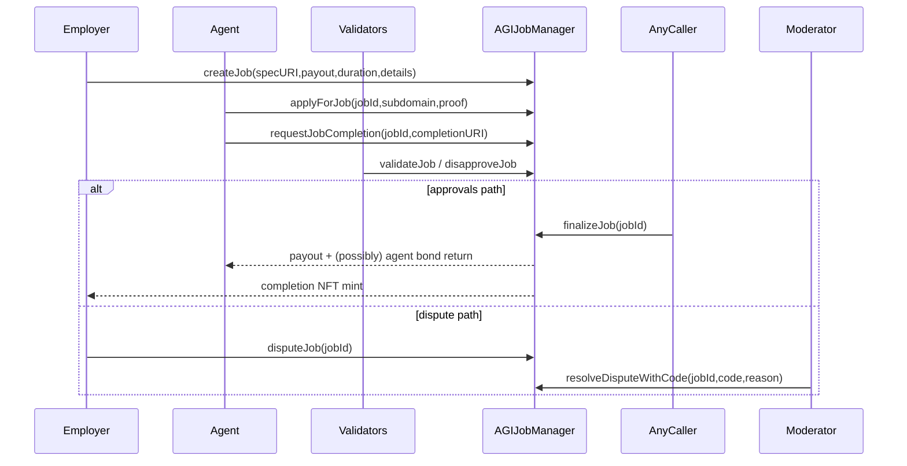

# Contracts Overview

## Purpose
High-level map of contracts, major workflows, and cross-contract calls.

## Audience
Developers and auditors.

## Preconditions / assumptions
- Core runtime contract is `contracts/AGIJobManager.sol`.
- ENS publication is optional via `contracts/ens/ENSJobPages.sol`.

## Contract inventory
| Contract | Type | Responsibility |
|---|---|---|
| `AGIJobManager` | Core | Escrow, job lifecycle, validator voting, disputes, payouts/refunds, reputation, ERC-721 completion NFT. |
| `ENSJobPages` | Integration | Creates/manages ENS job pages and handles hook callbacks. |
| Utility libraries | Linked libs | URI handling, ERC20 transfer safety, bond math, reputation math, ENS ownership checks. |
| ENS interfaces | Interfaces | Minimal interaction surface with ENS Registry/NameWrapper/PublicResolver. |

## Call graph (overview)


## Workflow snapshots

### Job lifecycle


### ENS hook lifecycle (optional)
```mermaid
flowchart TD
  A[Job event in AGIJobManager] --> B[_callEnsJobPagesHook(hook,jobId)]
  B --> C{External call success?}
  C -->|yes| D[EnsHookAttempted(...,true)]
  C -->|no| E[EnsHookAttempted(...,false)]
  E --> F[Continue core settlement path]
```

## Gotchas / failure modes
- ENS hooks are non-blocking by design.
- Validator loops are bounded with `MAX_VALIDATORS_PER_JOB`.
- AGI type list is bounded with `MAX_AGI_TYPES`.

## References
- [`../contracts/AGIJobManager.sol`](../contracts/AGIJobManager.sol)
- [`../contracts/ens/ENSJobPages.sol`](../contracts/ens/ENSJobPages.sol)
- [`./contracts/Utilities.md`](./contracts/Utilities.md)
