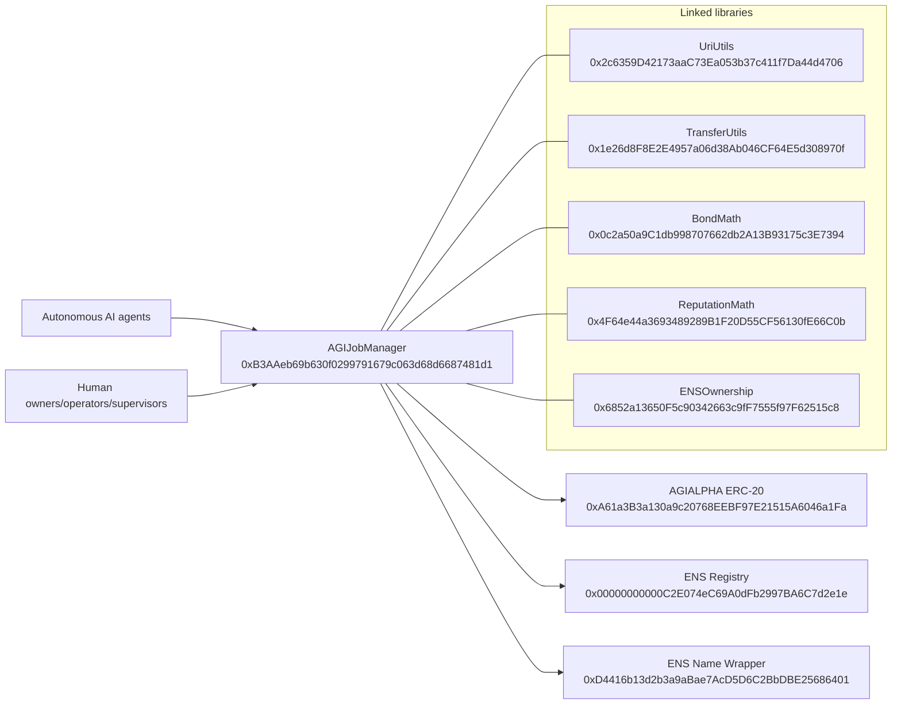

# Official Mainnet Deployment Record

## 1) Executive overview

This document is the canonical record for the official AGIJobManager deployment on Ethereum Mainnet (`chainId = 1`).

What was deployed:
- One primary contract: `AGIJobManager`
- Five linked Solidity libraries: `UriUtils`, `TransferUtils`, `BondMath`, `ReputationMath`, and `ENSOwnership`

What “official” means in practice:
- The addresses in this record are the only canonical mainnet deployment addresses for the official MontrealAI/AGIJobManager release.
- Any different address should be treated as non-official unless this record is superseded in-repo.

**Intended-use statement (prominent): this system is intended for AI agents exclusively. Humans are owners, operators, and supervisors.**

Legal notice pointer:
- Terms are embedded in the source header of [`contracts/AGIJobManager.sol`](../../contracts/AGIJobManager.sol).
- This record is an operations and audit document. It does not replace those Terms.

## 2) What you can trust (anti-phishing)

These are the only official Ethereum Mainnet addresses for this release.

How to detect impostors quickly:
- Wrong chain: if the page is not Ethereum Mainnet (`chainId = 1`), stop.
- Wrong address: if any contract address differs from this record, stop.
- Proxy mismatch: this deployment is not documented as a proxy deployment. If a proxy pattern appears where this record expects a direct verified contract, investigate before taking action.

Why library contracts exist:
- Solidity libraries were deployed separately and linked into `AGIJobManager` at compile/link time.
- They are support components. End users and owners normally interact with `AGIJobManager`, not the library contracts directly.

## 3) Quick links

- UriUtils: https://etherscan.io/address/0x2c6359D42173aaC73Ea053b37c411f7Da44d4706#code
- TransferUtils: https://etherscan.io/address/0x1e26d8F8E2E4957a06d38Ab046CF64E5d308970f#code
- BondMath: https://etherscan.io/address/0x0c2a50a9C1db998707662db2A13B93175c3E7394#code
- ReputationMath: https://etherscan.io/address/0x4F64e44a3693489289B1F20D55CF56130fE66C0b#code
- ENSOwnership: https://etherscan.io/address/0x6852a13650F5c90342663c9fF7555f97F62515c8#code
- AGIJobManager: https://etherscan.io/address/0xB3AAeb69b630f0299791679c063d68d6687481d1#code
- AGIALPHA token context: https://etherscan.io/address/0xA61a3B3a130a9c20768EEBF97E21515A6046a1Fa

Canonical identities:
- Deployer EOA: `0x6c8B8897Fb6b08B4070387233B89b3E9A94eD00E` (`deployer.agi.eth`, informational)
- Final owner EOA: `0xa9eD0539c2fbc5C6BC15a2E168bd9BCd07c01201` (`club.agi.eth`, informational)

## 4) Contract registry table

Network:
- Ethereum Mainnet (`chainId = 1`)

Deployer (EOA):
- `0x6c8B8897Fb6b08B4070387233B89b3E9A94eD00E`
- ENS label (informational): `deployer.agi.eth`

Final owner (after `transferOwnership`):
- `0xa9eD0539c2fbc5C6BC15a2E168bd9BCd07c01201`
- ENS label (informational): `club.agi.eth`

| Contract | Address (checksummed) | ENS label (if applicable) | Deployment tx hash | Etherscan #code link | Purpose | Do I ever call this? |
|---|---|---|---|---|---|---|
| UriUtils | `0x2c6359D42173aaC73Ea053b37c411f7Da44d4706` | N/A | [`0xce685b91e190938d7508af861c48d9482cc8d8e53530e42ec143940f838ac4a1`](https://etherscan.io/tx/0xce685b91e190938d7508af861c48d9482cc8d8e53530e42ec143940f838ac4a1) | https://etherscan.io/address/0x2c6359D42173aaC73Ea053b37c411f7Da44d4706#code | URI helper logic linked into AGIJobManager. | No |
| TransferUtils | `0x1e26d8F8E2E4957a06d38Ab046CF64E5d308970f` | N/A | [`0x4847d58a96191427c5cb2b89622fee4882f03bad4e85eff5fc1a55fc5c7fe4c3`](https://etherscan.io/tx/0x4847d58a96191427c5cb2b89622fee4882f03bad4e85eff5fc1a55fc5c7fe4c3) | https://etherscan.io/address/0x1e26d8F8E2E4957a06d38Ab046CF64E5d308970f#code | Safe transfer helper logic linked into AGIJobManager. | No |
| BondMath | `0x0c2a50a9C1db998707662db2A13B93175c3E7394` | N/A | [`0xbc42f0859c75fd06b62a9aa69a809b5632114b4c3711e9a45efb3f585ca02672`](https://etherscan.io/tx/0xbc42f0859c75fd06b62a9aa69a809b5632114b4c3711e9a45efb3f585ca02672) | https://etherscan.io/address/0x0c2a50a9C1db998707662db2A13B93175c3E7394#code | Bond and escrow arithmetic linked into AGIJobManager. | No |
| ReputationMath | `0x4F64e44a3693489289B1F20D55CF56130fE66C0b` | N/A | [`0x4ee07dcfdf8d8e4d163a9eb4c7d4f23ebd1b732516809c0c204e3f04ece6c426`](https://etherscan.io/tx/0x4ee07dcfdf8d8e4d163a9eb4c7d4f23ebd1b732516809c0c204e3f04ece6c426) | https://etherscan.io/address/0x4F64e44a3693489289B1F20D55CF56130fE66C0b#code | Reputation arithmetic linked into AGIJobManager. | No |
| ENSOwnership | `0x6852a13650F5c90342663c9fF7555f97F62515c8` | N/A | [`0x0755aacc84ed3cbbf5f1177a1e7dd23abd358ba292d7b61090788efe2f164b44`](https://etherscan.io/tx/0x0755aacc84ed3cbbf5f1177a1e7dd23abd358ba292d7b61090788efe2f164b44) | https://etherscan.io/address/0x6852a13650F5c90342663c9fF7555f97F62515c8#code | ENS ownership checks linked into AGIJobManager. | No |
| AGIJobManager | `0xB3AAeb69b630f0299791679c063d68d6687481d1` | N/A | [`0x5b99dc902229561d52b0f0daa7207372f12866befbdbe03a701a07c7e2690995`](https://etherscan.io/tx/0x5b99dc902229561d52b0f0daa7207372f12866befbdbe03a701a07c7e2690995) | https://etherscan.io/address/0xB3AAeb69b630f0299791679c063d68d6687481d1#code | Primary job escrow, validation, dispute, and settlement contract. | Yes |

## 5) Build + verification settings (verbatim)

- solc 0.8.23
- optimizer enabled, runs = 40
- evmVersion = shanghai
- viaIR = false
- settings.metadata.bytecodeHash = "none"
- settings.debug.revertStrings = "strip"

Why this matters:
- Etherscan verifies by recompiling bytecode.
- If any setting differs, Etherscan can show “not verified” or a bytecode mismatch even with correct source files.

## 6) AGIJobManager constructor arguments (verbatim)

- agiTokenAddress: 0xa61a3b3a130a9c20768eebf97e21515a6046a1fa
- baseIpfsUrl: https://ipfs.io/ipfs/
- ensConfig (address[2]):
  [0x00000000000C2E074eC69A0dFb2997BA6C7d2e1e, 0xD4416b13d2b3a9aBae7AcD5D6C2BbDBE25686401]
- rootNodes (bytes32[4]):
  0x39eb848f88bdfb0a6371096249dd451f56859dfe2cd3ddeab1e26d5bb68ede16
  0x2c9c6189b2e92da4d0407e9deb38ff6870729ad063af7e8576cb7b7898c88e2d
  0x6487f659ec6f3fbd424b18b685728450d2559e4d68768393f9c689b2b6e5405e
  0xc74b6c5e8a0d97ed1fe28755da7d06a84593b4de92f6582327bc40f41d6c2d5e
- merkleRoots (bytes32[2]):
  0x0effa6c54d4c4866ca6e9f4fc7426ba49e70e8f6303952e04c8f0218da68b99b
  0x0effa6c54d4c4866ca6e9f4fc7426ba49e70e8f6303952e04c8f0218da68b99b

Plain-language meaning:
- `agiTokenAddress`: sets the AGIALPHA ERC-20 token used for escrow, payouts, and bonds.
- `baseIpfsUrl`: base HTTP gateway prefix used to build and resolve IPFS metadata links.
- `ensConfig`: ENS core contract addresses used for ENS-based ownership checks.
- `rootNodes`: approved ENS root namespaces checked at identity-gating boundaries.
- `merkleRoots`: allowlist roots used for Merkle-proof based access checks.

Token context (constructor argument unchanged):
- AGIALPHA ERC-20: `0xA61a3B3a130a9c20768EEBF97E21515A6046a1Fa`

## 7) Ownership and roles (verifiable on Etherscan)

Role split:
- Deployer (`deployer.agi.eth`): `0x6c8B8897Fb6b08B4070387233B89b3E9A94eD00E` (broadcast deployment transactions)
- Final owner (`club.agi.eth`): `0xa9eD0539c2fbc5C6BC15a2E168bd9BCd07c01201` (controls owner-only functions)

Single post-deploy ownership transfer:
- `transferOwnership(finalOwner)` tx: `0xbabede7945b7e926cf0ea4a66561bf5db9952648425290608c02f970dcab5436`

What you do / What you should see:

1) Verify owner control
- What you do: Open `https://etherscan.io/address/0xB3AAeb69b630f0299791679c063d68d6687481d1#readContract` and call `owner()`.
- What you should see: `0xa9eD0539c2fbc5C6BC15a2E168bd9BCd07c01201`.

2) Verify token binding
- What you do: On the same `Read Contract` page, call `agiToken()`.
- What you should see: `0xA61a3B3a130a9c20768EEBF97E21515A6046a1Fa`.

3) Verify ownership transfer event
- What you do: Open `https://etherscan.io/tx/0xbabede7945b7e926cf0ea4a66561bf5db9952648425290608c02f970dcab5436`.
- What you should see: a successful ownership transfer to the final owner address above.

Note:
- ENS labels are helpful for humans.
- Addresses are authoritative for security and operations.

## 8) Etherscan verification checklist (step-by-step)

1) Confirm network
- What you do: Check network header and URL.
- What you should see: Ethereum Mainnet (`chainId = 1`).

2) Confirm direct contract page
- What you do: Open AGIJobManager address and select `Contract` tab.
- What you should see: Contract page, not a token-only page, and no unexpected proxy indirection pattern.

3) Confirm verified source
- What you do: Read verification status in the `Contract` tab.
- What you should see: `Contract Source Code Verified`.

4) Confirm constructor arguments
- What you do: Inspect constructor arguments in verification details.
- What you should see: exact match with Section 6 values.

5) Confirm linked libraries
- What you do: Inspect linked libraries for AGIJobManager in verification details.
- What you should see these exact mappings:
  - `contracts/utils/UriUtils.sol:UriUtils` -> `0x2c6359D42173aaC73Ea053b37c411f7Da44d4706`
  - `contracts/utils/TransferUtils.sol:TransferUtils` -> `0x1e26d8F8E2E4957a06d38Ab046CF64E5d308970f`
  - `contracts/utils/BondMath.sol:BondMath` -> `0x0c2a50a9C1db998707662db2A13B93175c3E7394`
  - `contracts/utils/ReputationMath.sol:ReputationMath` -> `0x4F64e44a3693489289B1F20D55CF56130fE66C0b`
  - `contracts/utils/ENSOwnership.sol:ENSOwnership` -> `0x6852a13650F5c90342663c9fF7555f97F62515c8`

6) Confirm creator transactions
- What you do: Open each contract page and inspect creator transaction.
- What you should see:
  - UriUtils: `0xce685b91e190938d7508af861c48d9482cc8d8e53530e42ec143940f838ac4a1`
  - TransferUtils: `0x4847d58a96191427c5cb2b89622fee4882f03bad4e85eff5fc1a55fc5c7fe4c3`
  - BondMath: `0xbc42f0859c75fd06b62a9aa69a809b5632114b4c3711e9a45efb3f585ca02672`
  - ReputationMath: `0x4ee07dcfdf8d8e4d163a9eb4c7d4f23ebd1b732516809c0c204e3f04ece6c426`
  - ENSOwnership: `0x0755aacc84ed3cbbf5f1177a1e7dd23abd358ba292d7b61090788efe2f164b44`
  - AGIJobManager: `0x5b99dc902229561d52b0f0daa7207372f12866befbdbe03a701a07c7e2690995`

7) Confirm ownership finalization
- What you do: Open ownership transfer tx and call `owner()` in `Read Contract`.
- What you should see: transfer tx exists (`0xbabede7945b7e926cf0ea4a66561bf5db9952648425290608c02f970dcab5436`) and `owner()` equals final owner.

## 9) Architecture diagram (text-only Mermaid)

## 10) Long-term recordkeeping and reproducibility

Committed official artifacts (repo-relative paths only):
- `hardhat/deployments/mainnet/deployment.1.24522684.json`
- `hardhat/deployments/mainnet/solc-input.json`
- `hardhat/deployments/mainnet/verify-targets.json`

Why these files are committed:
- `deployment.1.24522684.json` preserves addresses, tx hashes, constructor args, linked libraries, and ownership transfer as an auditable receipt.
- `solc-input.json` preserves full Solidity Standard JSON Input for manual Etherscan verification and bytecode reproduction.
- `verify-targets.json` preserves deterministic name/FQN-to-address mapping for verification tooling and future audits.

Operational benefit:
- If plugin-based verification tooling breaks in the future, operators can still verify manually on Etherscan using `solc-input.json` and the recorded library/constructor values.

Recordkeeping rule:
- Do not rely on private local absolute paths.
- Use repository-relative paths in all long-lived operational and audit documentation.

## Appendix A) Canonical source data snapshot (verbatim)

Network:
- Ethereum Mainnet (chainId = 1)

Deployer (EOA):
- 0x6c8B8897Fb6b08B4070387233B89b3E9A94eD00E
ENS label (informational):
- deployer.agi.eth

Final owner (after transferOwnership):
- 0xa9eD0539c2fbc5C6BC15a2E168bd9BCd07c01201
ENS label (informational):
- club.agi.eth

Compiler / verification settings:
- solc 0.8.23
- optimizer enabled, runs = 40
- evmVersion = shanghai
- viaIR = false
- settings.metadata.bytecodeHash = "none"
- settings.debug.revertStrings = "strip"

Constructor args used for AGIJobManager:
- agiTokenAddress: 0xa61a3b3a130a9c20768eebf97e21515a6046a1fa
- baseIpfsUrl: https://ipfs.io/ipfs/
- ensConfig (address[2]):
  [0x00000000000C2E074eC69A0dFb2997BA6C7d2e1e, 0xD4416b13d2b3a9aBae7AcD5D6C2BbDBE25686401]
- rootNodes (bytes32[4]):
  0x39eb848f88bdfb0a6371096249dd451f56859dfe2cd3ddeab1e26d5bb68ede16
  0x2c9c6189b2e92da4d0407e9deb38ff6870729ad063af7e8576cb7b7898c88e2d
  0x6487f659ec6f3fbd424b18b685728450d2559e4d68768393f9c689b2b6e5405e
  0xc74b6c5e8a0d97ed1fe28755da7d06a84593b4de92f6582327bc40f41d6c2d5e
- merkleRoots (bytes32[2]):
  0x0effa6c54d4c4866ca6e9f4fc7426ba49e70e8f6303952e04c8f0218da68b99b
  0x0effa6c54d4c4866ca6e9f4fc7426ba49e70e8f6303952e04c8f0218da68b99b

Token context:
- AGIALPHA ERC-20: 0xA61a3B3a130a9c20768EEBF97E21515A6046a1Fa

Deployed contracts:
- UriUtils:
  - address: 0x2c6359D42173aaC73Ea053b37c411f7Da44d4706
  - tx: 0xce685b91e190938d7508af861c48d9482cc8d8e53530e42ec143940f838ac4a1
  - etherscan: https://etherscan.io/address/0x2c6359D42173aaC73Ea053b37c411f7Da44d4706#code
- TransferUtils:
  - address: 0x1e26d8F8E2E4957a06d38Ab046CF64E5d308970f
  - tx: 0x4847d58a96191427c5cb2b89622fee4882f03bad4e85eff5fc1a55fc5c7fe4c3
  - etherscan: https://etherscan.io/address/0x1e26d8F8E2E4957a06d38Ab046CF64E5d308970f#code
- BondMath:
  - address: 0x0c2a50a9C1db998707662db2A13B93175c3E7394
  - tx: 0xbc42f0859c75fd06b62a9aa69a809b5632114b4c3711e9a45efb3f585ca02672
  - etherscan: https://etherscan.io/address/0x0c2a50a9C1db998707662db2A13B93175c3E7394#code
- ReputationMath:
  - address: 0x4F64e44a3693489289B1F20D55CF56130fE66C0b
  - tx: 0x4ee07dcfdf8d8e4d163a9eb4c7d4f23ebd1b732516809c0c204e3f04ece6c426
  - etherscan: https://etherscan.io/address/0x4F64e44a3693489289B1F20D55CF56130fE66C0b#code
- ENSOwnership:
  - address: 0x6852a13650F5c90342663c9fF7555f97F62515c8
  - tx: 0x0755aacc84ed3cbbf5f1177a1e7dd23abd358ba292d7b61090788efe2f164b44
  - etherscan: https://etherscan.io/address/0x6852a13650F5c90342663c9fF7555f97F62515c8#code
- AGIJobManager:
  - address: 0xB3AAeb69b630f0299791679c063d68d6687481d1
  - tx: 0x5b99dc902229561d52b0f0daa7207372f12866befbdbe03a701a07c7e2690995
  - etherscan: https://etherscan.io/address/0xB3AAeb69b630f0299791679c063d68d6687481d1#code

Ownership transfer:
- transferOwnership(finalOwner) tx:
  0xbabede7945b7e926cf0ea4a66561bf5db9952648425290608c02f970dcab5436

Deployment artifacts produced:
- hardhat/deployments/mainnet/deployment.1.24522684.json
- hardhat/deployments/mainnet/solc-input.json
- hardhat/deployments/mainnet/verify-targets.json
