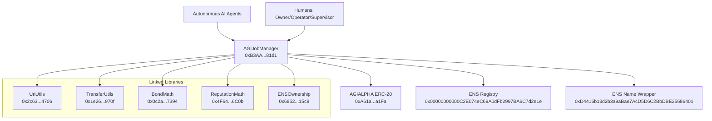

# Official Mainnet Deployment Record

## 1) Executive overview

This file is the canonical record for the official `AGIJobManager` deployment on Ethereum Mainnet (`chainId = 1`).

What was deployed:
- 1 primary contract: `AGIJobManager`
- 5 linked libraries: `UriUtils`, `TransferUtils`, `BondMath`, `ReputationMath`, `ENSOwnership`

Why there are 6 contracts:
- Solidity external libraries are deployed separately, then linked into the final `AGIJobManager` bytecode.
- This keeps logic modular and supports deterministic verification.

**Prominent intended-use statement: this system is intended for AI agents exclusively. Humans act as owners, operators, and supervisors.**

Legal notice: Terms are embedded in [`contracts/AGIJobManager.sol`](../../contracts/AGIJobManager.sol). This document is an operational deployment record only.

## 2) Quick links

Etherscan code links (all 6 contracts, one line): [UriUtils](https://etherscan.io/address/0x2c6359D42173aaC73Ea053b37c411f7Da44d4706#code) | [TransferUtils](https://etherscan.io/address/0x1e26d8F8E2E4957a06d38Ab046CF64E5d308970f#code) | [BondMath](https://etherscan.io/address/0x0c2a50a9C1db998707662db2A13B93175c3E7394#code) | [ReputationMath](https://etherscan.io/address/0x4F64e44a3693489289B1F20D55CF56130fE66C0b#code) | [ENSOwnership](https://etherscan.io/address/0x6852a13650F5c90342663c9fF7555f97F62515c8#code) | [AGIJobManager](https://etherscan.io/address/0xB3AAeb69b630f0299791679c063d68d6687481d1#code)

Token context: [AGIALPHA ERC-20](https://etherscan.io/address/0xA61a3B3a130a9c20768EEBF97E21515A6046a1Fa)

## 3) Contract registry table

Network: Ethereum Mainnet (`chainId = 1`)

Deployer:
- `0x6c8B8897Fb6b08B4070387233B89b3E9A94eD00E`

Final owner (after transferOwnership):
- `0xa9eD0539c2fbc5C6BC15a2E168bd9BCd07c01201` (`club.agi.eth`)

| Contract | Address | Deployment tx hash | Etherscan link | Purpose |
|---|---|---|---|---|
| UriUtils | `0x2c6359D42173aaC73Ea053b37c411f7Da44d4706` | [`0xce685b91e190938d7508af861c48d9482cc8d8e53530e42ec143940f838ac4a1`](https://etherscan.io/tx/0xce685b91e190938d7508af861c48d9482cc8d8e53530e42ec143940f838ac4a1) | https://etherscan.io/address/0x2c6359D42173aaC73Ea053b37c411f7Da44d4706#code | URI validation and URI composition helper logic linked into AGIJobManager. |
| TransferUtils | `0x1e26d8F8E2E4957a06d38Ab046CF64E5d308970f` | [`0x4847d58a96191427c5cb2b89622fee4882f03bad4e85eff5fc1a55fc5c7fe4c3`](https://etherscan.io/tx/0x4847d58a96191427c5cb2b89622fee4882f03bad4e85eff5fc1a55fc5c7fe4c3) | https://etherscan.io/address/0x1e26d8F8E2E4957a06d38Ab046CF64E5d308970f#code | Safe ERC-20 transfer wrapper logic linked into AGIJobManager. |
| BondMath | `0x0c2a50a9C1db998707662db2A13B93175c3E7394` | [`0xbc42f0859c75fd06b62a9aa69a809b5632114b4c3711e9a45efb3f585ca02672`](https://etherscan.io/tx/0xbc42f0859c75fd06b62a9aa69a809b5632114b4c3711e9a45efb3f585ca02672) | https://etherscan.io/address/0x0c2a50a9C1db998707662db2A13B93175c3E7394#code | Bond and escrow math logic linked into AGIJobManager. |
| ReputationMath | `0x4F64e44a3693489289B1F20D55CF56130fE66C0b` | [`0x4ee07dcfdf8d8e4d163a9eb4c7d4f23ebd1b732516809c0c204e3f04ece6c426`](https://etherscan.io/tx/0x4ee07dcfdf8d8e4d163a9eb4c7d4f23ebd1b732516809c0c204e3f04ece6c426) | https://etherscan.io/address/0x4F64e44a3693489289B1F20D55CF56130fE66C0b#code | Reputation scoring math logic linked into AGIJobManager. |
| ENSOwnership | `0x6852a13650F5c90342663c9fF7555f97F62515c8` | [`0x0755aacc84ed3cbbf5f1177a1e7dd23abd358ba292d7b61090788efe2f164b44`](https://etherscan.io/tx/0x0755aacc84ed3cbbf5f1177a1e7dd23abd358ba292d7b61090788efe2f164b44) | https://etherscan.io/address/0x6852a13650F5c90342663c9fF7555f97F62515c8#code | ENS ownership check logic linked into AGIJobManager. |
| AGIJobManager | `0xB3AAeb69b630f0299791679c063d68d6687481d1` | [`0x5b99dc902229561d52b0f0daa7207372f12866befbdbe03a701a07c7e2690995`](https://etherscan.io/tx/0x5b99dc902229561d52b0f0daa7207372f12866befbdbe03a701a07c7e2690995) | https://etherscan.io/address/0xB3AAeb69b630f0299791679c063d68d6687481d1#code | Primary contract for job escrow, assignment, validation, dispute handling, and settlement. |

## 4) Build + verification settings (verbatim)

- solc 0.8.23
- optimizer enabled, runs = 40
- evmVersion = shanghai
- viaIR = false
- settings.metadata.bytecodeHash = "none"
- settings.debug.revertStrings = "strip"

Why matching settings matters:
- Etherscan recompiles contract bytecode during verification.
- Any mismatch can cause verification failure even when source files are correct.

## 5) AGIJobManager constructor arguments (verbatim)

- agiTokenAddress: 0xa61a3b3a130a9c20768eebf97e21515a6046a1fa
- baseIpfsUrl: https://ipfs.io/ipfs/
- ensConfig (address[2]):
  [0x00000000000C2E074eC69A0dFb2997BA6C7d2e1e, 0xD4416b13d2b3a9aBae7AcD5D6C2BbDBE25686401]
- rootNodes (bytes32[4]):
  0x39eb848f88bdfb0a6371096249dd451f56859dfe2cd3ddeab1e26d5bb68ede16
  0x2c9c6189b2e92da4d0407e9deb38ff6870729ad063af7e8576cb7b7898c88e2d
  0x6487f659ec6f3fbd424b18b685728450d2559e4d68768393f9c689b2b6e5405e
  0xc74b6c5e8a0d97ed1fe28755da7d06a84593b4de92f6582327bc40f41d6c2d5e
- merkleRoots (bytes32[2]):
  0x0effa6c54d4c4866ca6e9f4fc7426ba49e70e8f6303952e04c8f0218da68b99b
  0x0effa6c54d4c4866ca6e9f4fc7426ba49e70e8f6303952e04c8f0218da68b99b

Plain-language meaning:
- `agiTokenAddress`: payout and bond token reference for AGIJobManager. Token context is AGIALPHA ERC-20 at `0xA61a3B3a130a9c20768EEBF97E21515A6046a1Fa`.
- `baseIpfsUrl`: base URL for IPFS-hosted metadata references.
- `ensConfig`: ENS Registry and ENS Name Wrapper addresses used by identity checks.
- `rootNodes`: ENS root namespace anchors used for namespace policy.
- `merkleRoots`: allowlist Merkle roots used by identity gating logic.

## 6) Ownership / control state (verifiable on Etherscan)

Expected state:
- `owner()` must return `0xa9eD0539c2fbc5C6BC15a2E168bd9BCd07c01201`.
- Ownership transfer transaction: `0xbabede7945b7e926cf0ea4a66561bf5db9952648425290608c02f970dcab5436`

Owner vs deployer:
- Deployer broadcasted deployment transactions.
- Owner controls owner-only functions after `transferOwnership(finalOwner)`.

What to do:
1. Open `https://etherscan.io/address/0xB3AAeb69b630f0299791679c063d68d6687481d1#readContract`.
2. Call `owner()`.
3. Open transfer tx `https://etherscan.io/tx/0xbabede7945b7e926cf0ea4a66561bf5db9952648425290608c02f970dcab5436`.

What you should see:
- `owner()` equals `0xa9eD0539c2fbc5C6BC15a2E168bd9BCd07c01201`.
- Transfer transaction exists and sets the final owner.

## 7) Verification checklist (Etherscan, non-technical)

1. Confirm this is a contract page (not a token-only tracker page and not a proxy indirection).
   - What to do: Open the AGIJobManager address page and click `Contract`.
   - What you should see: contract tabs with source and ABI.
2. Confirm source verification status.
   - What to do: On `Contract` tab, read status.
   - What you should see: `Contract Source Code Verified`.
3. Confirm constructor arguments.
   - What to do: Open constructor arguments / verification metadata.
   - What you should see: exact values from Section 5.
4. Confirm linked library addresses.
   - What to do: Review linked libraries in AGIJobManager verification details.
   - What you should see:
     - `contracts/utils/UriUtils.sol:UriUtils` -> `0x2c6359D42173aaC73Ea053b37c411f7Da44d4706`
     - `contracts/utils/TransferUtils.sol:TransferUtils` -> `0x1e26d8F8E2E4957a06d38Ab046CF64E5d308970f`
     - `contracts/utils/BondMath.sol:BondMath` -> `0x0c2a50a9C1db998707662db2A13B93175c3E7394`
     - `contracts/utils/ReputationMath.sol:ReputationMath` -> `0x4F64e44a3693489289B1F20D55CF56130fE66C0b`
     - `contracts/utils/ENSOwnership.sol:ENSOwnership` -> `0x6852a13650F5c90342663c9fF7555f97F62515c8`
5. Confirm ownership and token references.
   - What to do: In `Read Contract`, call `owner()` and `agiToken()`.
   - What you should see:
     - `owner() = 0xa9eD0539c2fbc5C6BC15a2E168bd9BCd07c01201`
     - `agiToken() = 0xA61a3B3a130a9c20768EEBF97E21515A6046a1Fa`

## 8) Operational pointers

What deployment did not do:
- No post-deploy parameter mutations are part of the deployment record, except ownership transfer.
- Ongoing configuration and actions are owner/operator tasks.

Where to operate safely:
- Owner/operator runbook: [`docs/OWNER_RUNBOOK.md`](../OWNER_RUNBOOK.md)
- Operations runbook: [`docs/OPERATIONS_RUNBOOK.md`](../OPERATIONS_RUNBOOK.md)
- Etherscan guide: [`docs/ETHERSCAN_GUIDE.md`](../ETHERSCAN_GUIDE.md)

Day-to-day owner/operator actions are expected via Etherscan `Write Contract`, following the runbooks.

## 9) Architecture diagram (Mermaid, text-only)

## 10) Long-term recordkeeping best practices

Official, committed deployment artifacts (repo-relative paths):
- `hardhat/deployments/mainnet/deployment.1.24522684.json`
- `hardhat/deployments/mainnet/solc-input.json`
- `hardhat/deployments/mainnet/verify-targets.json`

Why these files matter:
- `deployment.1.24522684.json`: auditable receipt of addresses, tx hashes, constructor args, libraries, and ownership transfer.
- `solc-input.json`: Solidity Standard JSON Input for future re-verification, including manual Etherscan workflows.
- `verify-targets.json`: deterministic mapping from contract names/FQNs to mainnet addresses.

These files make independent re-verification possible years later.

Do not rely on private local machine paths. Keep records in repository-relative form only.
