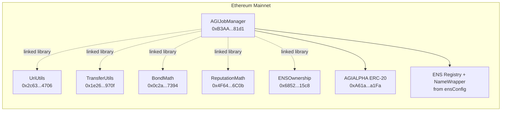

# Ethereum Mainnet Official Deployment Record (AGIJobManager)

## 1) Executive overview

This document is the canonical, long-lived record for the official AGIJobManager deployment on Ethereum Mainnet (`chainId = 1`).

This deployment has 6 contracts:
- 1 primary contract: `AGIJobManager`
- 5 linked libraries: `UriUtils`, `TransferUtils`, `BondMath`, `ReputationMath`, `ENSOwnership`

The libraries exist to keep logic modular and auditable while preserving one operator-facing main contract address.

> **Intended use policy:** AGIJobManager is intended for autonomous AI agents exclusively. Humans act as owners, operators, and supervisors.

Legal authority and Terms are embedded in the contract source:
- [`contracts/AGIJobManager.sol`](../../contracts/AGIJobManager.sol)

---

## 2) Quick links

Mainnet contract code pages:
`AGIJobManager` https://etherscan.io/address/0xB3AAeb69b630f0299791679c063d68d6687481d1#code | `UriUtils` https://etherscan.io/address/0x2c6359D42173aaC73Ea053b37c411f7Da44d4706#code | `TransferUtils` https://etherscan.io/address/0x1e26d8F8E2E4957a06d38Ab046CF64E5d308970f#code | `BondMath` https://etherscan.io/address/0x0c2a50a9C1db998707662db2A13B93175c3E7394#code | `ReputationMath` https://etherscan.io/address/0x4F64e44a3693489289B1F20D55CF56130fE66C0b#code | `ENSOwnership` https://etherscan.io/address/0x6852a13650F5c90342663c9fF7555f97F62515c8#code

Token context:
- AGIALPHA ERC-20 (default token context): https://etherscan.io/address/0xA61a3B3a130a9c20768EEBF97E21515A6046a1Fa#code

---

## 3) Contract registry

| Contract | Address | Deployment tx hash | Etherscan link | Purpose |
|---|---|---|---|---|
| UriUtils | `0x2c6359D42173aaC73Ea053b37c411f7Da44d4706` | `0xce685b91e190938d7508af861c48d9482cc8d8e53530e42ec143940f838ac4a1` | https://etherscan.io/address/0x2c6359D42173aaC73Ea053b37c411f7Da44d4706#code | URI normalization and validation helpers used by the protocol. |
| TransferUtils | `0x1e26d8F8E2E4957a06d38Ab046CF64E5d308970f` | `0x4847d58a96191427c5cb2b89622fee4882f03bad4e85eff5fc1a55fc5c7fe4c3` | https://etherscan.io/address/0x1e26d8F8E2E4957a06d38Ab046CF64E5d308970f#code | Safe token transfer helpers for ERC-20 operations. |
| BondMath | `0x0c2a50a9C1db998707662db2A13B93175c3E7394` | `0xbc42f0859c75fd06b62a9aa69a809b5632114b4c3711e9a45efb3f585ca02672` | https://etherscan.io/address/0x0c2a50a9C1db998707662db2A13B93175c3E7394#code | Bond and penalty arithmetic used in job and dispute flows. |
| ReputationMath | `0x4F64e44a3693489289B1F20D55CF56130fE66C0b` | `0x4ee07dcfdf8d8e4d163a9eb4c7d4f23ebd1b732516809c0c204e3f04ece6c426` | https://etherscan.io/address/0x4F64e44a3693489289B1F20D55CF56130fE66C0b#code | Reputation score update math for protocol actions. |
| ENSOwnership | `0x6852a13650F5c90342663c9fF7555f97F62515c8` | `0x0755aacc84ed3cbbf5f1177a1e7dd23abd358ba292d7b61090788efe2f164b44` | https://etherscan.io/address/0x6852a13650F5c90342663c9fF7555f97F62515c8#code | ENS ownership/identity helper logic used by AGIJobManager. |
| AGIJobManager | `0xB3AAeb69b630f0299791679c063d68d6687481d1` | `0x5b99dc902229561d52b0f0daa7207372f12866befbdbe03a701a07c7e2690995` | https://etherscan.io/address/0xB3AAeb69b630f0299791679c063d68d6687481d1#code | Main protocol contract for escrowed AGI jobs, validation, settlement, and operations controls. |

Network:
- Ethereum Mainnet (`chainId = 1`)

Deployer:
- `0x6c8B8897Fb6b08B4070387233B89b3E9A94eD00E`

---

## 4) Build and verification settings (verbatim)

- `solc 0.8.23`
- optimizer enabled, `runs = 40`
- `evmVersion = shanghai`
- `viaIR = false`
- `settings.metadata.bytecodeHash = "none"`
- `settings.debug.revertStrings = "strip"`

Why this matters:
- Etherscan "Verified Source Code" compares compiled bytecode and metadata to on-chain bytecode.
- If any compiler setting differs, verification can fail even when source files are correct.

---

## 5) AGIJobManager constructor arguments (verbatim)

- `agiTokenAddress`: `0xa61a3b3a130a9c20768eebf97e21515a6046a1fa`
- `baseIpfsUrl`: `https://ipfs.io/ipfs/`
- `ensConfig (address[2])`:
  - `0x00000000000C2E074eC69A0dFb2997BA6C7d2e1e`
  - `0xD4416b13d2b3a9aBae7AcD5D6C2BbDBE25686401`
- `rootNodes (bytes32[4])`:
  - `0x39eb848f88bdfb0a6371096249dd451f56859dfe2cd3ddeab1e26d5bb68ede16`
  - `0x2c9c6189b2e92da4d0407e9deb38ff6870729ad063af7e8576cb7b7898c88e2d`
  - `0x6487f659ec6f3fbd424b18b685728450d2559e4d68768393f9c689b2b6e5405e`
  - `0xc74b6c5e8a0d97ed1fe28755da7d06a84593b4de92f6582327bc40f41d6c2d5e`
- `merkleRoots (bytes32[2])`:
  - `0x0effa6c54d4c4866ca6e9f4fc7426ba49e70e8f6303952e04c8f0218da68b99b`
  - `0x0effa6c54d4c4866ca6e9f4fc7426ba49e70e8f6303952e04c8f0218da68b99b`

Plain-language meaning:
- `agiTokenAddress`: ERC-20 token used for payouts, bonds, and accounting.
- `baseIpfsUrl`: default gateway prefix for IPFS metadata resolution.
- `ensConfig`: ENS Registry and NameWrapper addresses used for ENS-aware identity checks.
- `rootNodes`: ENS namespace roots used for allowed naming domains.
- `merkleRoots`: initial allowlist roots for role-gated flows.

Default token context:
- AGIALPHA ERC-20: `0xA61a3B3a130a9c20768EEBF97E21515A6046a1Fa`
- Note: constructor data above is recorded exactly as used during deployment.

---

## 6) Ownership and control state

Final owner (after ownership transfer):
- `0xa9eD0539c2fbc5C6BC15a2E168bd9BCd07c01201` (`club.agi.eth`)

Ownership transfer transaction:
- `0xbabede7945b7e926cf0ea4a66561bf5db9952648425290608c02f970dcab5436`

Expected on-chain read:
- `owner()` must return `0xa9eD0539c2fbc5C6BC15a2E168bd9BCd07c01201`

Owner vs deployer:
- Deployer broadcasts deployment transactions.
- Owner holds ongoing privileged control after transfer.
- In this deployment, deployer and owner are different addresses.

How to confirm in Etherscan:
- Open AGIJobManager `Read Contract` tab.
- Call `owner()`.
- Confirm it matches the final owner above.

---

## 7) Etherscan verification checklist (non-technical)

### Step 1: Confirm the correct contract page
What to do:
- Open https://etherscan.io/address/0xB3AAeb69b630f0299791679c063d68d6687481d1#code.

What you should see:
- A normal contract page for AGIJobManager (not a proxy admin or implementation-proxy pair).

### Step 2: Confirm source verification
What to do:
- In the `Contract` tab, check the verification status banner.

What you should see:
- `Contract Source Code Verified`.

### Step 3: Confirm compiler settings
What to do:
- Inspect compiler metadata on Etherscan.

What you should see:
- `solc 0.8.23`, optimizer enabled (`40` runs), `shanghai`, `viaIR=false`, bytecodeHash `none`, revert strings `strip`.

### Step 4: Confirm constructor arguments
What to do:
- Open the constructor arguments/ABI-encoded input section on Etherscan.
- Compare with Section 5 of this record.

What you should see:
- Exact match for token address, base IPFS URL, ENS config, root nodes, and merkle roots.

### Step 5: Confirm linked library addresses
What to do:
- On the AGIJobManager `Code` page, inspect linked library mapping.

What you should see:
- `UriUtils = 0x2c6359D42173aaC73Ea053b37c411f7Da44d4706`
- `TransferUtils = 0x1e26d8F8E2E4957a06d38Ab046CF64E5d308970f`
- `BondMath = 0x0c2a50a9C1db998707662db2A13B93175c3E7394`
- `ReputationMath = 0x4F64e44a3693489289B1F20D55CF56130fE66C0b`
- `ENSOwnership = 0x6852a13650F5c90342663c9fF7555f97F62515c8`

### Step 6: Confirm owner and token references
What to do:
- In `Read Contract`, call `owner()` and `agiToken()`.

What you should see:
- `owner() = 0xa9eD0539c2fbc5C6BC15a2E168bd9BCd07c01201`
- `agiToken() = 0xa61a3b3a130a9c20768eebf97e21515a6046a1fa`

---

## 8) Operational pointers

What the deployment script did not do:
- No day-2 operational tuning beyond constructor initialization and ownership transfer.
- No post-deploy governance parameter adjustments are assumed by this record.

Owner/operator runbooks:
- [`docs/OWNER_RUNBOOK.md`](../OWNER_RUNBOOK.md)
- [`docs/OPERATIONS/RUNBOOK.md`](../OPERATIONS/RUNBOOK.md)
- [`docs/OPERATIONS/JOB_LIFECYCLE_ETHERSCAN_GUIDE.md`](../OPERATIONS/JOB_LIFECYCLE_ETHERSCAN_GUIDE.md)

Day-to-day operations:
- Per runbook, operators execute administrative actions through Etherscan `Write Contract` with the owner wallet.

---

## 9) Architecture diagram (text-only)

---

## 10) Long-term recordkeeping best practices

The repository stores three deployment artifacts for this release:
- `hardhat/deployments/mainnet/deployment.1.24522684.json`
- `hardhat/deployments/mainnet/solc-input.json`
- `hardhat/deployments/mainnet/verify-targets.json`

Why this matters:
- `deployment.*.json` preserves deployed addresses, tx hashes, and constructor context.
- `solc-input.json` preserves Standard JSON Input for deterministic reproduction.
- `verify-targets.json` preserves exact verification targets and linked library addresses.

Future re-verification:
- You can re-submit Standard JSON Input to Etherscan years later and compare with this record.

Recordkeeping rule:
- Do not rely on private local machine paths.
- Keep repository-relative artifacts under version control for audit continuity.
