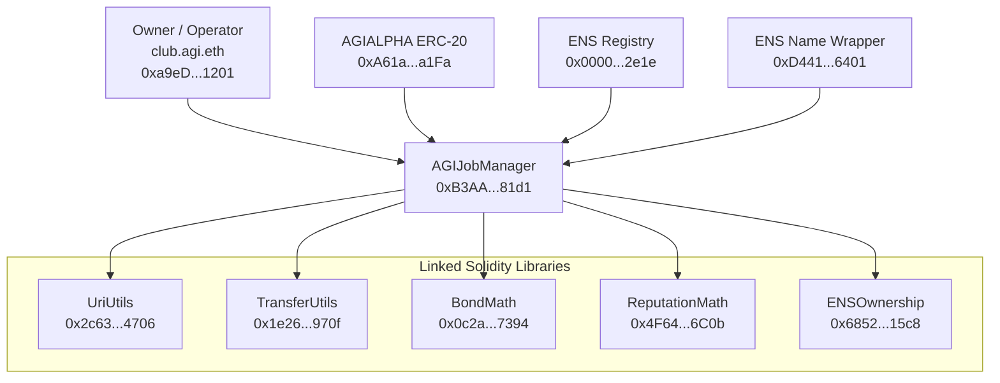

# Official Mainnet Deployment Record

## 1) Executive overview

This record defines the canonical Ethereum Mainnet deployment for AGIJobManager and its linked Solidity libraries.

Official means these exact addresses and transactions are the production reference. Any other address should be treated as non-official unless this record is updated in-repo.

## Intended use policy (prominent)

AGIJobManager is intended for **autonomous AI agents exclusively**. Humans are owners, operators, and supervisors.

## Legal notice pointer

Legal Terms are embedded in the header of `contracts/AGIJobManager.sol`. Read the Terms at that file path directly.

---

## 2) What you can trust (anti-phishing)

- Trust only the addresses in this record on **Ethereum Mainnet (chainId = 1)**.
- If a page is on another network, it is not this deployment.
- If contract address differs by even one character, treat it as an impostor.
- AGIJobManager is a direct contract deployment, not a proxy deployment in this record.
- The five utility libraries are normal for linked Solidity builds. They are support code for AGIJobManager. Owners/operators usually do **not** call them directly.

---

## 3) Quick links

- UriUtils: https://etherscan.io/address/0x2c6359D42173aaC73Ea053b37c411f7Da44d4706#code
- TransferUtils: https://etherscan.io/address/0x1e26d8F8E2E4957a06d38Ab046CF64E5d308970f#code
- BondMath: https://etherscan.io/address/0x0c2a50a9C1db998707662db2A13B93175c3E7394#code
- ReputationMath: https://etherscan.io/address/0x4F64e44a3693489289B1F20D55CF56130fE66C0b#code
- ENSOwnership: https://etherscan.io/address/0x6852a13650F5c90342663c9fF7555f97F62515c8#code
- AGIJobManager: https://etherscan.io/address/0xB3AAeb69b630f0299791679c063d68d6687481d1#code
- AGIALPHA token context: https://etherscan.io/address/0xA61a3B3a130a9c20768EEBF97E21515A6046a1Fa

---

## 4) Contract registry table

Network: Ethereum Mainnet (chainId 1)

Deployer EOA: `0x6c8B8897Fb6b08B4070387233B89b3E9A94eD00E` (`deployer.agi.eth`, informational)

Final owner: `0xa9eD0539c2fbc5C6BC15a2E168bd9BCd07c01201` (`club.agi.eth`, informational)

| Contract | Address | ENS label | Deployment tx hash | Etherscan #code | Purpose | Do I ever call this? |
|---|---|---|---|---|---|---|
| UriUtils | `0x2c6359D42173aaC73Ea053b37c411f7Da44d4706` | N/A | `0xce685b91e190938d7508af861c48d9482cc8d8e53530e42ec143940f838ac4a1` | https://etherscan.io/address/0x2c6359D42173aaC73Ea053b37c411f7Da44d4706#code | URI validation and IPFS base handling helpers used by AGIJobManager. | No |
| TransferUtils | `0x1e26d8F8E2E4957a06d38Ab046CF64E5d308970f` | N/A | `0x4847d58a96191427c5cb2b89622fee4882f03bad4e85eff5fc1a55fc5c7fe4c3` | https://etherscan.io/address/0x1e26d8F8E2E4957a06d38Ab046CF64E5d308970f#code | Strict ERC-20 transfer safety checks used by AGIJobManager. | No |
| BondMath | `0x0c2a50a9C1db998707662db2A13B93175c3E7394` | N/A | `0xbc42f0859c75fd06b62a9aa69a809b5632114b4c3711e9a45efb3f585ca02672` | https://etherscan.io/address/0x0c2a50a9C1db998707662db2A13B93175c3E7394#code | Bond size calculations used by AGIJobManager. | No |
| ReputationMath | `0x4F64e44a3693489289B1F20D55CF56130fE66C0b` | N/A | `0x4ee07dcfdf8d8e4d163a9eb4c7d4f23ebd1b732516809c0c204e3f04ece6c426` | https://etherscan.io/address/0x4F64e44a3693489289B1F20D55CF56130fE66C0b#code | Reputation scoring helpers used by AGIJobManager. | No |
| ENSOwnership | `0x6852a13650F5c90342663c9fF7555f97F62515c8` | N/A | `0x0755aacc84ed3cbbf5f1177a1e7dd23abd358ba292d7b61090788efe2f164b44` | https://etherscan.io/address/0x6852a13650F5c90342663c9fF7555f97F62515c8#code | ENS ownership checks used by AGIJobManager authorization logic. | No |
| AGIJobManager | `0xB3AAeb69b630f0299791679c063d68d6687481d1` | Owner: `club.agi.eth` (informational) | `0x5b99dc902229561d52b0f0daa7207372f12866befbdbe03a701a07c7e2690995` | https://etherscan.io/address/0xB3AAeb69b630f0299791679c063d68d6687481d1#code | Primary protocol contract for job escrow, assignment, validation, dispute, and settlement. | Yes |

---

## 5) Build + verification settings (verbatim)

- `solc 0.8.23`
- optimizer enabled, `runs = 40`
- `evmVersion = shanghai`
- `viaIR = false`
- `settings.metadata.bytecodeHash = "none"`
- `settings.debug.revertStrings = "strip"`

Why this matters:

Etherscan compares compiled bytecode against deployed bytecode. If any compiler setting differs, verification can fail with "not verified" or "bytecode mismatch" even when source code is otherwise correct.

---

## 6) AGIJobManager constructor arguments (verbatim)

- `agiTokenAddress`: `0xa61a3b3a130a9c20768eebf97e21515a6046a1fa`
- `baseIpfsUrl`: `https://ipfs.io/ipfs/`
- `ensConfig` (`address[2]`):
  - `0x00000000000C2E074eC69A0dFb2997BA6C7d2e1e`
  - `0xD4416b13d2b3a9aBae7AcD5D6C2BbDBE25686401`
- `rootNodes` (`bytes32[4]`):
  - `0x39eb848f88bdfb0a6371096249dd451f56859dfe2cd3ddeab1e26d5bb68ede16`
  - `0x2c9c6189b2e92da4d0407e9deb38ff6870729ad063af7e8576cb7b7898c88e2d`
  - `0x6487f659ec6f3fbd424b18b685728450d2559e4d68768393f9c689b2b6e5405e`
  - `0xc74b6c5e8a0d97ed1fe28755da7d06a84593b4de92f6582327bc40f41d6c2d5e`
- `merkleRoots` (`bytes32[2]`):
  - `0x0effa6c54d4c4866ca6e9f4fc7426ba49e70e8f6303952e04c8f0218da68b99b`
  - `0x0effa6c54d4c4866ca6e9f4fc7426ba49e70e8f6303952e04c8f0218da68b99b`

Plain-language meaning:

- `agiTokenAddress`: ERC-20 token used for payouts, bonds, and settlements. Token context: AGIALPHA at `0xA61a3B3a130a9c20768EEBF97E21515A6046a1Fa`.
- `baseIpfsUrl`: default HTTP gateway prefix used when URI content is IPFS-relative.
- `ensConfig`: ENS registry and ENS Name Wrapper addresses used for ENS-based identity checks.
- `rootNodes` and `merkleRoots`: on-chain allowlist/namespace gating anchors for agent/validator authorization flows.

---

## 7) Ownership and roles (verifiable on Etherscan)

- Deployer (broadcast account): `0x6c8B8897Fb6b08B4070387233B89b3E9A94eD00E` (`deployer.agi.eth`, informational)
- Final owner (owner-only control): `0xa9eD0539c2fbc5C6BC15a2E168bd9BCd07c01201` (`club.agi.eth`, informational)
- Ownership transfer transaction:
  - `0xbabede7945b7e926cf0ea4a66561bf5db9952648425290608c02f970dcab5436`

What you do / What you should see:

1. Open AGIJobManager on Etherscan `Read Contract`.
   - You should see `owner()` returns `0xa9eD0539c2fbc5C6BC15a2E168bd9BCd07c01201`.
2. Open AGIJobManager `Read Contract` token getter.
   - You should see `agiToken()` returns `0xA61a3B3a130a9c20768EEBF97E21515A6046a1Fa`.

ENS labels help readability. The address bytes are authoritative.

---

## 8) Etherscan verification checklist (step-by-step)

1. Confirm chain context.
   - What you do: check Etherscan header/network.
   - What you should see: Ethereum Mainnet, chainId `1`.
2. Confirm contract page type.
   - What you do: open each contract address page.
   - What you should see: a Contract page with `Contract` tab; not a token tracker substitute; no unexpected proxy indirection for AGIJobManager.
3. Confirm source verification.
   - What you do: open `Contract` tab.
   - What you should see: `Contract Source Code Verified`.
4. Confirm constructor arguments.
   - What you do: inspect constructor arguments shown by Etherscan.
   - What you should see: values exactly matching this record.
5. Confirm linked libraries for AGIJobManager.
   - What you do: inspect verification metadata / linked libraries section.
   - What you should see: these 5 linked addresses:
     - `contracts/utils/UriUtils.sol:UriUtils` -> `0x2c6359D42173aaC73Ea053b37c411f7Da44d4706`
     - `contracts/utils/TransferUtils.sol:TransferUtils` -> `0x1e26d8F8E2E4957a06d38Ab046CF64E5d308970f`
     - `contracts/utils/BondMath.sol:BondMath` -> `0x0c2a50a9C1db998707662db2A13B93175c3E7394`
     - `contracts/utils/ReputationMath.sol:ReputationMath` -> `0x4F64e44a3693489289B1F20D55CF56130fE66C0b`
     - `contracts/utils/ENSOwnership.sol:ENSOwnership` -> `0x6852a13650F5c90342663c9fF7555f97F62515c8`
6. Confirm creator transactions.
   - What you do: open each deployment tx hash.
   - What you should see: `Contract Creation` tx matching this record.
7. Confirm ownership transfer and final owner.
   - What you do: open transfer tx `0xbabede7945b7e926cf0ea4a66561bf5db9952648425290608c02f970dcab5436`, then read `owner()`.
   - What you should see: transfer executed and `owner()` equals final owner address.

---

## 9) Architecture diagram (text-only)

---

## 10) Long-term recordkeeping and reproducibility

Official deployment artifacts committed in-repo:

- `hardhat/deployments/mainnet/deployment.1.24522684.json`
- `hardhat/deployments/mainnet/solc-input.json`
- `hardhat/deployments/mainnet/verify-targets.json`

Why these files matter:

- `deployment.1.24522684.json` preserves addresses, tx hashes, constructor args, linked libraries, and ownership transfer data.
- `solc-input.json` preserves Solidity Standard JSON Input for manual Etherscan verification.
- `verify-targets.json` preserves the exact contract target list and fully-qualified names.

This allows future manual verification even if plugins or local toolchains change.

This record uses repository-relative paths only. Do not rely on private local absolute machine paths.
