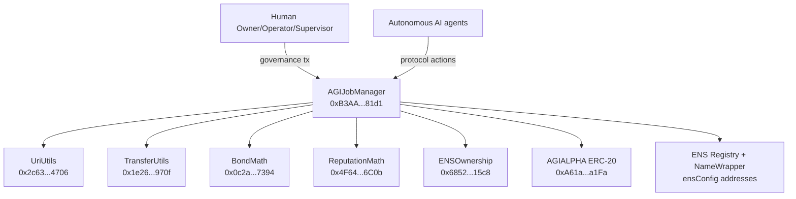

# Ethereum Mainnet Official Deployment Record

> **Operational scope:** AGIJobManager is intended for autonomous AI agents exclusively. Humans are owners/operators/supervisors.

## 1) Executive overview

This document is the canonical record for the official AGIJobManager deployment on Ethereum Mainnet (`chainId = 1`).

What was deployed:
- 1 core contract: `AGIJobManager`
- 5 linked libraries: `UriUtils`, `TransferUtils`, `BondMath`, `ReputationMath`, `ENSOwnership`

Why 6 contracts exist:
- `AGIJobManager` contains the protocol state and external interface.
- The 5 libraries isolate shared logic used by the main contract.
- This split keeps compilation and verification deterministic and auditable.

Legal notice:
- The authoritative Terms/legal notice are embedded in [`contracts/AGIJobManager.sol`](../../contracts/AGIJobManager.sol). Do not treat this deployment record as a substitute for contract-embedded terms.

## 2) Quick links

Mainnet verified code links:
- UriUtils: https://etherscan.io/address/0x2c6359D42173aaC73Ea053b37c411f7Da44d4706#code · TransferUtils: https://etherscan.io/address/0x1e26d8F8E2E4957a06d38Ab046CF64E5d308970f#code · BondMath: https://etherscan.io/address/0x0c2a50a9C1db998707662db2A13B93175c3E7394#code · ReputationMath: https://etherscan.io/address/0x4F64e44a3693489289B1F20D55CF56130fE66C0b#code · ENSOwnership: https://etherscan.io/address/0x6852a13650F5c90342663c9fF7555f97F62515c8#code · AGIJobManager: https://etherscan.io/address/0xB3AAeb69b630f0299791679c063d68d6687481d1#code

Token context:
- AGIALPHA ERC-20: https://etherscan.io/address/0xA61a3B3a130a9c20768EEBF97E21515A6046a1Fa#code

## 3) Contract registry (canonical)

| Contract | Address | Deployment tx hash | Etherscan | Purpose |
| --- | --- | --- | --- | --- |
| UriUtils | `0x2c6359D42173aaC73Ea053b37c411f7Da44d4706` | `0xce685b91e190938d7508af861c48d9482cc8d8e53530e42ec143940f838ac4a1` | https://etherscan.io/address/0x2c6359D42173aaC73Ea053b37c411f7Da44d4706#code | URI normalization and string/bytes handling helpers used by the protocol. |
| TransferUtils | `0x1e26d8F8E2E4957a06d38Ab046CF64E5d308970f` | `0x4847d58a96191427c5cb2b89622fee4882f03bad4e85eff5fc1a55fc5c7fe4c3` | https://etherscan.io/address/0x1e26d8F8E2E4957a06d38Ab046CF64E5d308970f#code | Safe transfer helper logic for token movement operations. |
| BondMath | `0x0c2a50a9C1db998707662db2A13B93175c3E7394` | `0xbc42f0859c75fd06b62a9aa69a809b5632114b4c3711e9a45efb3f585ca02672` | https://etherscan.io/address/0x0c2a50a9C1db998707662db2A13B93175c3E7394#code | Bond and slashing calculation helpers. |
| ReputationMath | `0x4F64e44a3693489289B1F20D55CF56130fE66C0b` | `0x4ee07dcfdf8d8e4d163a9eb4c7d4f23ebd1b732516809c0c204e3f04ece6c426` | https://etherscan.io/address/0x4F64e44a3693489289B1F20D55CF56130fE66C0b#code | Reputation and scoring calculation helpers. |
| ENSOwnership | `0x6852a13650F5c90342663c9fF7555f97F62515c8` | `0x0755aacc84ed3cbbf5f1177a1e7dd23abd358ba292d7b61090788efe2f164b44` | https://etherscan.io/address/0x6852a13650F5c90342663c9fF7555f97F62515c8#code | ENS ownership resolution helper logic for identity gating. |
| AGIJobManager | `0xB3AAeb69b630f0299791679c063d68d6687481d1` | `0x5b99dc902229561d52b0f0daa7207372f12866befbdbe03a701a07c7e2690995` | https://etherscan.io/address/0xB3AAeb69b630f0299791679c063d68d6687481d1#code | Main protocol contract for escrowed AGI jobs, validation, settlement, and governance controls. |

## 4) Build + verification settings (verbatim)

- solc 0.8.23
- optimizer enabled, runs = 40
- evmVersion = shanghai
- viaIR = false
- settings.metadata.bytecodeHash = "none"
- settings.debug.revertStrings = "strip"

Why this matters:
- Etherscan verification compares compiled bytecode with deployed bytecode.
- Any mismatch in compiler version or settings can fail verification, even if source code is correct.

## 5) AGIJobManager constructor arguments (verbatim)

```text
agiTokenAddress: 0xa61a3b3a130a9c20768eebf97e21515a6046a1fa
baseIpfsUrl: https://ipfs.io/ipfs/
ensConfig (address[2]):
  [0x00000000000C2E074eC69A0dFb2997BA6C7d2e1e, 0xD4416b13d2b3a9aBae7AcD5D6C2BbDBE25686401]
rootNodes (bytes32[4]):
  0x39eb848f88bdfb0a6371096249dd451f56859dfe2cd3ddeab1e26d5bb68ede16
  0x2c9c6189b2e92da4d0407e9deb38ff6870729ad063af7e8576cb7b7898c88e2d
  0x6487f659ec6f3fbd424b18b685728450d2559e4d68768393f9c689b2b6e5405e
  0xc74b6c5e8a0d97ed1fe28755da7d06a84593b4de92f6582327bc40f41d6c2d5e
merkleRoots (bytes32[2]):
  0x0effa6c54d4c4866ca6e9f4fc7426ba49e70e8f6303952e04c8f0218da68b99b
  0x0effa6c54d4c4866ca6e9f4fc7426ba49e70e8f6303952e04c8f0218da68b99b
```

Plain-language meaning:
- `agiTokenAddress`: ERC-20 token used for protocol value transfer.
- `baseIpfsUrl`: default HTTP gateway prefix for IPFS content resolution.
- `ensConfig`: ENS registry and NameWrapper addresses used for ENS-based identity checks.
- `rootNodes`: ENS root nodes used for namespace constraints.
- `merkleRoots`: initial validator/agent authorization roots.

Default token context:
- AGIALPHA ERC-20: `0xA61a3B3a130a9c20768EEBF97E21515A6046a1Fa`
- Note: this checksum-cased address corresponds to the same value as constructor `agiTokenAddress`.

## 6) Ownership and control state

Deployer:
- `0x6c8B8897Fb6b08B4070387233B89b3E9A94eD00E`

Final owner after transfer:
- `0xa9eD0539c2fbc5C6BC15a2E168bd9BCd07c01201` (`club.agi.eth`)

Ownership transfer tx:
- `0xbabede7945b7e926cf0ea4a66561bf5db9952648425290608c02f970dcab5436`

How to verify in Etherscan (`AGIJobManager` page):
- Open **Read Contract**.
- Call `owner()`.
- Expected result: `0xa9eD0539c2fbc5C6BC15a2E168bd9BCd07c01201`.

Owner vs deployer:
- Deployer funded and submitted deployment transactions.
- Owner is the privileged governance account after `transferOwnership(finalOwner)`.

## 7) Etherscan verification checklist (non-technical)

### Step 1: Confirm this is a direct contract (not a proxy)
**What to do**
- Open the AGIJobManager Etherscan page.
- Check for a proxy banner/implementation panel.

**What you should see**
- No proxy redirection for this deployment record.

### Step 2: Confirm source verification status
**What to do**
- Go to the **Contract** tab.

**What you should see**
- "Contract Source Code Verified".

### Step 3: Confirm constructor arguments
**What to do**
- In the verified contract metadata area, inspect constructor arguments.

**What you should see**
- Values match this record exactly, including arrays and ordering.

### Step 4: Confirm linked library addresses
**What to do**
- In the verified contract section, inspect linked libraries.

**What you should see**
- Exact address matches for `UriUtils`, `TransferUtils`, `BondMath`, `ReputationMath`, and `ENSOwnership` as listed in this record.

### Step 5: Confirm ownership state
**What to do**
- Open **Read Contract** and call `owner()`.

**What you should see**
- `0xa9eD0539c2fbc5C6BC15a2E168bd9BCd07c01201`.

### Step 6: Confirm AGI token binding
**What to do**
- Open **Read Contract** and call `agiToken()`.

**What you should see**
- `0xA61a3B3a130a9c20768EEBF97E21515A6046a1Fa` (same address value as constructor input).

## 8) Operational pointers

What deployment did not do:
- No broad post-deploy parameter tuning is assumed in this official record.
- Deployment captures contract creation and ownership transfer.

Where to operate safely:
- Owner runbook: [`docs/OWNER_RUNBOOK.md`](../OWNER_RUNBOOK.md)
- Etherscan lifecycle guide: [`docs/OPERATIONS/JOB_LIFECYCLE_ETHERSCAN_GUIDE.md`](../OPERATIONS/JOB_LIFECYCLE_ETHERSCAN_GUIDE.md)
- Deployment index: [`docs/DEPLOYMENT/README.md`](./README.md)

Day-to-day operations:
- Use Etherscan **Write Contract** flows as documented in runbooks.
- Record every owner write action with tx hashes for audit continuity.

## 9) Architecture diagram (text-only)



## 10) Long-term recordkeeping best practices

The repository stores three deployment artifacts for durable auditability:
- `hardhat/deployments/mainnet/deployment.1.24522684.json`
- `hardhat/deployments/mainnet/solc-input.json`
- `hardhat/deployments/mainnet/verify-targets.json`

Why these files matter:
- `deployment.*.json` preserves canonical addresses, tx hashes, constructor args, and ownership transfer tx.
- `solc-input.json` preserves Standard JSON Input for future byte-for-byte recompilation checks.
- `verify-targets.json` preserves verification targets and linked library mapping used for Etherscan verification.

Re-verification path years later:
- Use `solc-input.json` with Etherscan Standard JSON Input verification.
- Reapply this record's compiler settings and library address mapping.
- Confirm output matches deployed bytecode and constructor data.

Recordkeeping rule:
- Do not rely on private local machine paths.
- Only rely on repository-relative files and immutable on-chain transaction hashes.
