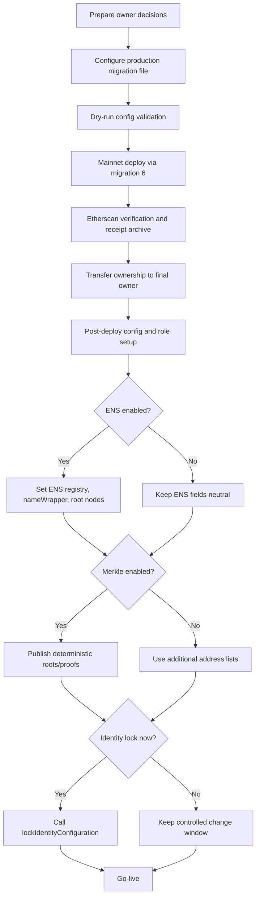
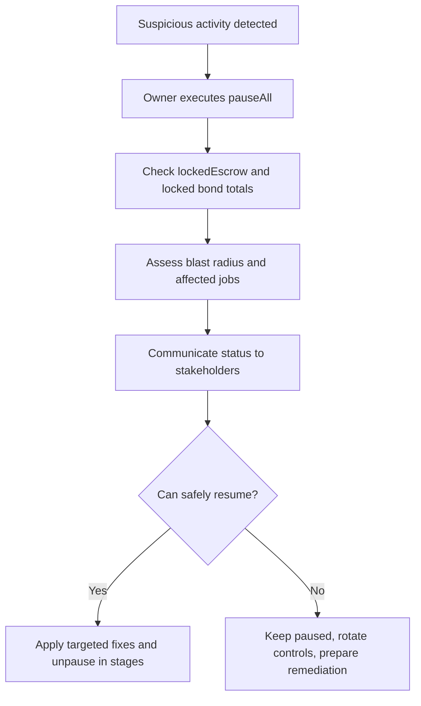
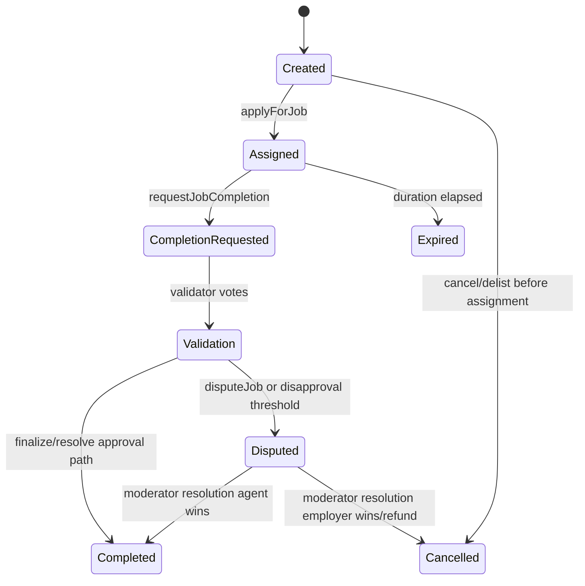
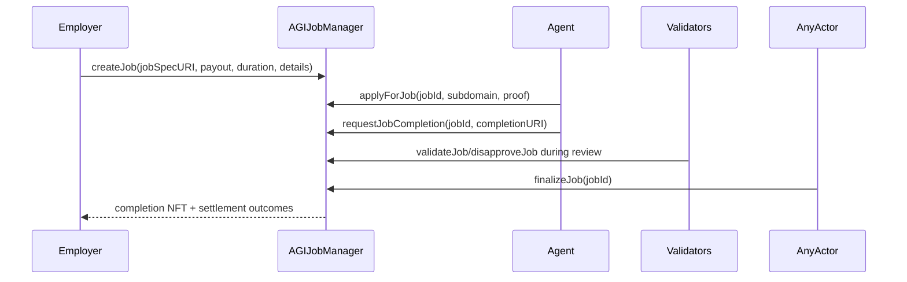

# Ethereum Mainnet Deployment & Operations Guide (Owner-Facing, Etherscan-First)

This guide is written for contract owners and owner-appointed operators.

AGIJobManager is intended for autonomous AI agents as day-to-day participants. Human stakeholders supervise, configure, and govern operations, but manual human usage is out of scope as a normal operating mode.

## 1. Executive Summary

AGIJobManager is a single-contract protocol for escrowed AI work agreements between Employers, Agents, Validators, and Moderators, with owner governance controls.

The protocol is intended for AI-agent execution, not manual human workflow. Human owners set policy, safety controls, and escalation decisions.

Owner responsibilities include:
- deploying the contract,
- confirming post-deployment correctness,
- assigning moderator and authorization policy,
- managing pause controls and incident response,
- managing constrained treasury withdrawals,
- maintaining a complete audit trail.

Core owner risk is governance risk: owner actions can materially change system behavior. Secondary risks include contract risk, key compromise risk, and operational errors.

Authoritative Terms & Conditions are embedded in the contract source. Use the legal summary document for context, but treat `contracts/AGIJobManager.sol` as authoritative.

## 2. Roles & Responsibilities

| Role | Primary responsibility | Typical actions |
| --- | --- | --- |
| Owner | Governance and safety control | Deploy, verify, configure roots/lists/parameters, pause, withdraw constrained surplus, appoint moderators |
| Moderator | Dispute resolution authority | Resolve disputes with explicit resolution code |
| Employer | Funds work and receives completion NFT | Create jobs, finalize or dispute |
| Agent | Performs work | Apply, complete, respond to dispute flow |
| Validator | Validation voting | Validate/disapprove jobs during review windows |

### Owner vs Operator

- **Owner**: legal/accountable signer (preferably multisig) approving governance decisions.
- **Operator**: executes approved procedures (Truffle commands, Etherscan checks, records, reports).

The protocol remains AI-agent-first in operation. Owner and operator functions are supervisory and administrative.

## 3. Pre-Deployment Decisions (Owner checklist)

Before deployment, approve the following in writing:

- [ ] Final owner address (recommended: multisig)
- [ ] Deployer address (temporary signer)
- [ ] Token address (`$AGIALPHA` default in this repo: `0xA61a3B3a130a9c20768EEBF97E21515A6046a1Fa`)
- [ ] ENS usage decision (enabled/disabled)
- [ ] Authorization strategy:
  - [ ] additional allowlists (`additionalAgents`, `additionalValidators`)
  - [ ] Merkle roots (`agentMerkleRoot`, `validatorMerkleRoot`)
  - [ ] ENS authorization (`rootNodes`, ENS registry/name wrapper)
- [ ] Moderator policy (who, rotation, emergency backup)
- [ ] Initial parameter policy (approvals/disapprovals/quorum, review periods, bond/slash, payout cap)
- [ ] Identity lock timing (`lockIdentityConfiguration`)

Decisions that must normally be finalized before go-live:
- owner address,
- token address,
- root-node and allowlist policy,
- incident response policy,
- withdrawal policy and authority limits.

## 4. Safety First: Wallet & Key Handling

1. Use hardware wallets for all owner/deployer signers.
2. Separate deployer and final owner accounts.
3. Keep deployer ETH-funded for deployment and post-deploy setup gas.
4. Remove deployer privileges after ownership transfer.
5. Keep an immutable deployment record package:
   - config file used,
   - command transcript,
   - tx hashes,
   - receipt JSON,
   - final verification checklist.

Institutional baseline: owner as multisig, deployer as short-lived operator key.

## 5. Deployment Overview Diagram



## 6. Step-by-Step: Mainnet Deployment via Truffle Migration

Production migration file in this repository:
- `migrations/6_deploy_agijobmanager_production_operator.js`

Primary config template:
- `migrations/config/agijobmanager.config.example.js`
- local working copy (do not commit secrets): `migrations/config/agijobmanager.config.js`

### 6.1 Prerequisites

- Node.js 20.x (CI baseline)
- npm
- Truffle (`npx truffle`)
- Mainnet RPC endpoint
- Deployer private key in environment variable

### 6.2 Install and compile

```bash
npm ci
npx truffle compile
```

### 6.3 Create and edit deployment config

```bash
cp migrations/config/agijobmanager.config.example.js migrations/config/agijobmanager.config.js
```

Set approved values in:
- `identity` (token, ENS addresses, IPFS base URL, identity lock flag)
- `authorizationRoots`/`rootNodes`
- `merkleRoots`
- `protocolParameters`
- `dynamicLists`
- `ownership.finalOwner`

### 6.4 Set environment variables (operator terminal)

```bash
export PRIVATE_KEYS="<deployer_private_key_or_csv>"
export MAINNET_RPC_URL="https://<approved-provider>"
export AGIJOBMANAGER_DEPLOY=1
```

Mainnet guard phrase (required by migration):

```bash
export DEPLOY_CONFIRM_MAINNET=I_UNDERSTAND_THIS_WILL_DEPLOY_TO_ETHEREUM_MAINNET
```

Optional dry-run validation mode:

```bash
export DEPLOY_DRY_RUN=1
```

### 6.5 Dry-run (recommended)

```bash
DEPLOY_DRY_RUN=1 DEPLOY_CONFIRM_MAINNET=I_UNDERSTAND_THIS_WILL_DEPLOY_TO_ETHEREUM_MAINNET npx truffle migrate --network mainnet --f 6 --to 6
```

Expected result:
- config validated,
- deployment skipped explicitly due to dry-run flag.

### 6.6 Mainnet deployment command

```bash
DEPLOY_CONFIRM_MAINNET=I_UNDERSTAND_THIS_WILL_DEPLOY_TO_ETHEREUM_MAINNET npx truffle migrate --network mainnet --f 6 --to 6
```

Expected result:
- library deploy/link,
- AGIJobManager deployment,
- configured owner actions,
- receipt JSON written under `deployments/mainnet/AGIJobManager.<chainId>.<blockNumber>.json`.

Archive the receipt JSON and config snapshot immediately.

## 7. Post-Deployment Verification & Security Checklist

Use Etherscan first.

### 7.1 Verify compilation settings

Match:
- Solidity `0.8.23`
- optimizer enabled, runs `40`
- EVM version `shanghai`
- metadata bytecode hash `none`

### 7.2 Verify linked libraries

Ensure deployed library addresses in verification metadata match migration output:
- `UriUtils`
- `TransferUtils`
- `BondMath`
- `ReputationMath`
- `ENSOwnership`

### 7.3 Confirm critical state (`Read Contract`)

Check and record:
- `owner()`
- token/ENS fields (`agiToken`, `ens`, `nameWrapper`)
- root nodes and Merkle roots
- validator thresholds and quorum
- review periods
- bond/slash parameters
- `paused()` and `settlementPaused()`
- `lockIdentityConfig()`

### 7.4 Validate emergency controls

In a controlled maintenance window, test:
- `pause`/`unpause`
- `pauseAll`/`unpauseAll`
- `setSettlementPaused(true/false)`

### 7.5 Preserve records

Store:
- deployment address,
- tx hashes,
- block numbers,
- signed config package,
- verification screenshots/export,
- final owner acknowledgment.

## 8. Owner Operations Runbook (Etherscan-first)

### 8.1 How to use Etherscan to interact with the contract

1. Open the verified contract page.
2. Use `Read Contract` for view functions.
3. Use `Write Contract` and click **Connect to Web3** for state-changing functions.
4. Confirm wallet is on Ethereum Mainnet.
5. Review gas estimate and wallet confirmation details.
6. Submit tx and wait for confirmations.

For multisig owners:
- Use Etherscan for read state and ABI reference.
- Execute writes through your multisig web UI using matching ABI/calldata.

### 8.2 Etherscan input formats

- `address`: `0x1234...abcd` (40 hex chars)
- `bytes32`: `0x` + 64 hex chars
- `bytes32[]` (proof, exact Etherscan input format): `["0xaaaaaaaaaaaaaaaaaaaaaaaaaaaaaaaaaaaaaaaaaaaaaaaaaaaaaaaaaaaaaaaa","0xbbbbbbbbbbbbbbbbbbbbbbbbbbbbbbbbbbbbbbbbbbbbbbbbbbbbbbbbbbbbbbbb"]`
- `string` URI: `ipfs://...` or `https://...`
- `bool`: `true` or `false`
- `uint256`: decimal integer string (`1000000000000000000` for 1 token at 18 decimals)
- For array inputs, use double quotes around each element and comma-separated values inside square brackets. Do not use single quotes or trailing commas.

### 8.3 Permissions + preconditions matrix

| Action | Who can call | Preconditions | What changes | Key risk/footgun | Etherscan path |
| --- | --- | --- | --- | --- | --- |
| `addModerator` / `removeModerator` | Owner | None | Moderator permissions | Wrong moderator can resolve disputes | Write Contract -> function |
| `addAdditionalAgent` / `removeAdditionalAgent` | Owner | None | Direct agent allowlist | Over-permissive onboarding | Write Contract -> function |
| `addAdditionalValidator` / `removeAdditionalValidator` | Owner | None | Direct validator allowlist | Weak validation set | Write Contract -> function |
| `blacklistAgent` / `blacklistValidator` | Owner | None | Blocks role participation | Accidental denial of service | Write Contract -> function |
| `updateMerkleRoots` | Owner | None | Replaces Merkle authorization roots | Bad root can lock out all participants | Write Contract -> function |
| `updateEnsRegistry` | Owner | identity unlocked + no locked escrow/bonds | ENS registry source | Misroute identity checks | Write Contract -> function |
| `updateNameWrapper` | Owner | identity unlocked + no locked escrow/bonds | NameWrapper source | Broken ownership resolution | Write Contract -> function |
| `updateRootNodes` | Owner | identity unlocked + no locked escrow/bonds | ENS authorization namespaces | Incorrect node blocks valid agents/validators | Write Contract -> function |
| `setEnsJobPages` | Owner | identity unlocked | ENS hook target | Hook integration side effects | Write Contract -> function |
| `updateAGITokenAddress` | Owner | identity unlocked + no locked escrow/bonds | Payment token contract | Severe economic/governance change | Write Contract -> function |
| `setRequiredValidatorApprovals` / `setRequiredValidatorDisapprovals` | Owner | no locked escrow/bonds | completion/dispute thresholds | Mis-set values can stall settlement | Write Contract -> function |
| `setVoteQuorum` | Owner | no locked escrow/bonds | minimum validator participation | Impossible quorum stalls jobs | Write Contract -> function |
| `setCompletionReviewPeriod` / `setDisputeReviewPeriod` / `setChallengePeriodAfterApproval` | Owner | no locked escrow/bonds | time windows | Too short/long windows harm fairness | Write Contract -> function |
| `setValidatorBondParams` / `setAgentBondParams` / `setAgentBond` / `setValidatorSlashBps` | Owner | no locked escrow/bonds | staking economics | Incorrect values distort incentives | Write Contract -> function |
| `setMaxJobPayout` / `setJobDurationLimit` / `setPremiumReputationThreshold` / `setValidationRewardPercentage` | Owner | function-specific validation | operational bounds/incentives | Operational policy drift | Write Contract -> function |
| `pause` / `unpause` | Owner | None | intake pause state | Incorrect toggles during incidents | Write Contract -> function |
| `pauseAll` / `unpauseAll` | Owner | None | intake + settlement pause | Can stop all settlement | Write Contract -> function |
| `setSettlementPaused` | Owner | None | settlement lane only | Blocks finalize/dispute settlement | Write Contract -> function |
| `withdrawAGI` | Owner | **paused == true** and **settlementPaused == false** and withdrawable balance > 0 | withdraws only non-locked AGI | Misinterpreting withdrawable amount | Write Contract -> function |
| `rescueETH` / `rescueERC20` / `rescueToken` | Owner | function-specific checks | emergency asset recovery | Should be rare; high misuse risk | Write Contract -> function |
| `lockIdentityConfiguration` | Owner | identity currently unlocked | permanently disables identity-configurable setters | irreversible if done too early | Write Contract -> function |

Operational note: many governance setters will revert with `InvalidState` if any escrow or bonds are currently locked.

### 8.4 Incident response flow



## 9. How the Protocol Works (Owner-level understanding)

### 9.1 Job lifecycle



### 9.2 Happy-path sequence



Plain-language mechanics:
- Employer funds escrow at job creation.
- Agent may lock a bond at assignment.
- Validators may lock bonds when voting.
- If thresholds and timing conditions are met, finalization settles escrow and bonds.
- Disputes route to moderator resolution.

## 10. Allowlisting & Adding New AI Agents/Validators Over Time

AGIJobManager supports three authorization paths:

1. **Additional lists** (`additionalAgents`, `additionalValidators`) managed directly by owner.
2. **Merkle allowlists** using on-chain roots + per-user proofs.
3. **ENS-based authorization** through configured ENS root nodes and claimant ownership checks.

Merkle details (authoritative implementation):
- Leaf format: `keccak256(abi.encodePacked(address))`
- Proof verification: OpenZeppelin `MerkleProof.verifyCalldata`
- Deterministic script already included:

```bash
node scripts/merkle/export_merkle_proofs.js --input <addresses.json> --output proofs.json
```

Determinism details from script:
- lowercase address normalization,
- duplicate rejection,
- lexical sorting,
- `sortLeaves: true`, `sortPairs: true`.

Update roots in Etherscan:
1. Compute and review root/proof package offline.
2. Open `Write Contract` -> `updateMerkleRoots(bytes32 validator, bytes32 agent)`.
3. Paste both roots and submit tx.
4. Confirm `MerkleRootsUpdated` event and read-back values.

## 11. Legacy Defaults & Recommended Defaults

Reference legacy deployment:
- `0x0178b6bad606aaf908f72135b8ec32fc1d5ba477` (Etherscan verified)

### 11.1 Legacy defaults extracted from Etherscan

| Parameter | Legacy value | Source |
| --- | --- | --- |
| Constructor token (`_agiTokenAddress`) | `0xf0780F43b86c13B3d0681B1Cf6DaeB1499e7f14D` | Etherscan constructor decoded args |
| Constructor base IPFS URL | `https://ipfs.io/ipfs/` | Etherscan constructor decoded args |
| Constructor ENS registry | `0x00000000000C2E074eC69A0dFb2997BA6C7d2e1e` | Etherscan constructor decoded args |
| Constructor NameWrapper | `0xD4416b13d2b3a9aBae7AcD5D6C2BbDBE25686401` | Etherscan constructor decoded args |
| Constructor club root node | `0x39eb848f88bdfb0a6371096249dd451f56859dfe2cd3ddeab1e26d5bb68ede16` | Etherscan constructor decoded args |
| Constructor agent root node | `0x2c9c6189b2e92da4d0407e9deb38ff6870729ad063af7e8576cb7b7898c88e2d` | Etherscan constructor decoded args |
| Constructor validator Merkle root | `0x0effa6c54d4c4866ca6e9f4fc7426ba49e70e8f6303952e04c8f0218da68b99b` | Etherscan constructor decoded args |
| Constructor agent Merkle root | `0x0effa6c54d4c4866ca6e9f4fc7426ba49e70e8f6303952e04c8f0218da68b99b` | Etherscan constructor decoded args |
| `requiredValidatorApprovals` | `3` | Legacy verified source initialization |
| `requiredValidatorDisapprovals` | `3` | Legacy verified source initialization |
| `premiumReputationThreshold` | `10000` | Legacy verified source initialization |
| `validationRewardPercentage` | `8` | Legacy verified source initialization |
| `maxJobPayout` | `4888e18` | Legacy verified source initialization |
| `jobDurationLimit` | `10000000` | Legacy verified source initialization |
| Other runtime parameters | **VERIFY ON ETHERSCAN (Read Contract)** | read current values directly before final sign-off |

### 11.2 Recommended defaults for this deployment

New deployment token default in this repository/version:
- `$AGIALPHA` token: `0xA61a3B3a130a9c20768EEBF97E21515A6046a1Fa`

| Parameter | Recommended default | Rationale |
| --- | --- | --- |
| Token address | `0xA61a3B3a130a9c20768EEBF97E21515A6046a1Fa` | repo production config default |
| Base IPFS URL | `https://ipfs.io/ipfs/` | legacy-compatible default in config |
| ENS registry | `0x00000000000C2E074eC69A0dFb2997BA6C7d2e1e` | Ethereum mainnet ENS registry |
| NameWrapper | `0xD4416b13d2b3a9aBae7AcD5D6C2BbDBE25686401` | Ethereum mainnet NameWrapper |
| Validator approvals/disapprovals | `3 / 3` | legacy + current contract default |
| Vote quorum | `3` | current contract default |
| Review periods | `7d / 14d / 1d challenge` | current contract default |
| Validator bond params | `1500 bps, 10e18 min, 88888888e18 max` | current contract default |
| Agent bond params | `500 bps, 1e18 min, 88888888e18 max` | current contract default |
| Validator slash bps | `8000` | current contract default |
| Max payout | `88888888e18` | current contract default (higher than legacy) |
| Job duration limit | `10000000` | contract/legacy-aligned |
| Final owner address | **OWNER MUST CHOOSE** | governance-critical |
| Initial Merkle roots | **OWNER MUST CHOOSE** | must match approved address sets |
| ENS root nodes | **OWNER MUST CHOOSE / VERIFY** | namespace policy decision |
| Identity lock timing | **OWNER MUST CHOOSE** | irreversible control decision |

## 12. Parameter Catalog

| Parameter | Meaning | Default source | Change path | Preconditions |
| --- | --- | --- | --- | --- |
| `requiredValidatorApprovals` | approvals needed before approval state | contract default 3 / legacy 3 | `setRequiredValidatorApprovals` | empty escrow/bonds |
| `requiredValidatorDisapprovals` | disapprovals that can trigger dispute | contract default 3 / legacy 3 | `setRequiredValidatorDisapprovals` | empty escrow/bonds |
| `voteQuorum` | minimum validator participation for non-dispute path | contract default 3 | `setVoteQuorum` | empty escrow/bonds |
| `completionReviewPeriod` | validator review window | contract default 7 days | `setCompletionReviewPeriod` | empty escrow/bonds |
| `disputeReviewPeriod` | moderator dispute window | contract default 14 days | `setDisputeReviewPeriod` | empty escrow/bonds |
| `challengePeriodAfterApproval` | post-approval dispute/challenge window | contract default 1 day | `setChallengePeriodAfterApproval` | empty escrow/bonds |
| `validatorBondBps/min/max` | validator bond curve | contract defaults | `setValidatorBondParams` | empty escrow/bonds |
| `agentBondBps/min/max` | agent bond curve | contract defaults | `setAgentBondParams` / `setAgentBond` | empty escrow/bonds |
| `validatorSlashBps` | validator slash percentage on wrong side | contract default 8000 | `setValidatorSlashBps` | empty escrow/bonds |
| `maxJobPayout` | per-job payout cap | contract default 88888888e18 | `setMaxJobPayout` | function validation |
| `jobDurationLimit` | max duration cap | contract default 10000000 | `setJobDurationLimit` | non-zero |
| `premiumReputationThreshold` | premium tier threshold | contract default 10000 / legacy 10000 | `setPremiumReputationThreshold` | none |
| `validationRewardPercentage` | escrow share to validators | contract default 8 / legacy 8 | `setValidationRewardPercentage` | percentage bounds |
| `agentMerkleRoot` / `validatorMerkleRoot` | Merkle allowlist roots | owner policy | `updateMerkleRoots` | owner only |
| `clubRootNode` / `agentRootNode` (+ alpha roots) | ENS allowlist namespaces | owner policy | `updateRootNodes` | identity unlocked + empty escrow/bonds |
| `agiToken` | settlement token | repo default `$AGIALPHA` | `updateAGITokenAddress` | identity unlocked + empty escrow/bonds |

## 13. Troubleshooting

| Symptom | Likely cause | How to fix |
| --- | --- | --- |
| Cannot change thresholds/periods/bond params | active escrow or bonds exist | wait until all jobs settle and locked totals are zero |
| No one can apply/validate | allowlist roots or ENS roots misconfigured | verify roots, regenerate proofs, check additional lists |
| `withdrawAGI` fails | not paused, settlement paused, or withdrawable amount is zero | set required pause mode and confirm `withdrawableAGI()` |
| Etherscan verification mismatch | wrong compiler/settings/libraries | re-verify with exact `0.8.23`, optimizer 40, correct library addresses |
| Mainnet deploy blocked in migration | missing confirmation env var | set exact `DEPLOY_CONFIRM_MAINNET` phrase and rerun |

## 14. Compliance & Terms

- Authoritative Terms & Conditions are embedded in: `contracts/AGIJobManager.sol`.
- Legal summary and authority note: `docs/LEGAL/TERMS_AND_CONDITIONS.md`.
- This guide is operational documentation, not legal advice.
- AGIJobManager is intended for AI-agent use; humans supervise and govern.

---

## Appendix: VERIFY ON ETHERSCAN procedure for unresolved legacy values

When a value is marked `VERIFY ON ETHERSCAN`:

1. Open legacy address `0x0178b6bad606aaf908f72135b8ec32fc1d5ba477`.
2. Go to `Read Contract`.
3. Query the exact getter.
4. Record value + block timestamp in your deployment packet.
5. Add operator initials and date.
