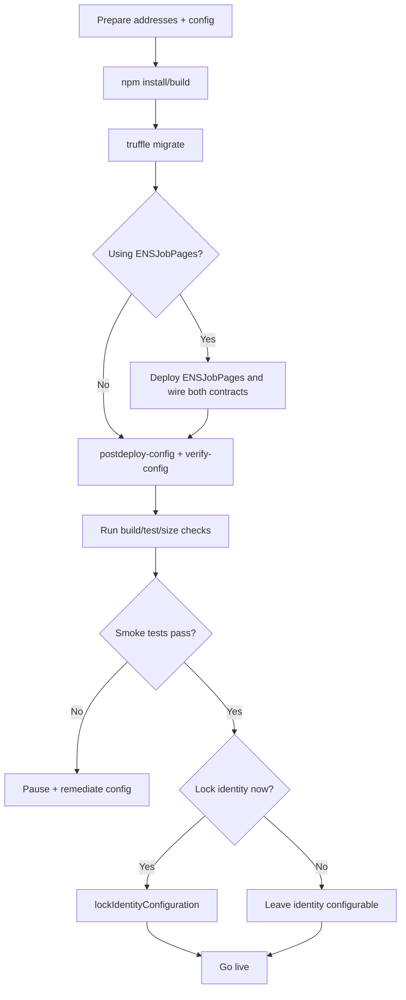

# Deploy Runbook

## 1) Pre-deploy checklist

### Addresses and prerequisites
- AGI ERC20 token address.
- ENS registry address.
- ENS NameWrapper address.
- ENS PublicResolver address (for ENSJobPages deployment).
- ENS jobs root node and root name string (for ENSJobPages).
- AGI namespace root nodes for manager constructor:
  - `clubRootNode`, `agentRootNode`, `alphaClubRootNode`, `alphaAgentRootNode`.
- Merkle roots:
  - `validatorMerkleRoot`, `agentMerkleRoot`.

### Config values to pre-approve
- Validator thresholds/quorum.
- Review windows and challenge period.
- Bond parameters and slash ratio.
- Max payout and duration limits.
- Validation reward and AGI type payout tiers.

### ENS ownership requirements
- If root is unwrapped: ENS root owner must allow contract to set subnode records.
- If root is wrapped: wrapper owner must be contract or grant `isApprovedForAll`.

## 2) Deploy sequence (repo-accurate)

### Deploy contracts
```bash
npm install
npm run build
truffle migrate --network <network>
```

Repository migration used: `migrations/2_deploy_contracts.js`.

### Optional ENSJobPages deployment
If using ENS hooks, deploy `ENSJobPages` separately with:
- ensAddress
- nameWrapperAddress
- publicResolverAddress
- jobs root node
- jobs root name

Then set manager address on ENSJobPages (`setJobManager`) and set ENSJobPages on manager (`setEnsJobPages`).

### Configure post-deploy
Run script-based configuration:
```bash
truffle exec scripts/postdeploy-config.js --network <network> --address <AGIJOBMANAGER_ADDRESS>
```

Verify configured state:
```bash
truffle exec scripts/verify-config.js --network <network> --address <AGIJOBMANAGER_ADDRESS>
```

## 3) Post-deploy config checklist
- [ ] Set validator thresholds/quorum.
- [ ] Set windows (`completionReviewPeriod`, `disputeReviewPeriod`, `challengePeriodAfterApproval`).
- [ ] Set reward/bond parameters.
- [ ] Set moderators.
- [ ] Set additional agents/validators if needed.
- [ ] Configure blacklists (normally empty at launch).
- [ ] Add AGI types (`addAGIType`) ensuring combined payout headroom against validation reward.
- [ ] Configure ENS hook endpoint (`setEnsJobPages`) and `setUseEnsJobTokenURI` as desired.

## 4) Verification and bytecode checks

Runtime size checks:
```bash
npm run size
node scripts/check-contract-sizes.js
```

Tests and compile:
```bash
npm run build
npm run test
```

Etherscan verification is performed externally (plugin/tool of choice) using deployed constructor args from migration config; do not expose private keys or mnemonics.

## 5) Smoke tests

Use local `test` network or testnet scripts/tests:
- create job and verify `lockedEscrow` increase.
- apply agent and verify `lockedAgentBonds` behavior.
- request completion and cast validator votes.
- finalize and verify expected payout path and NFT mint.
- verify `withdrawableAGI()` excludes all locked balances.

ENS smoke check (if configured):
- confirm `EnsHookAttempted` emissions across create/assign/completion/revoke.
- intentionally break ENSJobPages and confirm settlement still succeeds (best-effort behavior).

## 6) Lockdown and go-live

1. Confirm identity and roots are correct.
2. Optionally execute `lockIdentityConfiguration()` (irreversible).
3. Confirm not paused and `settlementPaused == false`.
4. Announce operator monitoring playbooks and event alerts.

## 7) Rollback / incident notes

- **ENS misconfigured**: if identity is **not locked**, update `ensJobPages` to a healthy contract or set it to zero address; if identity is already locked, this remediation path is unavailable and ENS issues must be handled off-chain while core settlement remains functional.
- **Wrong token/identity addresses pre-jobs**: use `updateAGITokenAddress` / identity setters while identity still configurable and locked balances are zero.
- **Wrong token address after activity**: direct replacement blocked by empty-lock requirement; pause, drain obligations via normal settlement, then reconfigure if still unlocked.


