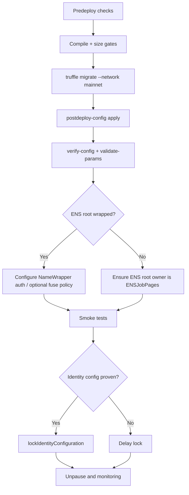

# Deployment Runbook (Mainnet-oriented)

This runbook uses repository-native Truffle scripts and environment variables.



## 1) Predeploy checks

1. Install deps:
   ```bash
   npm install
   ```
2. Fill `.env` from `.env.example` (never commit secrets).
3. Ensure required deploy env values are set (`PRIVATE_KEYS`, RPC, token/ENS/root nodes, merkle roots).
4. Verify compiler/network pins in `truffle-config.js` match intended chain profile.

## 2) Deploy contracts

Compile and deploy:

```bash
npm run build
npm run size
truffle migrate --network mainnet --reset
```

If deploying to another configured network:

```bash
truffle migrate --network sepolia --reset
```

## 3) Post-deploy configuration

Apply owner settings via script (uses env or JSON config):

```bash
truffle exec scripts/postdeploy-config.js --network mainnet --address <AGIJOBMANAGER_ADDRESS>
```

Dry-run preview:

```bash
truffle exec scripts/postdeploy-config.js --network mainnet --address <AGIJOBMANAGER_ADDRESS> --dry-run
```

This script supports thresholds, periods, metadata fields, merkle roots, moderators, allowlists, blacklists, AGI types, and ownership transfer config.

## 4) Verification steps

Config verification:

```bash
truffle exec scripts/verify-config.js --network mainnet --address <AGIJOBMANAGER_ADDRESS>
truffle exec scripts/ops/validate-params.js --network mainnet --address <AGIJOBMANAGER_ADDRESS>
```

Etherscan verification (plugin configured in `truffle-config.js`):

```bash
truffle run verify AGIJobManager --network mainnet
```

## 5) Smoke tests

Minimal transaction smoke test (manually in `truffle console --network mainnet` or staging net first):

1. `createJob` with low payout/duration.
2. Authorized agent `applyForJob`.
3. `requestJobCompletion`.
4. At least one validator vote.
5. `finalizeJob` after conditions/time windows.
6. Confirm expected events and locked accounting movement.

## 6) Lock identity configuration

Call `lockIdentityConfiguration()` only after confirming:
- token address,
- ENS registry + NameWrapper,
- root node configuration,
- ENS hook contract address.

After lock, identity setters guarded by `whenIdentityConfigurable` are permanently blocked.

## 7) Unpause + monitoring checklist

1. Ensure `pause=false` and `settlementPaused=false` for normal operation.
2. Start event watchers for: `JobCreated`, `JobDisputed`, `DisputeResolvedWithCode`, `AGIWithdrawn`, `SettlementPauseSet`, `EnsHookAttempted`.
3. Record deployed addresses and config snapshot in `docs/deployments/` or internal ops registry.
