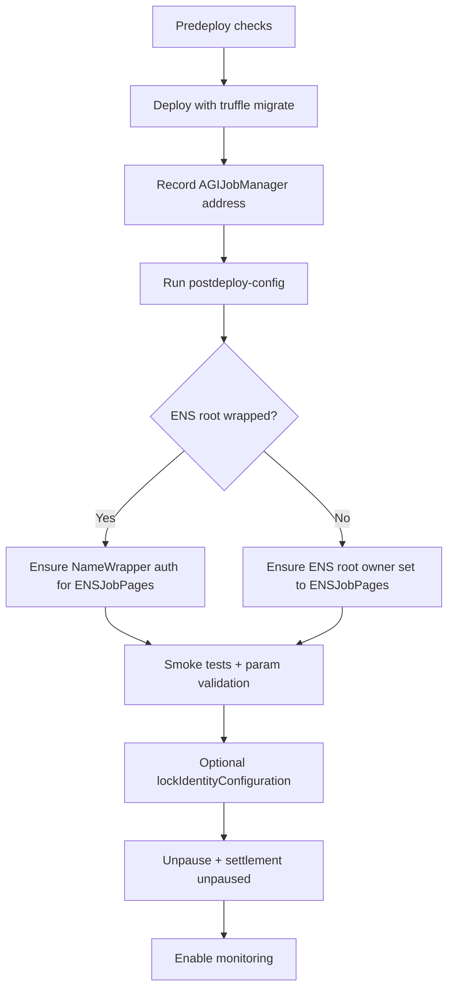

# Deploy Runbook (Mainnet-Oriented)

This runbook is aligned to current Truffle migrations and scripts.

## 1) Predeploy checks
1. Node/npm dependencies installed.
2. `.env` populated for `truffle-config.js` variables (`PRIVATE_KEYS`, RPC, optional gas params).
3. Confirm intended network + addresses for token/ENS/NameWrapper/root nodes/merkle roots.
4. Validate bytecode size gate before deployment:
   - `npm run build`
   - `npm run size`

## 2) Deploy contracts
- Development/test:
  - `npx truffle migrate --network test`
- Mainnet:
  - `npx truffle migrate --network mainnet --reset`

Migration behavior:
- Deploys utility libraries and links them.
- Deploys AGIJobManager using `migrations/deploy-config.js` resolved values.
- Optionally calls `lockIdentityConfiguration` if `LOCK_IDENTITY_CONFIG=true` or `LOCK_CONFIG=true`.

## 3) Post-deploy configuration
Use the scripted path:
- `truffle exec scripts/postdeploy-config.js --network <network> --address <AGIJobManager> --config-path <file.json>`

Set (as needed by config):
- validator thresholds/quorum/reward
- payout/duration/review windows
- merkle roots
- AGI types
- moderators/additional validators/additional agents/blacklists
- optional ownership transfer

## 4) Verification
If `truffle-plugin-verify` is configured and env key is present:
- `npx truffle run verify AGIJobManager@<address> --network mainnet`

If plugin verification is unavailable, document manual verification in release notes:
- compiler version/settings from `truffle-config.js`
- constructor arguments from migration output/env
- deployed bytecode hash and source commit SHA

## 5) Smoke tests
1. Run deterministic parameter checks:
   - `truffle exec scripts/ops/validate-params.js --network <network> --address <AGIJobManager>`
2. Execute minimal lifecycle transaction set in a staging network (create/apply/request/vote/finalize).
3. If ENS hooks enabled, confirm `EnsHookAttempted` events and expected ENS records.

## 6) Lock identity configuration
Call `lockIdentityConfiguration()` **after** token/ENS/namewrapper/root/hook addresses are final.
Do not lock early if you still need to rewire identity primitives.

## 7) Unpause and start monitoring
1. Ensure `pause()==false` and `settlementPaused==false` for normal operation.
2. Start event/indexer monitoring for lifecycle, dispute, and treasury events.
3. Confirm on-call owner/moderator procedures are active.
