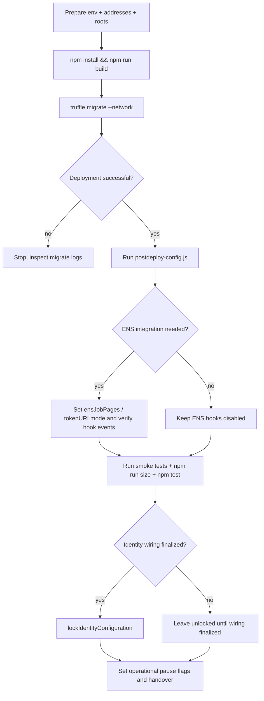

# Deploy Runbook

This runbook documents deployment for the current Truffle-based repository.

## 1) Pre-deploy checklist

### Required addresses and roots
- AGI ERC20 token address (`AGI_TOKEN_ADDRESS`)
- ENS registry (`AGI_ENS_REGISTRY`)
- NameWrapper (`AGI_NAMEWRAPPER`)
- ENS root nodes:
  - `AGI_CLUB_ROOT_NODE`
  - `AGI_ALPHA_CLUB_ROOT_NODE`
  - `AGI_AGENT_ROOT_NODE`
  - `AGI_ALPHA_AGENT_ROOT_NODE`
- Optional Merkle roots:
  - `AGI_VALIDATOR_MERKLE_ROOT`
  - `AGI_AGENT_MERKLE_ROOT`

### Operational parameter plan
Prepare target values for:
- validator thresholds (`requiredValidatorApprovals`, `requiredValidatorDisapprovals`, `voteQuorum`)
- review windows (`completionReviewPeriod`, `disputeReviewPeriod`, `challengePeriodAfterApproval`)
- payout ceilings (`maxJobPayout`, AGI type payout percentages, `validationRewardPercentage`)
- bond settings (`validatorBond*`, `agentBond*`, `validatorSlashBps`)

### ENS prerequisites
- Ensure root ownership/authorization aligns with the intended integration mode:
  - unwrapped root: ENS root owner must be `ENSJobPages` for subname creation.
  - wrapped root: `NameWrapper.ownerOf(rootNode)` owner must authorize `ENSJobPages` (owner or approved operator).

## 2) Deployment sequence (exact repo pattern)

1. Install dependencies:
   ```bash
   npm install
   ```
2. Build artifacts:
   ```bash
   npm run build
   ```
3. Deploy with Truffle network target:
   ```bash
   npx truffle migrate --network <network>
   ```

Expected behavior from `migrations/2_deploy_contracts.js`:
- Deploy and link utility libraries.
- On `development`/`test`, deploy mock token/ENS/name wrapper and deploy AGIJobManager with zero roots.
- On non-local networks, load addresses/roots from `migrations/deploy-config.js` env resolution logic and deploy AGIJobManager.
- Optional identity lock at deploy time if `LOCK_IDENTITY_CONFIG=true` (or `LOCK_CONFIG=true`).

## 3) Post-deploy configuration sequence

Use the provided post-deploy script:

```bash
node scripts/postdeploy-config.js --network <network> --address <AGIJobManagerAddress> --config-path <config.json>
```

The script supports (via JSON/env):
- threshold and parameter setters,
- metadata text fields,
- Merkle roots,
- moderators,
- additional agents/validators,
- blacklist updates,
- AGI types,
- optional ownership transfer.

## 4) Verification and safety checks

### Bytecode size checks
- Target contract runtime size check:
  ```bash
  npm run size
  ```
- Full artifact size scan:
  ```bash
  node scripts/check-contract-sizes.js
  ```

### Test suite sanity
```bash
npm test
```

### Etherscan verification (high-level)
- Ensure `ETHERSCAN_API_KEY` is set.
- Use Truffle verify plugin workflow for network contract address(es).
- Confirm compiler settings match `truffle-config.js` (`0.8.23`, optimizer enabled runs=50, `viaIR=false`).

## 5) Operator smoke tests

Run on testnet/local network after deployment:
- create job with funded employer,
- apply as eligible agent,
- request completion,
- submit validator votes,
- finalize to terminal state,
- confirm `withdrawableAGI()` remains non-negative and reflects locked counters.

ENS smoke checks (if configured):
- confirm `EnsHookAttempted` emits for hooks 1-4 during lifecycle,
- if hook failures occur, verify core settlement still succeeds (best-effort design),
- optional terminal lock: call `lockJobENS(jobId, false)`; owner can additionally call `lockJobENS(jobId, true)` to burn fuses on wrapped roots.

## 6) Lockdown steps

1. Verify no active obligations if identity updates are still pending.
2. Call `lockIdentityConfiguration()` when token/ENS/root wiring is finalized.
3. Ensure pause/settlement toggles are in desired operational mode (`unpause` + `setSettlementPaused(false)`).

## 7) Rollback and incident notes

- ENS misconfigured: set `ensJobPages` to `0x0` (if identity lock not engaged) or keep hooks failing safely and operate without ENS side effects.
- Wrong token address before lock and before obligations: use `updateAGITokenAddress` (requires empty obligations).
- Wrong token address after lock or with active obligations: redeploy and migrate operations; in-place fix is intentionally blocked.

## Deploy-day flow (decision chart)


