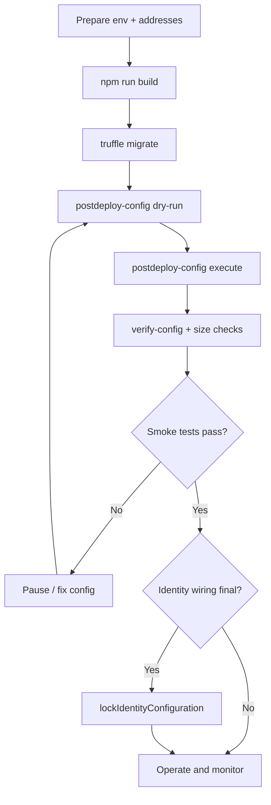

# Deploy Runbook

## 1) Pre-deploy checklist

### Required addresses and values

- AGI ERC-20 token address (`AGI_TOKEN_ADDRESS`)
- ENS registry (`AGI_ENS_REGISTRY`)
- NameWrapper (`AGI_NAMEWRAPPER`)
- Root nodes:
  - `AGI_CLUB_ROOT_NODE`
  - `AGI_ALPHA_CLUB_ROOT_NODE`
  - `AGI_AGENT_ROOT_NODE`
  - `AGI_ALPHA_AGENT_ROOT_NODE`
- Merkle roots:
  - `AGI_VALIDATOR_MERKLE_ROOT`
  - `AGI_AGENT_MERKLE_ROOT`
- Optional base metadata URL: `AGI_BASE_IPFS_URL`

### ENS prerequisites

- Ensure the intended jobs root is controlled by either owner EOA/multisig (unwrapped) or NameWrapper (wrapped mode).
- Ensure resolver supports `setText` and `setAuthorisation` if ENSJobPages will be used.

### Parameter readiness

Prepare values for post-deploy config:
- validator thresholds (`requiredValidatorApprovals`, `requiredValidatorDisapprovals`, `voteQuorum`)
- reward and bond parameters
- review/challenge windows
- payout and duration limits

## 2) Deploy sequence (repo-native)

```bash
npm install
npm run build
npx truffle migrate --network <network>
```

Expected outcome:
- Utility libraries + `AGIJobManager` deployed.
- On `development`/`test`, mock token/ENS/wrapper are also deployed and funded.

## 3) Post-deploy configuration sequence

Use the provided script (dry-run first):

```bash
node scripts/postdeploy-config.js --network <network> --address <AGIJobManager_address> --dry-run
node scripts/postdeploy-config.js --network <network> --address <AGIJobManager_address>
```

Then verify:

```bash
node scripts/verify-config.js --network <network> --address <AGIJobManager_address>
```

Operator sequence:
1. Configure thresholds and windows.
2. Configure bond/slash parameters.
3. Configure allowlists/blacklists/moderators as needed.
4. Add AGI types (`addAGIType`) only with ERC-721 contracts and valid payout percentages.
5. Wire ENSJobPages (`setEnsJobPages`) and optional token URI toggle (`setUseEnsJobTokenURI`).

## 4) Verification and bytecode checks

```bash
npm run size
node scripts/check-contract-sizes.js
```

High-level explorer verification:
- Verify constructor args used by migration.
- Confirm deployed runtime size under EIP-170 cap.
- Confirm metadata/settings match `truffle-config.js` compiler version.

## 5) Smoke tests

Local canonical suite:

```bash
npm test
```

Targeted operational checks (recommended on testnet before mainnet):
- create job
- apply with valid agent eligibility
- request completion
- collect validator votes
- finalize/dispute path
- confirm `withdrawableAGI` excludes `lockedEscrow` and all bond buckets
- if ENS hooks configured, confirm lifecycle still succeeds when hook target is unavailable (best-effort behavior)

## 6) Lockdown steps

1. Confirm no pending escrow/bonds for identity rewiring changes.
2. Execute `lockIdentityConfiguration()` once token/ENS/root wiring is final.
3. Ensure pause states are intentional:
   - `paused == false` for normal operation
   - `settlementPaused == false` for finalization/withdraw paths

## 7) Rollback and incident notes

- **ENS misconfigured**: set `ensJobPages` to zero address to disable hooks while preserving core settlement.
- **Wrong token address**: can be changed only before identity lock and only with empty escrow (`updateAGITokenAddress`).
- **Bad roots**: can be rotated via `updateRootNodes` only before lock and with empty escrow; Merkle roots can be updated live.

## Deploy-day flow


