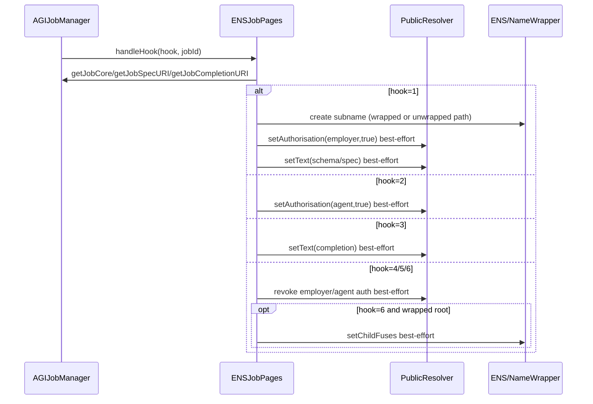

# ENSJobPages Deep Reference

Primary source: `contracts/ens/ENSJobPages.sol`.

## Integration model

`AGIJobManager` can call `ENSJobPages.handleHook(hook, jobId)` via `_callEnsJobPagesHook`. The call is gas-limited and best-effort, and emits `EnsHookAttempted` from `AGIJobManager`.

`ENSJobPages` then reads job data back from the caller via `IAGIJobManagerView` (`getJobCore`, `getJobSpecURI`, `getJobCompletionURI`) and applies ENS updates.

## Hook map

| Hook ID | Meaning | ENSJobPages action |
|---:|---|---|
| `1` | job created | create subname, set employer authorization, set schema/spec text |
| `2` | agent assigned | authorize agent in resolver |
| `3` | completion requested | set completion text field |
| `4` | revoke | remove employer/agent authorizations |
| `5` | lock (no fuse burn) | revoke auth, emit lock event |
| `6` | lock + fuse burn | revoke auth, attempt `setChildFuses` when wrapped root |

## Hook sequence

## Wrapped vs unwrapped roots

`_isWrappedRoot()` returns true when `ens.owner(jobsRootNode) == address(nameWrapper)`.

- **Wrapped root path**: `setSubnodeRecord` through NameWrapper and wrapper authorization checks (`ownerOf` / `isApprovedForAll`).
- **Unwrapped root path**: direct ENS registry `setSubnodeRecord`, requiring `ENS.owner(jobsRootNode) == address(this)`.

## Fuse behavior and semantics

When `burnFuses=true` and root is wrapped, `ENSJobPages` attempts to burn `CANNOT_SET_RESOLVER` and `CANNOT_SET_TTL` (`LOCK_FUSES`) on the child with max expiry. This attempt is best-effort (`try/catch`); failure does not revert settlement or lock flow. Event `JobENSLocked(jobId,node,fusesBurned)` indicates outcome.

## Operational prerequisites

1. Set non-zero `ens`, `publicResolver`, `jobsRootNode`, and non-empty `jobsRootName`.
2. Set `jobManager` to deployed `AGIJobManager`.
3. Ensure ownership/authorization:
   - unwrapped: `ENS.owner(jobsRootNode) == ENSJobPages`.
   - wrapped: wrapper owner exists and authorizes `ENSJobPages` when needed.
4. If using ENS token URIs for minted job NFTs, enable both sides:
   - `AGIJobManager.setUseEnsJobTokenURI(true)`
   - optional `ENSJobPages.setUseEnsJobTokenURI(true)` (local flag on companion contract).
