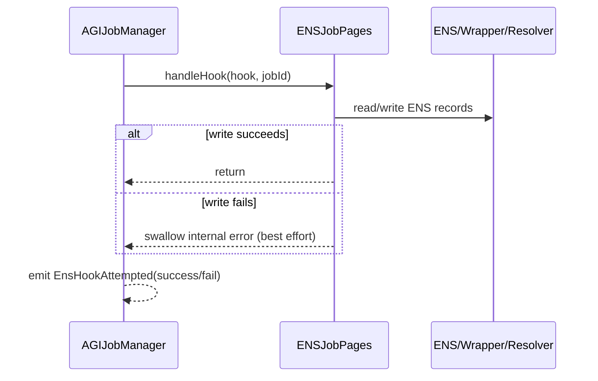

# ENS Integration

## Responsibilities

`ENSJobPages` creates and updates ENS-backed job pages for AGIJobManager lifecycle events. It is optional and invoked via `AGIJobManager._callEnsJobPagesHook`.

Core behaviors:
- create `job-<id>.<jobsRootName>` page
- authorize employer/agent in resolver
- publish job spec/completion text records
- revoke permissions on terminal transitions
- optionally burn child fuses when lock-burn hook is used

## Hook ID mapping

| Hook ID | Trigger in AGIJobManager | ENSJobPages behavior |
|---|---|---|
| `1` (`ENS_HOOK_CREATE`) | `createJob` | create page + set spec text + authorize employer |
| `2` (`ENS_HOOK_ASSIGN`) | `applyForJob` | authorize assigned agent |
| `3` (`ENS_HOOK_COMPLETION`) | `requestJobCompletion` | set completion text |
| `4` (`ENS_HOOK_REVOKE`) | cancel/expire/finalize/complete flows | revoke employer/agent authorization |
| `5` (`ENS_HOOK_LOCK`) | finalize path when burn disabled | revoke + emit lock event (no fuse burn) |
| `6` (`ENS_HOOK_LOCK_BURN`) | finalize path when burn enabled | revoke + attempt NameWrapper fuse burn |

All hook calls are **best effort** and emit `EnsHookAttempted(hook, jobId, target, success)`.

## Wrapped vs unwrapped root

- **Unwrapped root**: `ENSJobPages` writes subnode records via ENS registry.
- **Wrapped root**: `ENSJobPages` uses NameWrapper `setSubnodeRecord`; lock-burn path attempts `setChildFuses` with:
  - `CANNOT_SET_RESOLVER`
  - `CANNOT_SET_TTL`

## Permissions model

- `handleHook` is restricted to `jobManager` via `onlyJobManager`.
- Direct maintenance methods are `onlyOwner`.
- Resolver writes and authorization updates are attempted via `try/catch`; failures do not revert lifecycle.

## Hook execution sequence

## Troubleshooting

| Symptom | Likely cause | Verify | Remediation |
|---|---|---|---|
| `EnsHookAttempted(...,success=false)` | `ensJobPages` reverted or wrong target | Check `ensJobPages` code/address and emitted events | Fix target; core contract can continue safely |
| No ENS page created | `jobManager` not configured in ENSJobPages | Check `ENSJobPages.jobManager()` | Call `setJobManager` |
| Resolver text not written | resolver lacks method/authorization | Check resolver contract and ownership | Set compatible resolver and permissions |
| Fuse burn not happening | root not wrapped or wrapper auth missing | Check `nameWrapper.ownerOf(uint256(jobsRootNode))` and events | Use wrapped root with correct ownership |
| NFT tokenURI not ENS URI | `setUseEnsJobTokenURI(false)` or ENS URI empty | Check toggle and ENS return values | Enable toggle and ensure root/name config |
