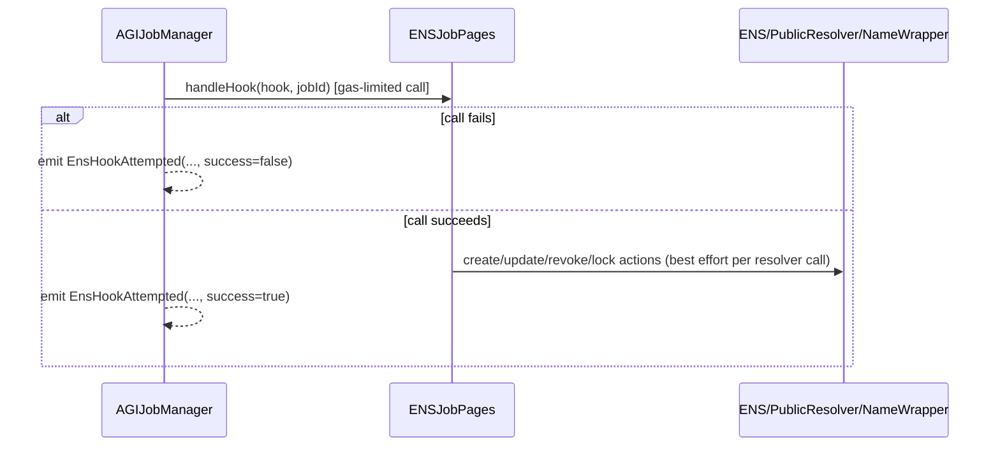

# ENS Integration

## Scope

ENS integration in this repo is optional and best-effort:
- `AGIJobManager` emits lifecycle hook calls to `ensJobPages` via `handleHook(uint8,uint256)`.
- `ENSJobPages` updates ENS subnames/resolver text records and permissions.
- Core escrow/settlement does **not** revert on ENS hook failure.

## Hook ID mapping

| Hook ID | Emitted by `AGIJobManager` | `ENSJobPages.handleHook` behavior |
|---:|---|---|
| `1` | after `createJob` | create job ENS subname, set schema/spec text, authorize employer |
| `2` | after `applyForJob` | authorize assigned agent |
| `3` | after `requestJobCompletion` | set completion text |
| `4` | terminal revoke points (`_completeJob`, `_refundEmployer`, `expireJob`) | revoke employer + agent resolver authorization |
| `5` | `lockJobENS(jobId,false)` | revoke auth + emit lock event (no fuse burn) |
| `6` | `lockJobENS(jobId,true)` | same as 5 + try `setChildFuses` on wrapped root |

## Wrapped vs unwrapped root behavior

### Unwrapped root
- `ENSJobPages` requires direct ENS ownership of `jobsRootNode`.
- Uses `ens.setSubnodeRecord`.

### Wrapped root
- Root owner in ENS registry is `NameWrapper`.
- `ENSJobPages` uses `nameWrapper.setSubnodeRecord`.
- Authorization requirement: wrapper owner is contract or has `isApprovedForAll(owner, ENSJobPages)=true`.

## Fuse-locking / permissions model

- Job lock operation always revokes resolver authorizations for employer/agent (best effort).
- Fuse burn (`LOCK_FUSES = CANNOT_SET_RESOLVER | CANNOT_SET_TTL`) only attempted when:
  - `lockJobENS(..., true)` is called,
  - root is wrapped,
  - and caller in `AGIJobManager` is owner (enforced there).
- Fuse burn failures are swallowed (best effort) and reflected via emitted lock event in `ENSJobPages`.

## Hook execution sequence

## Troubleshooting

| Symptom | Likely cause | How to verify | Remediation |
|---|---|---|---|
| `EnsHookAttempted(..., false)` repeatedly | `ensJobPages` unset, wrong address, or hook revert | inspect `ensJobPages` value and code size; inspect transaction logs | fix `ensJobPages` pointer if unlockable; otherwise operate without ENS hooks |
| Subnames not created | root ownership/authorization invalid | check `ens.owner(jobsRootNode)` and wrapper approval path | transfer/approve root authority to ENSJobPages |
| Resolver text missing | resolver not configured or resolver call failed | inspect resolver address and text records directly | set valid resolver; retry via owner helper methods on ENSJobPages |
| Fuse burn not happening | unwrapped root or wrapper auth missing | verify root wrapped status + wrapper ownership/approval | wrap root and authorize ENSJobPages; owner re-run `lockJobENS(jobId,true)` |
| NFT URI not using `ens://` | `useEnsJobTokenURI` disabled or ENS URI empty | check `setUseEnsJobTokenURI` state and `jobEnsURI` output | enable flag and ensure `jobsRootName` is configured |
