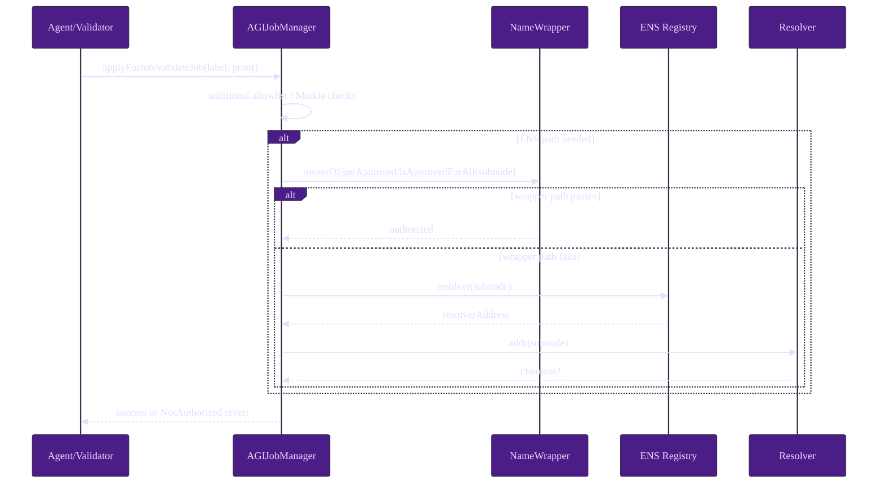

# ENS Integration (AGIJobManager)

This guide documents the exact ENS surface area used by AGIJobManager, with explicit trust boundaries and failure behavior anchored to repository code.

> **Operator note**
> ENS in AGIJobManager is a role-gating and metadata integration layer. Core escrow accounting and settlement safety do not depend on ENS success. See settlement accounting state and solvency checks in [`AGIJobManager`](../../contracts/AGIJobManager.sol).

## Purpose and scope

AGIJobManager uses ENS in three places:

1. **Identity/authorization gating** for agent application and validator voting via ENS ownership checks, combined with Merkle and owner allowlists (`applyForJob`, `_recordValidatorVote`, `_isAuthorized`).
2. **Optional ENS job pages hook integration** via `ensJobPages` and `handleHook` calls.
3. **Optional `ens://` NFT metadata mode** through best-effort `jobEnsURI` reads in `_mintJobNFT`.

Primary code:
- [`contracts/AGIJobManager.sol`](../../contracts/AGIJobManager.sol)
- [`contracts/utils/ENSOwnership.sol`](../../contracts/utils/ENSOwnership.sol)
- Optional integration target: [`contracts/ens/ENSJobPages.sol`](../../contracts/ens/ENSJobPages.sol)

## Components and trust boundaries

| Component | Type | Trust boundary | Used for |
| --- | --- | --- | --- |
| `AGIJobManager` | In-repo contract | Authoritative enforcement layer | Authorization checks, hook dispatch, tokenURI selection |
| ENS Registry (`ens`) | External contract address | External dependency; may fail or return malformed data | Resolver fallback ownership path |
| NameWrapper (`nameWrapper`) | External contract address | External dependency; may fail or return malformed data | Primary ownership/approval path |
| `ensJobPages` | Optional external/in-repo contract | Best-effort hook/URI source only | Job page lifecycle hooks, optional `ens://` URI |

```mermaid
%%{init: {"theme":"base","themeVariables":{
"fontFamily":"ui-sans-serif, system-ui, -apple-system, Segoe UI, Roboto, Arial",
"background":"#14001F","primaryColor":"#4B1D86","primaryTextColor":"#E9DAFF",
"lineColor":"#7A3FF2","tertiaryColor":"#1B0B2A",
"noteBkgColor":"#1B0B2A","noteTextColor":"#E9DAFF"
}}}%%
flowchart TD
    A[Caller: agent/validator] --> B{Additional allowlist?}
    B -->|yes| Z[Authorized]
    B -->|no| C{Merkle proof valid?}
    C -->|yes| Z
    C -->|no| D{Root node configured?}
    D -->|no| X[NotAuthorized]
    D -->|yes| E[Compute subnode = keccak(rootNode, keccak(label))]
    E --> F{NameWrapper owner/approval path valid?}
    F -->|yes| Z
    F -->|no| G{ENS resolver.addr path valid?}
    G -->|yes| Z
    G -->|no| X
```

## Configuration model

| Config item | Where stored | Who can change | How to verify | Locking behavior | Safety notes |
| --- | --- | --- | --- | --- | --- |
| ENS registry address | `ens` in `AGIJobManager` | `onlyOwner` via `updateEnsRegistry` | read `ens()` + `EnsRegistryUpdated` | Blocked after `lockIdentityConfiguration`; requires empty escrow state before update | Must be contract address (`code.length > 0`) |
| NameWrapper address | `nameWrapper` in `AGIJobManager` | `onlyOwner` via `updateNameWrapper` | read `nameWrapper()` + `NameWrapperUpdated` | Blocked after lock; requires empty escrow | `0x0` allowed (disables wrapper path) |
| Root nodes | `clubRootNode`, `agentRootNode`, `alphaClubRootNode`, `alphaAgentRootNode` | `onlyOwner` via `updateRootNodes` | read getters + `RootNodesUpdated` | Blocked after lock; requires empty escrow | Wrong roots deny valid users or authorize wrong namespace |
| Merkle roots | `validatorMerkleRoot`, `agentMerkleRoot` | `onlyOwner` via `updateMerkleRoots` | read getters + `MerkleRootsUpdated` | **Not** locked by identity lock | Keep off-chain Merkle publication/versioning disciplined |
| ENS hook target | `ensJobPages` | `onlyOwner` via `setEnsJobPages` | read `ensJobPages()` + `EnsJobPagesUpdated` | Blocked after identity lock | Hook calls are best-effort and not required for settlement |
| ENS tokenURI mode | `useEnsJobTokenURI` (private toggle) | `onlyOwner` via `setUseEnsJobTokenURI` | observe minted `NFTIssued` URI output behavior | Not blocked by identity lock | Keep disabled unless hook target is hardened |
| Identity wiring lock | `lockIdentityConfig` | `onlyOwner` via `lockIdentityConfiguration` | read `lockIdentityConfig()` + `IdentityConfigurationLocked` | Irreversible | Freeze only after multi-step verification |

Code anchors for configuration and lock controls:
- [`updateEnsRegistry`](../../contracts/AGIJobManager.sol), [`updateNameWrapper`](../../contracts/AGIJobManager.sol), [`updateRootNodes`](../../contracts/AGIJobManager.sol), [`setEnsJobPages`](../../contracts/AGIJobManager.sol), [`setUseEnsJobTokenURI`](../../contracts/AGIJobManager.sol), [`lockIdentityConfiguration`](../../contracts/AGIJobManager.sol).

> **Safety warning**
> Identity configuration updates (`updateAGITokenAddress`, `updateEnsRegistry`, `updateNameWrapper`, `updateRootNodes`) require empty escrow/bond state via `_requireEmptyEscrow()`. Plan maintenance windows accordingly.

## Runtime authorization model

### Contract-enforced algorithm

For agent application and validator vote actions:

1. Reject blacklisted caller.
2. Accept immediately if caller is in owner allowlist (`additionalAgents`/`additionalValidators`).
3. Else accept if Merkle proof is valid against role root.
4. Else attempt ENS ownership verification against primary role root and alpha role root:
   - derive `subnode = keccak256(abi.encodePacked(rootNode, keccak256(bytes(subdomain))))`
   - check NameWrapper ownership/approval path first: `ownerOf`, `getApproved`, `isApprovedForAll`
   - if wrapper path is not valid, check resolver fallback: `ens.resolver(subnode)` then `resolver.addr(subnode)`
5. If all paths fail, revert `NotAuthorized`.

Code anchors:
- Role-gated entrypoints: [`applyForJob`](../../contracts/AGIJobManager.sol), [`validateJob`](../../contracts/AGIJobManager.sol), [`disapproveJob`](../../contracts/AGIJobManager.sol), [`_recordValidatorVote`](../../contracts/AGIJobManager.sol).
- Identity combination logic: [`_isAuthorized`](../../contracts/AGIJobManager.sol).
- ENS staticcall logic and gas-bounded parsing: [`ENSOwnership.verifyENSOwnership`](../../contracts/utils/ENSOwnership.sol).

## Runtime sequence (authorized user)



## What is best-effort vs enforced

- **Enforced on-chain**: role gating decision, root/merkle matching, lock semantics, ownership checks’ boolean result.
- **Operator responsibility**: correct ENS addresses and roots, safe sequencing of lock, Merkle root publication hygiene, monitoring.
- **Best-effort external behavior**: ENS staticcalls and hook/URI calls can fail; failures result in authorization denial or fallback URI path, not escrow invariant breakage.

## Optional ENSJobPages integration

If deployed, `ENSJobPages` can mirror job lifecycle into ENS text records and provide canonical `ens://` names/URIs. `AGIJobManager` interacts through a gas-capped `handleHook(uint8,uint256)` call and optional `jobEnsURI(uint256)` staticcall. See [`contracts/ens/ENSJobPages.sol`](../../contracts/ens/ENSJobPages.sol) and [`contracts/ens/IENSJobPages.sol`](../../contracts/ens/IENSJobPages.sol).

> **Non-goal / limitation**
> ENS ownership is not reputation, legal identity, anti-phishing protection, or compromise-proof custody. It is one input to eligibility policy.
