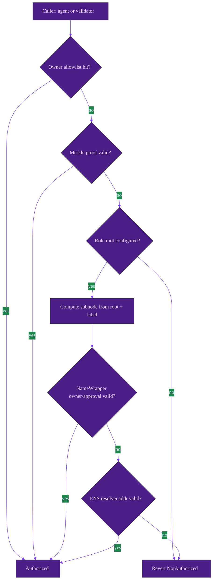
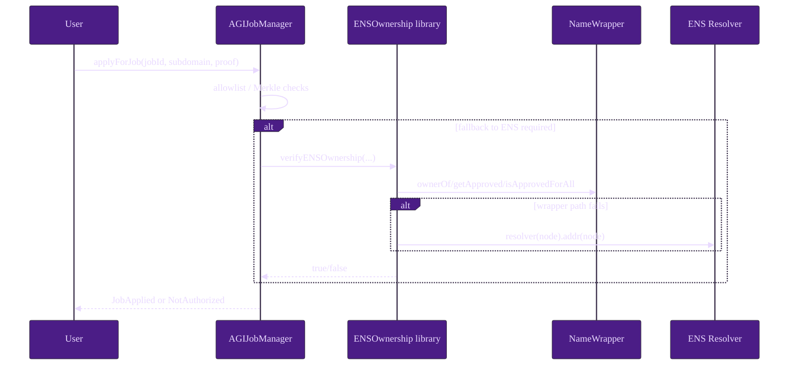

# ENS Integration (AGIJobManager)

This guide documents the **actual ENS integration surface** of AGIJobManager and separates on-chain enforcement from off-chain operator duties.

> **Operator note**
> ENS is a policy and identity layer. Escrow accounting, solvency controls, and settlement invariants remain enforced by `AGIJobManager` even when ENS dependencies fail. See [`contracts/AGIJobManager.sol`](../../contracts/AGIJobManager.sol).

## Purpose and scope

AGIJobManager uses ENS in three explicit paths:

1. **Role authorization fallback** for agent application and validator votes when allowlist/Merkle checks do not pass. See `applyForJob`, `validateJob`, `disapproveJob`, `_recordValidatorVote`, `_verifyOwnership`, and `_verifyOwnershipByRoot` in [`contracts/AGIJobManager.sol`](../../contracts/AGIJobManager.sol).
2. **Best-effort hook integration** to optional `ENSJobPages` via `_callEnsJobPagesHook` and `lockJobENS` in [`contracts/AGIJobManager.sol`](../../contracts/AGIJobManager.sol).
3. **Best-effort `ens://` token metadata mode** through `setUseEnsJobTokenURI` and guarded staticcall reads in `_mintJobNFT` in [`contracts/AGIJobManager.sol`](../../contracts/AGIJobManager.sol).

Concrete contract entrypoints and storage layout:
- ENS identity state (`ens`, `nameWrapper`, root nodes, Merkle roots, `ensJobPages`, `lockIdentityConfig`) is declared in [`AGIJobManager.sol` state variables](../../contracts/AGIJobManager.sol#L136-L147).
- Identity rewiring functions are in the owner-config section: [`updateEnsRegistry`](../../contracts/AGIJobManager.sol#L782-L786), [`updateNameWrapper`](../../contracts/AGIJobManager.sol#L788-L792), [`setEnsJobPages`](../../contracts/AGIJobManager.sol#L794-L798), [`setUseEnsJobTokenURI`](../../contracts/AGIJobManager.sol#L800-L802), [`updateRootNodes`](../../contracts/AGIJobManager.sol#L803-L815), [`lockIdentityConfiguration`](../../contracts/AGIJobManager.sol#L480-L483).
- ENS ownership verification code path is delegated to [`ENSOwnership.verifyENSOwnership`](../../contracts/utils/ENSOwnership.sol#L62-L94).

Core implementation files:
- [`contracts/AGIJobManager.sol`](../../contracts/AGIJobManager.sol)
- [`contracts/utils/ENSOwnership.sol`](../../contracts/utils/ENSOwnership.sol)
- Optional integration target: [`contracts/ens/ENSJobPages.sol`](../../contracts/ens/ENSJobPages.sol)

## Components and trust boundaries

| Component | Type | Trust boundary | Purpose |
| --- | --- | --- | --- |
| `AGIJobManager` | In-repo contract | Authoritative enforcement layer | Authorization composition, settlement, hook dispatch |
| ENS Registry (`ens`) | External contract | External dependency, may fail/revert/misconfigure | Resolver fallback ownership path |
| NameWrapper (`nameWrapper`) | External contract | External dependency, optional (`address(0)` allowed) | Primary ownership/approval path |
| `ensJobPages` | Optional contract | Best-effort only; never escrow-critical | ENS page hooks and optional `ens://` URI generation |

## Configuration model

| Config item | Where stored | Who can change | How to verify | Locking behavior | Safety notes |
| --- | --- | --- | --- | --- | --- |
| `ens` | `ENS public ens` in `AGIJobManager` | `onlyOwner` via `updateEnsRegistry` | `ens()` + `EnsRegistryUpdated` | Blocked by `lockIdentityConfiguration`; requires `_requireEmptyEscrow()` | Must be non-zero contract (`code.length > 0`) |
| `nameWrapper` | `NameWrapper public nameWrapper` | `onlyOwner` via `updateNameWrapper` | `nameWrapper()` + `NameWrapperUpdated` | Blocked by lock; requires empty escrow | `0x0` disables wrapper path and leaves resolver fallback |
| Root nodes | `clubRootNode`, `agentRootNode`, `alphaClubRootNode`, `alphaAgentRootNode` | `onlyOwner` via `updateRootNodes` | root getters + `RootNodesUpdated` | Blocked by lock; requires empty escrow | Misconfigured nodes can deny valid users or admit wrong namespace |
| Merkle roots | `validatorMerkleRoot`, `agentMerkleRoot` | `onlyOwner` via `updateMerkleRoots` | getters + `MerkleRootsUpdated` | Blocked by `lockIdentityConfiguration`; requires empty escrow | Primary fallback lever **before** lock; unavailable after lock |
| ENS hook target | `address public ensJobPages` | `onlyOwner` via `setEnsJobPages` | `ensJobPages()` + `EnsJobPagesUpdated` | Blocked by lock | Hook failures are intentionally non-fatal |
| ENS URI toggle | `bool private useEnsJobTokenURI` | `onlyOwner` via `setUseEnsJobTokenURI` | Observe `NFTIssued` URI and `tokenURI(tokenId)` | Not blocked by identity lock | Enable only after hook target hardening |
| Identity lock | `bool public lockIdentityConfig` | `onlyOwner` via `lockIdentityConfiguration` | `lockIdentityConfig()` + `IdentityConfigurationLocked` | Irreversible | Freezes token/ENS/wrapper/root/hook wiring |

> **Safety warning**
> `updateAGITokenAddress`, `updateEnsRegistry`, `updateNameWrapper`, and `updateRootNodes` all enforce `_requireEmptyEscrow()` before allowing changes. See [`contracts/AGIJobManager.sol`](../../contracts/AGIJobManager.sol).

> **Operator note**
> `lockIdentityConfiguration()` is not a full protocol shutdown, but it **does** freeze identity rewiring and Merkle root updates because those setters use `whenIdentityConfigurable`. After lock, rely on allowlists, blocklists, and pause controls for incident handling. See [`updateMerkleRoots`](../../contracts/AGIJobManager.sol#L816-L825), [`addAdditionalValidator`](../../contracts/AGIJobManager.sol#L374-L377), [`blacklistAgent`](../../contracts/AGIJobManager.sol#L754-L757), and pause controls in [`AGIJobManager.sol`](../../contracts/AGIJobManager.sol#L458-L479).

## Runtime authorization model

### Contract-enforced algorithm

For role-gated actions (`applyForJob`, validator vote paths):

1. Reject if caller is blacklisted (`blacklistedAgents` / `blacklistedValidators`).
2. Accept if caller is in `additionalAgents` / `additionalValidators`.
3. Accept if supplied Merkle proof matches role root (`validatorMerkleRoot` or `agentMerkleRoot`).
4. Otherwise evaluate ENS ownership for primary + alpha root using `ENSOwnership.verifyENSOwnership(...)`:
   - validate label format (`EnsLabelUtils.requireValidLabel`) in [`contracts/utils/ENSOwnership.sol`](../../contracts/utils/ENSOwnership.sol)
   - derive `subnode = keccak256(abi.encodePacked(rootNode, keccak256(bytes(subdomain))))`
   - check NameWrapper path first (`ownerOf`, `getApproved`, `isApprovedForAll`)
   - if wrapper check fails, use ENS resolver fallback (`ens.resolver(subnode)` then `resolver.addr(subnode)`)
5. Revert with `NotAuthorized` if all authorization paths fail.

Authoritative precedence inside the ENS path:
- The wrapper path is attempted first via `_verifyOwnership` and `ENSOwnership.verifyENSOwnership` with `NameWrapper.ownerOf/getApproved/isApprovedForAll` checks. [`AGIJobManager.sol`](../../contracts/AGIJobManager.sol#L684-L706), [`ENSOwnership.sol`](../../contracts/utils/ENSOwnership.sol#L71-L83)
- Resolver fallback is used when wrapper checks are unavailable/negative; ownership is inferred from `ens.resolver(node)` + `resolver.addr(node)` and compared to claimant. [`ENSOwnership.sol`](../../contracts/utils/ENSOwnership.sol#L84-L92)
- If both checks fail (or inputs are invalid), authorization fails closed (`false` → `NotAuthorized` in caller). [`AGIJobManager.sol`](../../contracts/AGIJobManager.sol#L521-L522), [`AGIJobManager.sol`](../../contracts/AGIJobManager.sol#L600-L601)

### What is enforced vs operational vs best-effort

| Category | Responsibilities |
| --- | --- |
| **(a) Smart contract enforces** | role-gating, empty-escrow precondition for identity rewiring, irreversible identity lock, bounded-gas ENS staticcalls, and fail-closed `NotAuthorized` behavior. |
| **(b) Operators must do off-chain** | verify external ENS addresses per chain, review root constants, manage multisig discipline, run staged positive/negative test vectors, and monitor config events. |
| **(c) Best-effort behavior** | ENS hook dispatch and optional `ens://` URI reads may fail silently-with-event and do not change escrow correctness. |

## Runtime sequence (authorized path)

## Related references

- Generated ENS surface reference: [`docs/REFERENCE/ENS_REFERENCE.md`](../REFERENCE/ENS_REFERENCE.md)
- Robustness and incident runbooks: [`docs/INTEGRATIONS/ENS_ROBUSTNESS.md`](./ENS_ROBUSTNESS.md)
- Canonical setup walkthrough: [`docs/INTEGRATIONS/ENS_USE_CASE.md`](./ENS_USE_CASE.md)
- Wireframe (text-only SVG): [`docs/assets/ens-integration-wireframe.svg`](../assets/ens-integration-wireframe.svg)
