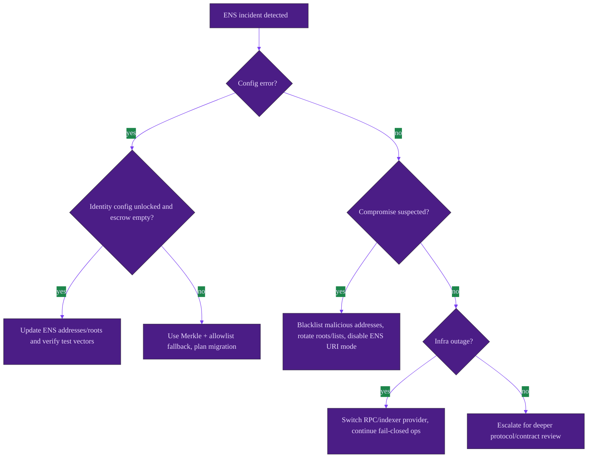
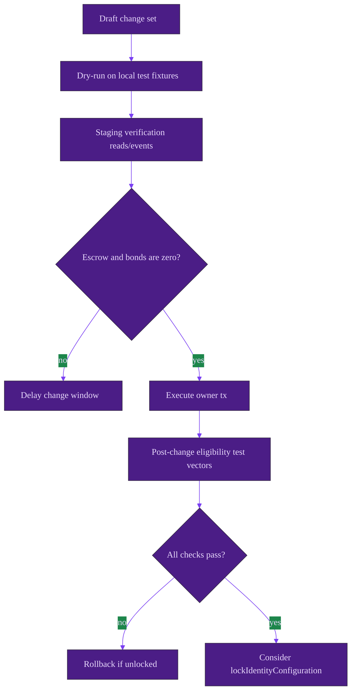

# ENS Robustness, Failure Modes, and Runbooks

This document focuses on degraded-path behavior, operations, and security posture for ENS-linked functionality.

## Failure modes and safe handling

| Failure mode | Symptoms | On-chain behavior | UI/operator impact | Safe remediation | Prevention |
| --- | --- | --- | --- | --- | --- |
| Wrong ENS registry address | Valid users fail ENS resolver path | `_isAuthorized` returns false on ENS path; role action may revert `NotAuthorized` | Eligibility failures | If unlocked and escrow empty, call `updateEnsRegistry`; re-test known identity | Two-person review + pre-prod dry run |
| Wrong NameWrapper address | Wrapped names not recognized | Wrapper ownership path fails; resolver fallback may still pass | Partial identity failures | Call `updateNameWrapper` if unlocked and escrow empty; verify `ownerOf` path | Maintain chain/address registry |
| Wrong root node(s) configured | Correct labels fail or wrong namespace accepted | Subnode derived against wrong root in ENS checks | Authorization drift | Call `updateRootNodes` (if unlocked + empty escrow), then rerun positive and negative vectors | Require signed root manifest |
| Name becomes unwrapped or approvals revoked | Previously eligible account denied | Wrapper path fails; resolver may or may not pass | User access incident | Validate resolver fallback ownership; coordinate ENS owner action | Monitor ownership and approval deltas |
| Resolver misconfigured or changed | Resolver fallback fails unexpectedly | Resolver path returns false | Access incident when wrapper path also unavailable | Restore resolver records; keep wrapper ownership clean | Monitor resolver address + `addr` records |
| `ensJobPages` hook contract reverts | Hook side effects absent | `_callEnsJobPagesHook` swallows failure | Missing ENS page updates only | Repair/replace hook target if unlocked; settlement remains available | Keep hook logic hardened and tested |
| `jobEnsURI` malformed/reverting | Unexpected URI source failure | `_mintJobNFT` ignores bad return and retains base URI path | Metadata not using ENS URI | Disable URI mode or fix hook target | Keep `setUseEnsJobTokenURI(false)` until proven |
| Identity config locked too early | Cannot update ENS addresses/roots/token wiring | `ConfigLocked` from guarded setters | No on-chain recovery for locked fields | Operate via Merkle/allowlists; plan migration if necessary | Lock checklist + sign-off gates |
| RPC/indexer outages | Off-chain checks fail/intermittent | Contract unchanged | Operator blind spots, delayed diagnosis | Fail closed operationally; retry with redundant providers | Multi-provider monitoring |
| Malicious/invalid label strings | Unexpected mismatches or early revert | Name validation and deterministic hashing; auth fails closed | User confusion | Enforce label-only input in UI and runbooks | Strong client-side validation and UX hints |

Code anchors: [`AGIJobManager.sol`](../../contracts/AGIJobManager.sol), [`ENSOwnership.sol`](../../contracts/utils/ENSOwnership.sol), [`ENSJobPages.sol`](../../contracts/ens/ENSJobPages.sol).

## Security posture

| Threat vector | Impact | Mitigation | Residual risk | Operator responsibilities |
| --- | --- | --- | --- | --- |
| ENS key compromise | Attacker may satisfy ENS-gated eligibility | Layer with Merkle roots and allowlist controls; blacklist support | Short-term authorization abuse window | Rotate roots/lists quickly, blacklist attackers, investigate custody hygiene |
| Misconfiguration by owner | Authorization outage or policy drift | Empty-escrow gate + optional identity lock | Human error remains | Use staged rollout and dual approval |
| External ENS contract anomalies | False negatives on ownership | Bounded staticcalls + fallback path; fail closed | Legitimate users may be blocked | Keep break-glass allowlists and support playbooks |
| Hook target compromise | Incorrect ENS page metadata | Hooks are best-effort and not settlement-critical | Off-chain confusion | Disable hook target / ENS URI mode rapidly |
| Social phishing around ENS names | User-level loss, spoofing | Explicit non-goal and UX warnings | Cannot be solved on-chain | Operator comms and user education |

> **Non-goals / limitations**
> - ENS gating does not attest legal identity or reputation quality.
> - ENS does not prevent social engineering, phishing, or compromised wallets.
> - `lockIdentityConfiguration` is intentionally irreversible.

## Incident response decision tree

## Safe configuration change procedure

## Monitoring and observability

### Events to watch

- `EnsRegistryUpdated`, `NameWrapperUpdated`, `RootNodesUpdated`, `MerkleRootsUpdated`, `IdentityConfigurationLocked`, `EnsJobPagesUpdated`, `EnsHookAttempted`, `NFTIssued` from [`AGIJobManager`](../../contracts/AGIJobManager.sol).
- Optional ENS lifecycle events (`JobENSPageCreated`, `JobENSPermissionsUpdated`, `JobENSLocked`, `ENSHookProcessed`, `ENSHookSkipped`) from [`ENSJobPages`](../../contracts/ens/ENSJobPages.sol).

### Sanity-check reads

- `ens()`, `nameWrapper()`, `clubRootNode()`, `agentRootNode()`, `alphaClubRootNode()`, `alphaAgentRootNode()`, `validatorMerkleRoot()`, `agentMerkleRoot()`, `lockIdentityConfig()`, `ensJobPages()`.
- If URI mode is expected, verify `tokenURI(tokenId)` returns expected output and compare against `jobEnsURI(jobId)` from `ENSJobPages`.

## Runbooks

### Safe configuration change checklist

1. Confirm change rationale and blast radius.
2. Verify escrow/bond balances are zero (`lockedEscrow`, `lockedAgentBonds`, `lockedValidatorBonds`, `lockedDisputeBonds`).
3. Execute change with owner account/multisig.
4. Run known-good and known-bad authorization test vectors.
5. Confirm event emission and getter reads.
6. If stable, decide whether to call irreversible `lockIdentityConfiguration`.

### Incident response: compromised ENS root or namespace

1. Freeze admissions operationally (pause front-end flows if required).
2. Blacklist malicious addresses where appropriate.
3. Rotate to emergency Merkle roots and/or owner allowlists.
4. If identity config remains unlocked and escrow empty, update root nodes.
5. Communicate user-facing impact and recovery timeline.

### If configuration is locked

- **Can still do**: Merkle root updates, allowlist/blacklist management, operational controls, settlement actions.
- **Cannot do**: `updateAGITokenAddress`, `updateEnsRegistry`, `updateNameWrapper`, `setEnsJobPages`, `updateRootNodes`.
- **Recovery path**: operate with remaining policy levers or perform controlled contract migration.
