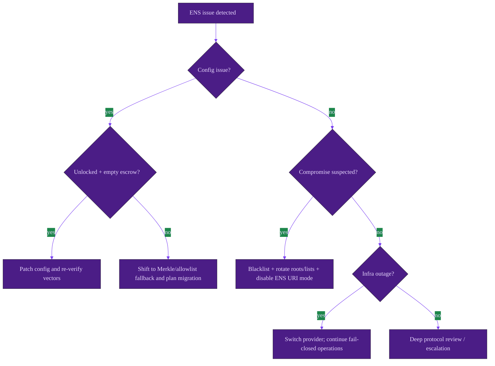
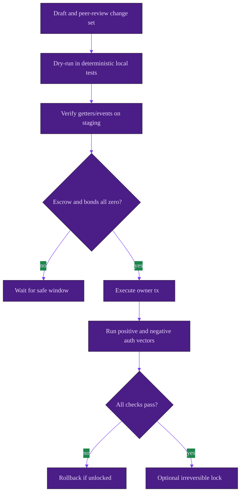

# ENS Robustness, Failure Modes, and Operations

This playbook defines how ENS-linked behavior degrades, how failures surface on-chain, and which operator levers remain safe.

> **Operator note**
> Authorization is fail-closed (`NotAuthorized`) while hook/metadata integrations are best-effort by design. See [`contracts/AGIJobManager.sol`](../../contracts/AGIJobManager.sol) and [`contracts/utils/ENSOwnership.sol`](../../contracts/utils/ENSOwnership.sol).

## Failure modes and remediations

| Failure mode | Symptoms | On-chain behavior | UI / operator impact | Safe remediation | Prevention |
| --- | --- | --- | --- | --- | --- |
| ENS registry misconfigured | valid ENS users fail authorization | resolver path returns false; eventual `NotAuthorized` | admissions friction | if unlocked + escrow empty: `updateEnsRegistry`; otherwise use Merkle/allowlist path | peer-reviewed chain-specific address book |
| NameWrapper misconfigured/unavailable | wrapped names not recognized | wrapper checks return false; fallback resolver may still pass | partial authorization failures | `updateNameWrapper` when allowed; temporarily rely on resolver + Merkle | staged rollout tests on wrapper + resolver vectors |
| Wrong root node(s) | legitimate labels rejected or wrong namespace accepted | deterministic subnode mismatch | policy drift risk | rotate roots via `updateRootNodes` (unlocked + empty escrow) | dual-control root constant review |
| Label input malformed | user submits invalid string label | `EnsLabelUtils.requireValidLabel` path fails and action reverts | user support load | enforce label validation in client and ops runbooks | strict UI input constraints |
| ENS ownership changed unexpectedly | prior participant loses/changes eligibility | future gating follows new ownership state | onboarding surprises | communicate policy; override with Merkle/allowlist if needed | pre-action ownership checks in operator tooling |
| Hook target (`ensJobPages`) reverts | hook-related events show failure | `_callEnsJobPagesHook` emits `EnsHookAttempted` and continues | job page state may lag | fix or unset `ensJobPages`; keep settlement live | continuous hook smoke tests |
| `jobEnsURI` malformed/reverting | expected ENS token URI absent | `_mintJobNFT` keeps base URI when ENS URI call fails/invalid | metadata discrepancy | disable ENS URI mode via `setUseEnsJobTokenURI(false)` | enable only after hardened integration tests |
| Identity configuration locked too early | cannot rewrite ENS/token/root wiring | guarded setters revert `ConfigLocked` | cannot correct wiring in-place | operate with Merkle/allowlists; plan controlled migration | formal lock checklist with sign-off |
| RPC / indexer outage | monitoring cannot read ENS state reliably | contract logic unchanged | observability gaps | fail closed operationally, switch providers | multi-provider dashboards + alerts |

Reference implementation anchors:
- Fail-closed authorization entrypoints: [`applyForJob`](../../contracts/AGIJobManager.sol#L516-L543), [`validateJob`](../../contracts/AGIJobManager.sol#L594-L618), [`disapproveJob`](../../contracts/AGIJobManager.sol#L620-L644).
- Best-effort ENS hooks and metadata reads: [`_callEnsJobPagesHook`](../../contracts/AGIJobManager.sol#L1282-L1302), [`_mintJobNFT`](../../contracts/AGIJobManager.sol#L1189-L1232), [`ENSJobPages.handleHook`](../../contracts/ens/ENSJobPages.sol#L204-L261).
- Identity lock and mutable policy controls: [`lockIdentityConfiguration`](../../contracts/AGIJobManager.sol#L480-L483), [`updateMerkleRoots`](../../contracts/AGIJobManager.sol#L817-L823).

## Security posture

| Threat vector | Impact | Mitigation in code | Residual risk | Operator responsibilities |
| --- | --- | --- | --- | --- |
| ENS key compromise | attacker may satisfy ENS-based eligibility | multi-path auth (allowlist/Merkle/ENS) + blacklist levers | temporary unauthorized admissions | rotate Merkle roots, blacklist addresses, incident communication |
| Owner misconfiguration | outage or authorization drift | empty-escrow gate + explicit lock semantics | human error remains | staged deployment procedure and peer review |
| External contract anomalies | false negatives/instability | gas-bounded staticcalls, conservative decode, false on malformed reads | availability degradation | maintain emergency non-ENS authorization policy |
| Hook target compromise | corrupted ENS page metadata | best-effort dispatch, non-fatal to settlement | off-chain integrity concerns | disable hook/ENS URI mode and investigate |
| Phishing/social engineering | user wallet compromise | explicit non-goal; no on-chain anti-phishing guarantees | persistent ecosystem risk | user training and signed operator advisories |

> **Non-goals / limitations**
> - ENS ownership is not legal identity, KYC, or reputation truth.
> - ENS integration cannot prevent compromised wallets or social recovery abuse.
> - `lockIdentityConfiguration` is intentionally irreversible.

## Incident response decision tree

## Safe configuration change procedure

## Monitoring and observability

### Events to watch

From `AGIJobManager`:
- `EnsRegistryUpdated`, `NameWrapperUpdated`, `RootNodesUpdated`, `MerkleRootsUpdated`
- `IdentityConfigurationLocked`, `EnsJobPagesUpdated`, `EnsHookAttempted`, `NFTIssued`

From optional `ENSJobPages`:
- `ENSHookProcessed`, `ENSHookSkipped`, `ENSHookBestEffortFailure`
- `JobENSPageCreated`, `JobENSPermissionsUpdated`, `JobENSLocked`

Suggested alert semantics:
- Alert **high** when `EnsRegistryUpdated`, `NameWrapperUpdated`, `RootNodesUpdated`, or `IdentityConfigurationLocked` is emitted outside approved change windows.
- Alert **medium** when `EnsHookAttempted` or `ENSHookProcessed` reports repeated failures, because these indicate metadata drift but not escrow breakage.
- Alert **critical** when operational test vectors that previously passed begin reverting with `NotAuthorized` for known-good identities.

### Sanity-check reads

- Identity wiring: `ens()`, `nameWrapper()`, `clubRootNode()`, `agentRootNode()`, `alphaClubRootNode()`, `alphaAgentRootNode()`, `lockIdentityConfig()`.
- Policy fallback: `validatorMerkleRoot()`, `agentMerkleRoot()`, `additionalAgents(address)`, `additionalValidators(address)`.
- Hook mode: `ensJobPages()`, `tokenURI(tokenId)` and expected `NFTIssued` URI.

## Runbooks

### Safe configuration change checklist

1. Confirm change ticket, reviewer approvals, and blast-radius analysis.
2. Verify `lockedEscrow`, `lockedAgentBonds`, `lockedValidatorBonds`, and `lockedDisputeBonds` are zero.
3. Execute one change at a time and inspect emitted events.
4. Run known-good and known-bad authorization vectors.
5. Confirm fallback controls (Merkle + allowlist) still operate.
6. Decide on irreversible lock only after full verification.

### Incident response: ENS compromised root/namespace

1. Freeze intake paths operationally (front-end + operator runbook controls).
2. Blacklist confirmed malicious addresses.
3. Rotate Merkle roots / temporary allowlists for continuity.
4. If unlocked and escrow empty, rotate root nodes and revalidate test vectors.
5. Publish operator advisory and post-incident report.

Immediate containment transaction set (ordered):
1. `pause()` / `pauseAll()` as operational policy requires.
2. `blacklistAgent` / `blacklistValidator` for known compromised addresses.
3. `updateMerkleRoots` + `addAdditionalAgent`/`addAdditionalValidator` for continuity.
4. `setUseEnsJobTokenURI(false)` if ENS URI drift is observed.
5. If safe window exists (unlocked + empty escrow), apply root/address rewiring and re-test.

### If configuration is locked

- **Still mutable:** Merkle roots, allowlists, blacklists, pause controls, settlement operations.
- **Frozen:** `updateAGITokenAddress`, `updateEnsRegistry`, `updateNameWrapper`, `setEnsJobPages`, `updateRootNodes`.
- **Recovery:** continue with remaining policy levers or execute a controlled contract migration.
